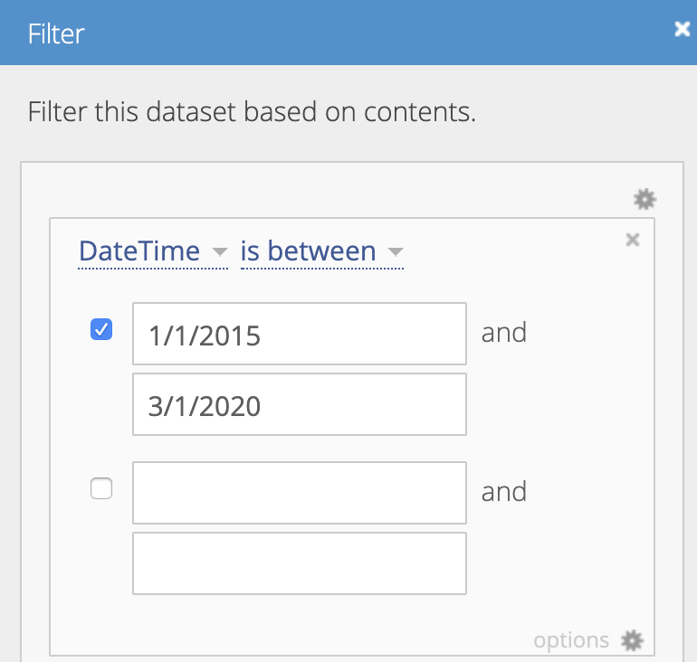

# Austin Animal Center Intake data

We're going to use animal intake data from the Austin Animal Center as an exercise in exploring data through visualization.

Rubrics for different tools are outlined below, but they all work from the same data. Follow the directions below to get the data.

## Tour and explore the data

- Go to the [Primer page](https://data.austintexas.gov/Health-and-Community-Services/Austin-Animal-Center-Intakes/wter-evkm) for the ACC Intake data on Austin's data portal.
- Review the description and the columns in the data to make sure you understand what is there.

Here is some food for thought about what you might glean from the data ...

- We have an `Animal ID`, which is unique for each animal brought in, including some repeat visits by some animals. We can't be sure that every animal that came in more than once has the same ID, but we can explore those that do.
- We have some animal `Name` data that might be fun to look at, but given these are spotty and we don't know if these are owner names or those assigned by animal center staff, we probably can't do any serious analysis here.
- We have a `DateTime` and `MonthYear` columns. They are essentially the same when downloaded. The "time" part of those might just be when the data was entered, so we'll concentrate more on the dates. But having this allows us to look at how many animals have come into the center over time and seasonally. Anytime you have a date, it is worth looking at.
- We have `Found Location` which might initially be exciting, but these addresses are not clean we won't have time to clean them or money to geocode them. They don't include ZIP, which is often a useful generic geographical unit.
- `Intake type` is a good categorical field indicating how the animal arrived at the center. We could look at how many stray animals come in verse other types.
- `Intake condition` is another valuable field. We could see how many animals are sick, or nursing, etc.
- `Animal type` is probably the most interesting category that readers can relate to. We'll definitely look at this.
- `Sex upon intake` tells us both the sex and if the animal has been sterilized or not. Of minor interest, perhaps.
- `Age upon intake` could be interesting if it were normalized on a standard unit. It's also a guess by ACC staff.
- `Breed` is also a guess by staff and not a very clean data field. We should probably stay away from any serious analysis here.
- `Color` much like breed is of limited use.

## Download the data from Socrata

- From the [Primer page](https://data.austintexas.gov/Health-and-Community-Services/Austin-Animal-Center-Intakes/wter-evkm), click on the **View Data** link to view the entire data set.
- Use the Filter to get the most recent five FULL years of data, plus the most recent full month of the current year. Socrata is not intuitive when it comes to filtering dates, so use this example:
  - Use the Filter for `Date Time` and choose **is between**.
  - For the start date, use 01/01/2015 because it is inclusive
  - For the end date, use 08/01/2020 because it is NOT inclusive.

> Note this image is old. Use the updated dates above.

- Go to the `Date Time` column and choose to sort by Ascending and then by Descending to make sure the actual dates capture are Jan. 1 2015 to July 31, 2020. Adjust your filter if not.
- **Export** as a CSV file.

Use the resulting CSV file for the lesson below based on the tool you were assigned:

- [Workbench/Datawrapper rubric](rubric-wb-dw.md)
- [Tableau rubric](rubric-tableau.md)
