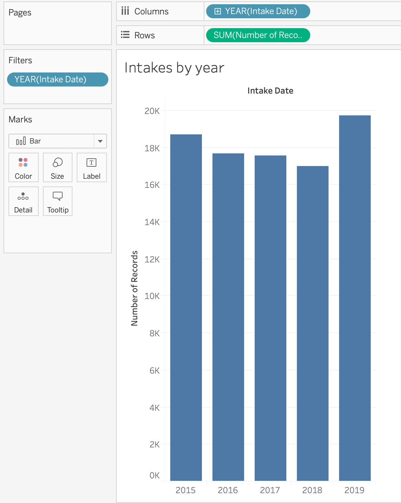

# Exploring Austin Animal Center intakes

See the [README](README.md) for more on downloading the data properly.

## Your quest

We'll use Tableau to explore five years of animal intake data to find insights that might lead to a story. You'll make a bunch of charts, including one that has been cleaned up for publishing.

We'll tackle one question at a time, and then you'll have an opportunity to explore some on your own.

## Assignment details

Use Tableau sheets/charts to find answers to the following questions, and explore others on your own.

### Connect to your data

- It is always best to create a folder on your computer to hold all your project assets so you know where to find them. Put your downloaded CSV file there.
- Launch Tableau and make sure you have closed any existing projects you have open and are starting a new one.
- If you don't already have the Connect menu visible, click **Connect to data** and choose **Text file**.
- Find your downloaded CSV file and connect to it.
- As always, review all the columns to make sure they are the correct datatype, but you should be fine in this case.
- Let's rename the `Date Time` to `Intake Date`. You can do double-click on the name or use the dropdown on the column and choose **Rename**.

### Animal intakes over time

Our goal here is to see the number of animals brought in over a full five-year time period. _You might try this yourself before following the directions so you can experiment and learn._

- Start with Sheet 1. You can rename it "Intakes by year."
- Select the renamed `Intake Date` dimension and the `Number of Records` measure on the left. Use Command-click (or Control-click on Windows) to select the second item.
- Use the **Show Me** tab to create a regular bar chart.
- Use the **Flip axis** button to make time the X axis. 
- We have to filter the data (example below) to include just the years 2015-2019 or our chart will start and end with unreasonable comparisons.
  - **Drag** the `Intake date` column to the _Filter_ pane, which will bring up a window to choose the time period to filter on. **Choose "# Years"**.
  - Uncheck the unneeded years and click OK.

> What do you see? Think to yourself how you might write a sentence that describes what you have learned from this view.

### Monthly trends

There are two charts we are going to make here, once of intakes across all months, and one for seasonal intakes across each month.

#### Intakes by month

- Right-click on the sheet name "Intakes by year" and choose **Duplicate** to make a copy. Rename your new sheet "Intakes by month".
- Choose the drop-down from the **Year(Intake Date)** pill now in Columns and change the view to use the second **Month (May 2015)** option. This shows us intakes by all months.

> Use your cursor to hover over the monthly bars to get an idea where the peaks and valleys are. What does this graphic tell you that is different from the last one?

#### Seasonal intakes by month

- Duplicate your "Intakes by month" chart and rename the new sheet "Seasonal intakes by month".
- Change the **Intake Date** view to use the other **Month (May)** value.

> This view shows something quite different from the long monthly view in that all records for each month are combined together, so we can see over the past five years which months are busiest for the center. Between the two monthly views we can get an idea of seasonal trends for the center. You really need both views to make sure a really busy month in one year affects the overall seasonal trend when combining months.

### Trends by animal type

Now let's look at this by animal type to see if different animals drive some of these seasonal trends.

- Let's start a brand new sheet can call it "Intakes by animal type, seasonal".
- Filter the `Intake Date` to include only the years 2015-2019.
- This time choose three fields to make your chart: `Animal Type`, `Intake Date` and `Number of Records`. Remember holding the Command key (or Control key in Windows) allows you to select multiple fields.
- In the Show Me tab, choose the middle line chart option. This will show breaks in time values instead of connecting the dots, which could cause confusion.

- Change the `Intake Date` value to use to combine months. (The **Month (May)** version.)

> See anything noteworthy here? What might you want to look at further or do more reporting on if you were working on a story? What others ways might you look at animal type over time to explore further? Try some on your own.

### Compare 2020 to other years

With this view we're going to look at this data a little differently. We only have a few months of data for 2020 in our data set (Jan and Feb for the Spring 2020 class), which we filtered out of all our other views. It's time to see how these first months of 2020 compares to previous years.

- Start a new sheet and name it "2020 comparison".
- **Drag** the `Intake Date` to filter, but this time choose to filter by **# Month**.
- Select only the months that you have full data for 2020. (In Spring 2020, this will be January and February.)
- Make a bar chart using `Intake Date` and `Number of Records`.
- Edit the title to include a note about the months used.

> What is your finding? How do the first months of 2020 compare to previous years? Is there a story here?

### Explore on your own

I would like you to further explore some of the data on your own, creating new sheets for each view. If you have trouble thinking of how to explore them, remember you can choose the fields and then use the Show Me list for types of charts you can make with that data.

- Explore `Intake Condition`. Which conditions are most prevalent?
- Look at `Intake Type` to see how the `Number of Records` has changed over time.
- Look at `Intake Type`, `Animal Type` and `Number of Records` together. Swap the order like indicated below to see what happens.

### Problematic data

- Explore the fields `Name`, `Address` and `Breed` (all independently in new sheets).
- When you turn in your assignment, include a comment or text that explains the problems of looking at these fields.

### Create a publishable chart

Choose **one** of the eight charts you've built in your exploration and "finish" it out by providing headlines, sourcing and all those things outlined in the [Good charts lecture](https://drive.google.com/open?id=1EMEIdUqeK94swrm0VvwPPBqzk5zSZqJmKnkckS2KFiw).

Even though you are building a single chart, I recommend putting it on a **dashboard** so you have more flexibility to deal with text, legends and the like.

Keep all your other charts in the workbook, but clean up just the one for publishing. Include the name of the sheet or dashboard when you turn it in.

## Stuff to turn in

Turn in the following:

- Your Tableau project, which you need to **export as a Packaged Workbook**. You'll find this under File > Export Packaged Workbook. The resulting file should have a **.tbwx** extension. Upload this into the Canvas assignment. This should have the five charts outlined individually above, plus the three "explore on your own" charts. (50 pts)
- Your "publishable" chart: In a comment on the assignment, tell me which sheet or dashboard is your "finished" chart. (100 pts)
- Your explanation on the problematic columns. You can add this as a comment on the assignment. (50 pts)
