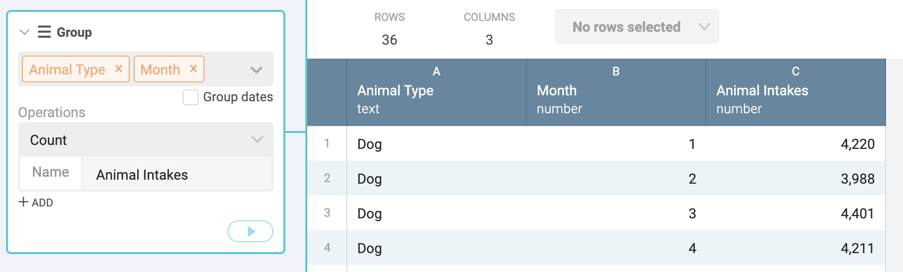

# Exploring Austin Animal Center intakes

See the [README](README.md) for more on downloading the data properly.

## Your quest

We'll use Workbench to explore five years of animal intake data to find insights and then visualize some of those using Datawrapper.

We'll tackle one question at a time, and then you'll have an opportunity to explore some on your own. Here are the questions we'll answer:

- Are animal intakes increasing or descreasing over time (year)?
- Is there a seasonal monthly trend in overall animal intakes?
- Do certain types of animals drive that seasonal intake?

## Connect and clean your data

It is always best to create a folder on your computer to hold all your project assets so you know where to find them. Put your downloaded Socrata CSV file there.

- Launch [Workbench](https://app.workbenchdata.com/) and start a new Workflow. Title it **YourName - AAC**.
- Use the **Upload** option for data source upload your CSV and name the tab **Import & Clean**.
- As always, review all the columns to make sure they are the correct datatype. You'll notice that the two date fields `DateTime` and `MonthYear` both are the same, and came in as text. Let's convert one of those into a real Date format.
  - Create a new step with **Convert to Date**
  - Add the `MonthYear` column.
  - On the _Input Format_, choose **Date (U.S.) MM/DD/YYY**.
- Rename the MonthYear column as **Date**.

## Animal intakes over time

Our goal here is to see the number of animals brought in each year over a full five-year time period. Are they getting fewer animals or more animals each year? It will look something like this:

This is a column chart with years along the bottom (the X axis) with the bars counting the number of animals brought in (the Y axis). Before diving in, it might help to peek at [Datawrapper column charts](https://academy.datawrapper.de/article/20-how-to-create-a-column-chart) to see what our data should look like. In doing so, you'll see our first column needs to be the category (Years in our case) and the second column the values (Count of animal intakes).

Since every row is an animal intake, we just need to count the number of rows for each year to find our numbers.

### Filter to the data we need

The first thing we need to think about is the date range of our dataset. We downloaded five full years of data plus several months of the current year. If we include 2020, then our chart will look like a sharp decrease at the end because it only has a partial year of data. (We'll check the intake pace for 2020 later in a different chart later.)

- Start a new tab since we are starting a new quest/answer. Name it **IntakesByYear**.
- Use **Start from tab** and choose the **Import** tab.
- Add a new step with **Filter by condition**.
  - Choose `Date` for the column.
  - For the operation, choose **Date is after**
  - Fill in "2019-12-31", the last date we want to keep. (This step takes some time. Be patient.)
  - Choose the **Delete** option and play the step.

### Grouping records by year

There are actually a couple of ways to do this, using either the **Group by date** function or the **Group** function with the _Group dates_ option. We'll use the later, mainly because it allows us to rename the column as the same time. They can both get the job done.

- Add a step with the **Group** function.
- Add the `Date` column
- Check the **Group date** option.
  - For the _Granularity of date_, choose **by year**.
- For _Operations_ keep the **Count** aggregation.
- For the _Name_ type in `Animal intakes`.

Note that Workbench groups these records by the first day of the year, not a particularly clean data point. That would be confusing for our readers. We would rather have just the year. That's our next challenge.

### Pulling the year from a date

Again, there are several ways to pull a year from a date: We could create a new column **Formula** using `=YEAR(A1)` or we could split the column. Either way, we have to change it to Text first. We'll use **Split column**, but it is a multi-step process to get what we want.

- Use the dropdown on the `Date` column and choose **Convert to text** to add that step.
- Add another step and choose **Split columns**
  - Choose the `Date` column.
  - For _Split on_, choose **X characters from the left**.
  - For _Number of characters_ type in `4` and play the step

OK, now we have to remove our extra column and then rename our date column.

- Add a step with **Select columns**.
- For column, choose `Date 2`
- Select the **Delete** option and play
- Rename the `Date ` column as `Year`.

OK, now we have our data in the shape we need for Datawrapper.

### Export the data

- Click on the **Export** button at the top-right of the screen and then click on the download button.

The file goes into the Downloads folder on your computer. I _highly recommend_ that you rename this file as something descriptive like "intakes-by-year.csv" AND move to a project folder as a single place to keep all your assets.

We are making several of these files and you'll want to be able to find them and tell them apart. I always create an organized folder for all my projects to keep all my assets like this. Organization is key to data projects (and sanity).

## Intakes by year chart

Now onto Datawrapper to make our chart. Remember our goal is something like this:

- Log into into [Datawrapper dashboard](https://app.datawrapper.de/).
- Choose the **New chart** button at the top.
- Click the **XLS/CSV upload** button and find your file and upload it. **Proceed** to the next step if it hasn't already.

### Check and describe

The **Check and describe** step allows you to make some adjustments to your data. You can click on columns and change data types, transpose your data and even make edits.

In our case everything is good. You can **Proceed** to the next step.

### Visualize

The **Visualize** step is the workhorse of Datawrapper where you _make_ your chart. It has several substeps.

Datawrapper will choose an appropriate chart based on your data, and in my case it chose a line chart. Not a bad choice for time-based data, but we are going to use a column chart because studies show it is among the easiest for readers to understand.

- Choose the **Column** chart from the list. You'll see the chart change.
- Click on the **Refine** step. This is where we can set all kinds of chart options.
  - Most of these defaults are OK for this chart, but there are lots of options for you to play with here. Take a couple of minutes and play with them to see how they change the chart.
  - One setting good to change here is to on **Appearance**, set to **always** show the values so we have numbers at the top of the bars without having to hover.

Now let's move on to the **Annotate** step. This is where you add a title, description, source, etc. There are some other annotation options we'll use in later charts.

Chart titles and descriptions can be some of the most difficult writing you can do, IMHO. You don't want to describe your steps or say the obvious, but you do need to give the reader all the relevant detail needed to understand the chart.

- Add a title and description. Don't skimp on this step ... work on this to make it good.
- Add a link to the original data published on Socrata. (If we skip this our 5-row original data will be available, but we want to give readers the original data if we can.)
- Add your byline.

Now you can check out the **Design** options and check how your chart will look on mobile and tablets with the icons at the bottom right.

Use **Proceed** to move onto the **Publish & Embed** step.

Here you can create an embed to add your chart to a content management system, or download as a PNG image you can insert into a story.

For this assignment, I want you to choose the **PNG** option. You'll see there are options there to size your graphic. Just use the defaults, save the image.

- Rename the downloaded image and put it in your project assets folder so you can upload it later to your Canvas assignment.

## Monthly trends

For our next visualization we want to see how how many animals are brought in each month to the shelter over our entire time period. We want to see if there are seasonal spikes.

In this case we don't need to filter out 2020 because we want to see all the months.

### Prepare our data

For this chart we want to build a line chart with the months across the X axis and the number of intakes (or count of rows) for the Y axis.

Again, it makes sense to look at the [Datawrapper academy for line charts](https://academy.datawrapper.de/article/23-how-to-create-a-line-chart) to see how our data should be structured.

You'll see there that the first column is the category of time, in our case the month and year. Additional columns are counts of data we want to chart, but we only have one thing to count, our number of intakes for each month.

This time we will use the **Group by Date** function to get this.

### Group by date

- Start a new tab from the **Import & clean** tab and name it `Monthly`.
- Start a new step with the **Group by Date** function.
  - For column choose `Date`
  - For _Group by_ choose **Month**.
  - For _Operation_ choose **Count**.

Again, our `Date` field comes up as the first date of the month. This will be OK as we can choose how to display this date when we are in Datawrapper and make it pretty.

- Export this data as a CSV file
- Rename the file `monthly-intakes.csv` and put it in your project folder.

### Visualize with line chart

- Start a new Datawrapper chart in your account.
- Upload your csv.
- In the **Check and describe** step, double-click on the B column title `count` and rename it to `Animal intakes`.
- **Proceed** to the **Visualize** step.

In my case Datawrapper chose the line chart and that is what we want in this case, but we need to make some adjustments to it.

- Move on to the **Refine** step.
- Roll over the points in the chart and you'll see the hover tooltips show you the same year for every month. This is not good ... we want to be able to see which month of the year each point is.
- On the **Horizontal axis** section, look for the _Tick format_ option.
  - Change this to the option **Apr '15, Mar '15**. This will change the tooltip to show both the month and year.
- On the **Customize lines** section, look for the _Fill area below line_ option.
  - Click the checkbox.
  - You could change the fill color, but the default grey is a good choice.

This make it easy for readers to discern the line and give an indication that there is value underneath it (that we are counting the number of animals.)

There is no option to show the tooltip for every point and that is good because it would be mess if we did. But do click on the **Customize symbols** option and play with them to see what they do, though I don't think you need any for this chart.

- Move to the **Refine** step
- Fill out all the information here.

Again, take care in writing your headline and description to give readers everything they need to understand the chart (without the benefit of the story). What is the main point of this chart? Make sure you communicate that to the reader.

- Move onto the **Publish and Embed** step.
- Go ahead and click the big **Publish chart** button to see what happens.
- On the resulting link choose the **Normal size** option. Go ahead and click on it to look at it.
- Save that link as you will turn it in with this assignment.

Note also the embed code that can be used with some content management systems.

You can go back an make changes and edits to the chart but you will need to republish it for those changes to take affect.

## Trends by animal type

We could see from our last chart that there are definitely monthly spikes in animal intakes each spring. Our next quest is to see what is driving that spike. We'll start looking a the data based on the `Animal type`.

### Explore animal type

Before we start preparing our data for the next chart, let's get a handle on what kinds of animals we are talking about here. Let's see how many rows we have for each animal type.

> This might be a good one to try on your own before you read the steps below.

- Start a new tab and name it `Animal type`.
- Start from tab **Import & Clean**.
- Start a new step with **Group**
  - For _column_ choose `Animal type`.
  - for the _Operations_ leave it **Count**.
- Play the step.

Our results shows there are five types of animals, but some of them like "Bird" and "Livestock" have only a few records. If we made a line chart over time for animal types those fields would have hardly any values.

When we prepare our chart data, we will **Refine** our data to merge the "Bird" and "Livestock" rows with "Other" so we only have three animal types.

## Animal types by month on intake

What we want to learn here is how many animals of each type does the shelter brings in each month, regardless of the year. In other words, how many dogs did they bring in January of all years 2015-2019? And then in February, etc. And we want that for all the animal types: dogs, cats and "other".

This way we can use several years of data to see if certain types of animals "typically" come in during certain months.

If we were to visualize this in our head as a line chart, our X axis would have twelve categories, one for each month of the year. Our Y axis count the number of animals brought in each month, but there would be a new line for each animal type.

Take a look again at the [Datawrapper academy for making a line chart](https://academy.datawrapper.de/article/23-how-to-create-a-line-chart) and look at the example there.

 Our goal is much like the example, except we want 12 months across the bottom and a line for each animal type instead of Apple product.

Their data looks like this:

Our data need to be structured in the same way, but for `Quarter` we need the month of the year, and we need a column for each "Animal type".

### Preparing our data

This is more complicated workflow than the ones we've done so far because we not only have to group our data by month regardless of year, we also have to refine some values and reshape the data. I'll give examples of the more complicated steps and explain them along the way.

- Start a new tab and name it `AnimalTypeMonth`.
- Start from the **Import & Clean** tab.
- Filter your data to exclude the 2020 records. Just like in our first chart we don't want partial years of data or we'll have more records for some months than others.

### Refine merging

Remember how I said we want to merge birds, livestock and other? We'll do that now.

- Start a new step with the **Refine** function
- Choose the `Animal Type` column.
- Click on the _Bird_, _Livestock_ and _Other_ boxes and click **Merge** at the bottom.

What you've done here is change all the records that had Bird or Livestock and made them "Other". You've _changed_ the data, but only in this workflow. Our original data is still safe. Now we only have Dogs, Cats and Other values in the the `Animal type` field.

### Extract the month from a date

If we did a **Group** or **Group by Date** on the `Date` field, it would count the records by each _individual_ month and we don't want that. We want to count all the "January" records regardless of year. to do this we need to create a new column that has just the _Month_ of the `Date` field. We'll use an Excel **Formula** for this.

- Add a new step and choose **Formula**.
- Leave the type **Excel**
- For the formula type in `=MONTH(A1)`.
- Make sure **Apply to all rows** is checked.
- Name the new column `Month` and play the step

Take a look at the new column at the end of the data and you'll see a Number field with just the month number of the `Date`. "1" for "January"; "2" for "February", etc.

### Group by multiple values

So far when we've done a **Group** function we've done so only on one column. When we do that it groups all the records where the value in that column matches, then does the aggregation.

In this case we want to group by two values: `Month` and `Animal type`. We want to count all the January dogs, then all the February dogs, etc.

- Start a new step and choose the **Group** function.
- For _Columns_ choose both `Animal type` and `Month`.
- For _Operation_ leave it **Count**.

So this counted all the rows where the `Month` and `Animal type` matched: There are 4,220 records with both "Dog" for `Animal type` and "1" for `Month` (at least when I pulled the data. Your number might not be the same but it should be similar). It counted each Month and animal type combination.

There should be 36 rows of data: 3 animal types x 12 months.

### Refine to rename variables

OK, our month names suck, obviously. Datawrapper is smart, but not smart enough to understand a single number as a date. We need to change them to real month names. We'll use **Refine** again for this, but we have to convert the field to Text before we can.

- Start a new step and choose **Convert to text**. Put in the `Month` field and play it.
- Start a new step and choose the **Refine** function.
- For _Column_ choose the `Month` field.
- For each value, click on the value and type in the proper name. You can see an example below, but go ahead and do all of them.

OK, now we have good month names, but we need to reshape our data so that each row is one month, and there is a column for each animal type.

### Reshape long-to-wide

The concept of reshaping data is part of every data science programming language. This isn't the same as grouping and aggregating ... we will end up with the same number of _observations_ (or data points) in our data, we will just describe those observations in a different way.

Right now our data is "long", where each row is a single value and the columns describe that value. We need it "wide" where both columns and rows to describe the data.

If you have multiple columns of the same type of thing, like multiple Years of data, or Apple device types, it is wide data.

For reshaping from long-to-wide, the concept is this: We will pick a column where we want each value to be made into the rows. Then we pick another one where we will spread out the observations into new categories based on that category. It's easier to see than to explain.

- Start a new step and choose the **Reshape** function.
- For the direction choose **Long to wide**.
- For the _Row variable_ choose `Month`, since we want one row for each month.
- For the _Column variable_ choose `Animal type` since we want a new row for each animal: Dog, Cat and Other.

Now our data looks something like this:

Now this looks like our Datawrapper example data. It took a bit to get there, including some logic to pull out the month from a date field and some grouping and reshaping of the data. You'll likely need to apply those same concepts in other data projects that visualize dat no matter what tool or language you use.

You might notice that months are in alphabetically order instead of month order. Datawrapper will fix that.

- Use your **Export** button to download your CSV file, rename it and move it to your project folder.

## Visualize a multi-line chart

Now we'll use Datawrapper to build a new line chart, but this one will have more than one line on the chart.

- Start a new Datawrapper project.
- Upload your data.
- At your **Check & Describe** step it will give you a view of the data. Datawrapper _should_ recognize that your `Month` as a date datatype. If not, choose that column and change it.
- In the **Visualize** step, Datawrapper choose the line chart for me, which is appropriate.

This isn't a bad start, but we can make it so much better in the **Refine** step. The first thing you'll see is that Cats are much different than Dogs or Other, which are pretty steady month-to-month. That could be a story angle and we'll want to highlight that in chart.

For each improvement we do in **Refine** I'll try to explain the reasoning.

- Go to the **Refine** step.
- Notice that not all the months show on the X axis. On the _Horizontal axis_ look at the **Tick format** and change it to the abbreviated format for month. This allows us to show all the month names.
- Cats are our story here. We can use the **Customize lines** section here to highlight the Cat line. Click on the **customize colors** button and use the options to make Cat stand out. Note you have colors, line widths and line dashes to work with. Don't go crazy ... just make sure Cat is different than Dogs and Other (which should be the same style so Cat stands out).
- The labeling of Cat, Dog and Other at the top of the chart is hard for readers to figure out. They have to keep looking back and forth between the lines and the legend. We can fix that by setting the **Labeling** _Line labels_ to **Right** instead of **Top**.

### Annotation highlights

While I think it is clear here already that cats are our focus, I want to show you a quick demonstration of how to add highlights and text annotations to a chart.

As you watch the gif below, know that when selecting the highlight points, it is really two separate clicks on the graphic, not a click-n-drag thing.

After adding either the highlight or the text, you can adjust where they appear on the graphic by adjusting the data point coordinates. It's strange at first to adjust distance based on a date or value of cats, but after mucking with it for a bit you can figure it out.

You can play with those but they are not required for the assignment.

### Finish up your chart and publish

I'm again leaving it to you to properly title, describe and source your chart. Go ahead and publish to Datawrapper and include the link in the assignment below.

## Food for thought and problematic data

You might take a couple of minutes to look over the raw data again and think of other stories you might be able to tell and the visualizations that might support it.

There are some fields in the data that look promising but are not ... at least not in their current state.

- `Name` seems like it could be a fun category to play with. To do it right you would need to do some serious cleanup of the name field to remove (or understand) names starting with `*`. (You could try to tackle this in Workbench with **Refine**, but a better tool would be [OpenRefine](https://openrefine.org/), which that function is inspired from.) There are also many that have the weight instead of a name. You might need to do research/interviews at the AAC to figure out if these are names given by the shelter or what.
- `Address` of where dogs were found would be very cool to look at, but these addresses are a mess. If they had a clean ZIP code, we could look by that. We could geocode the addresses to get a Latitude and Longitude, but it would cost money and some of these are pretty poorly formatted. Might be worth it if you know there is a story there.
- `Breed` really looks fun but there are definitely challenges there. Who decides the breed? What's the difference between a "Pit Bull/German Shepherd" and a "German Shepherd/Pit Bull"? If you are counting German Shepherds, do you include the mixes?

## Turn in your work

- Create a Google Doc and share it with me.
- Share your Workbench workflow as public and add the link to the Google Doc.
- Upload your first PNG chart to the Google Doc
- Include the published links to the other charts so I can see them on Datawrapper.
- SUBMIT THE GOOGLE DOC LINK to the assignment.
