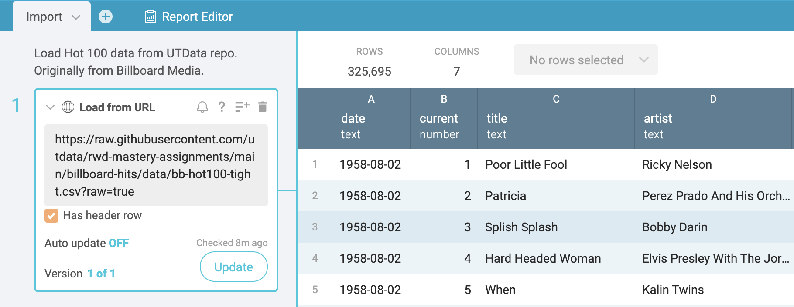
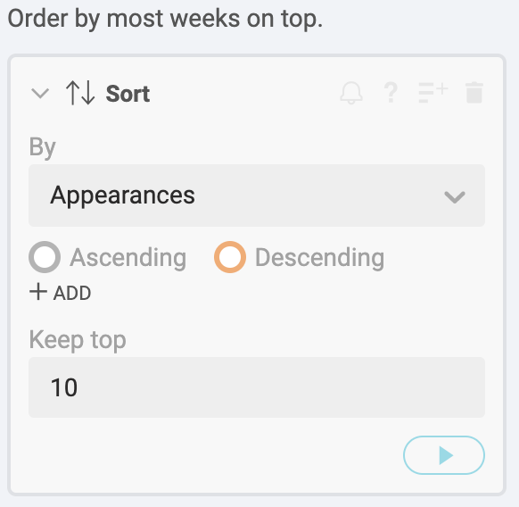

# Billboard Hot 100 rubric for Workbench

## What you will learn

> This is a detailed assignment that walks you through each step, explaining concepts along the way. You may want to review the [Basic Data Journalism Functions](https://vimeo.com/showcase/7320305) as you go along.

We'll be using Workbench to practice importing data from a URL, filter, select, group, aggregate and make some very simple charts. We'll also have have a short writing assignment.

## Overview of the assignment

We'll be using the Billboard Hot 100 charts data to find the answers to the following questions:

1. Who are the 10 Performers with the most appearances on the Hot 100 chart at any position?
2. Which Performer had the most Songs to reach No. 1?
3. Which Performer had the most Songs to reach No. 1 in the most recent five years?
4. Who had the most Top 10 hits overall?
5. What Performer/Song combination has been on the charts the most number of weeks at any position?
6. What Performer/Song combination was No. 1 for the most number of weeks?

FOOD FOR THOUGHT: What are your guesses for the questions above? No peeking!

## Why Workbench

Workbench fits into the category of data journalism tools that I consider "transparent and repeatable". Workbench is more in line with data science languages like R and Python and has several advantages over Excel or Sheets:

- Each step in the data workflow process is recorded.
- You can document what you are thinking for each step for your future self or others interested in your work.
- You can insert and correct steps anywhere in the process without starting over.
- You can collaborate with colleagues. You can share your work with readers.
- While Workbench can't do everything, it is built upon Python's [pandas](https://pandas.pydata.org/pandas-docs/stable/) data science library so you can use Python code for advanced functions not available in the interface.
- It is (currently) free, web-based and easy to learn. It is a _young_ tool under active development and the owners are trying to turn it into a business, but they have committed to keeping the current toolset free for journalists. It was born out of a project at the Columbia School of Journalism.

## Importing and cleaning data

### Import from URL

- Start a new [Workbench](https://app.workbenchdata.com/) workflow.
- Give the Workflow at descriptive title about this project. (In this class, please precede the title with your name.)
- Use the **Start from URL** function and use this link:

``` text
https://github.com/utdata/rwd-mastery-assignments/blob/master/billboard-hits/billboard.csv?raw=true
```

It will take several seconds to load as it is nearly 320,500 rows of data.



OK, that process was cooler than it looked. This data is stored in Github, a popular code-sharing platform for developers. Most data journalists use Github to share their work, which means you can stand upon the shoulders of giants. If you find a CSV file on Github, you can add `?raw=true` to the end of the URL to import the data into Workbench (and other data science tools).

- Name your tab **Import**. (I recommend you keep your tab names short. You can end up with a lot of them.)

### About the data

This dataset contains every weekly Hot 100 singles chart from Billboard.com. **Each row of data represents a song and the corresponding position on that week's chart.** Included in each row are the following elements:

- url: Billboard Chart URL
- WeekID: Date of chart release
- Week Position: Current week on chart
- Song: Song name
- Performer: Performer name
- SongID: Concatenation of song & performer
- Instance: This is used to separate breaks on the chart for a given song. As an axample, an instance of 6 tells you that this is the sixth time this song has appeared on the chart, with skips in between.
- Previous Week Position: As of the current date
- Peak Position: Top position on chart as of this date
- Weeks on Chart: Weeks on chart as of this date

### Fix the dates

After you import the data, look through all the columns, paying special attention to the "datatype" listed under the column name. Are numbers listed at numbers or text? Are dates listed as such? Are there `null` values that should be present? You'll often have to correct such things.

In our case the `WeekID` is not listed as a date and we'll need to fix that. There are some `null` values in the `Previous week position` but that is OK because it is the first week on the chart for some songs.

- Convert the `WeekID` to a date. There are at least two ways do to this:
  - You can always add a new step with the **+ ADD STEP** button below the last step. In this case you would then choose the **Convert to date & time** function and the select the column `WeekID` to convert. Play with the **Input format** to get the date style that works for you. "AUTO" is probably fine in this instance.
  - Another way to do the same this is to roll your cursor over the `WeekID` column header until you see the dropdown menu for that column, then choose **Convert to date & time** from the list. That will add the same kind of step as the first method.


## Top 10 Performers

Now to find the most popular artist in the history of the Hot 100. Who did you guess?

To get this answer we need a simple aggregation. Since each row of data is an appearance on the chart, we just need to group the data by `Performer` and then count how many rows each performer has.

### Import data from a tab

- Start a new tab. (Each _answer_ we seek will be at the end of a tab, though sometimes we'll use multiple tabs to get to an answer. If we started grouping our data on the **Import** tab then we wouldn't be able to use our cleaned data for the other answers.)
- Use **Start from tab** function and choose the **Import** tab. (This will give you the last step from the Import tab.)


### Group and aggregate

In Workbench, aggregation is part of the **Group** step. (Most data science languages separate [Group and Aggregate](https://vimeo.com/showcase/7320305/video/435910349) into separate steps. Workbench does the same, but it's under the hood of the graphical interface.)

- Start a new step and choose the **Group** function.
- For **Select column** type in `Performer`. (Note the type-assist. Once you've typed enough of a column name to select it, you can hit **Return** on your keyboard to select that field.) See [Select](https://vimeo.com/showcase/7320305/video/435910324) for a refresher on the concept.
  - (A little explanation: When we Group by Performer, we are organizing the data to put all the rows with the same Performer together before we perform some kind of math on them: Counting, Summing or whatever. So we are organizing the data to have all the ABBA rows together, then all the rows for B.B. King, etc.)
- For **Operations** keep the _Count_ selection, but go ahead and click on that menu to see the other possibilities. (This is the **Aggregation** step. Workbench combines aggregations with Group because you typically aggregate after grouping.)
- Name the new column **Weeks on chart** because that is what we are doing: Counting the number of weeks this performer has been on the Hot 100.
- **Add a note** to the step that explains what you are doing. If you roll your cursor over the step title you'll get icons, including the note button outlined below. Use notes like this to explain to your future self or readers what you are doing in the step. (Go ahead and add notes to your previous steps, too.)


We could add more aggregations here by clicking on the **+ ADD** icon at the bottom of the Operations sub-step. In doing so, we could add new columns to our table with using different methods in the Operations dropdown. This table is much like a Pivot Table in Excel or Sheets. You'll likely need to use multiple aggregations in later assignments.

### Sorting data

Now we have a list of performers and how many times they've been on the chart, but we want to know who has been there the most. For this we need to [Sort](https://vimeo.com/showcase/7320305/video/435910315) the data. (This simple operation comes in many different names in data science languages: "Arrange" in R, "Order by" in Python and SQL.)

- Add a new step and choose the **Sort** function.
- Add the column we need, `Weeks in chart`, in the **By** menu.
- Click on the **Descending** button. (Journalists usually want the _most_ of everything.)
- For the **Keep top** item, type in `10`. (We are going to keep only the top 10 records of our list so we can make a chart later.)
- Don't forget to add your note to the step! (I want you to do this for each step, but I'm not going to remind you anymore.)



### Making a chart

We have data for the 10 artists with the most weeks on the Hot 100. It might be easier to see the difference in popularity if we made a simple bar chart from the data.

We are going to use the **Column charts** function in Workbench. Column charts are the same as a bar chart, which are column charts flipped sideways. Workbench only has column charts, one of the many failings of Workbench charting. The tool is really only good enough to _see_ your analysis. If you want to publish a chart, then it's better to use [Datawrapper](https://www.datawrapper.de/) which we will get to later.

- Add a new step and choose **Column chart**.
- For the **X axis** use the `Performer` column.
- For the **Y axis** use the `Weeks on chart` column.
- Give your chart a descriptive title. Note you can also rename the axis names.


Congrats! You have made a chart of the most popular Performers in the history of the Hot 100. A little bit of history here ... Taylor Swift overcame Elton John for the top spot in the second half of 2019. Elton's been around for a long time, but Taylor popularity at a young age has rocketed her above him.

## Most songs at No. 1

So, Taylor Swift is the top queen of pop. (Don't worry, Madonna makes an appearance later). But who has had the most No. 1 songs on the charts? Any guesses?

- Start a new tab and call it **No. 1**.
- Use the **Start from tab** function and again start from the **Import** tab.

### Filtering data

To get our answer, we need to consider only No. 1 songs from our table. We'll do this using another Basic Data Journalism Function [Filter](https://vimeo.com/showcase/7320305/video/435910359). We'll take the list of songs at any position and we'll choose only the songs that have "1" as their `Week Position`. (Or we could use `Peak Position` since you can't get any "higher" than No. 1.)

There are two types of filters in Workbench: **Filter by condition** and **Filter by value**.

_Filter by condition_ allows you to define a rule that must be true to keep or delete rows, and the rules you can set depend on the datatype. You can filter before or after dates, greater than or less than numbers, and pick characters out of text, etc.

_Filter by value_ allows you to pick from the values in a column, typically handy when there are a limited number of selections. It can be very precise, though, where filter by condition can sometimes catch or exclude unwanted values if you aren't careful defining your rules.

- Start a new step and choose **Filter by condition**.
  - In the **IF** field, select the `Week Position` column.
  - For **Select condition**, choose **Number is**.
  - For **Value** type in `1`.
  - On the radio buttons below the step, choose to **Keep** the rows and play the step.


Now we have a list of songs when they were No. 1 on the charts.

Note in the **Filter by condition** step that you can have more than one condition within each IF statement by clicking on the "AND|OR" within the IF box. You can also add a new IF statement by clicking on the  **AND|OR** button below the IF box. This allows you to control the order of operations of some pretty complex conditional statements.

And, by having the choice to Keep or Delete rows, you can either find things you want to focus on, or find things you want to exclude.

### Deduplicating data

Right now we have all information about songs that are No. 1 for each week since Aug. 1958. Before we can count the number of times a Performer has had a No. 1 song, we need to adjust our data to show each No. 1 Song/Performer combination only once. (Right now it is listed for each week the song is at No. 1.)

There are a couple of ways to achieve this and both take multiple steps. The method we will use is a little easier to follow, IMHO.

- Start a new step and choose the **Select columns** function.
- For **Select columns** dropdown, add `Song` and `Performer`.


You've used yet another "Basic function of data journalism" by "Selecting" columns.

Look through the resulting list and you'll see that Song/Performer combinations are listed more than once. We need to deduplicate that list so they only appear once so we can count the Performer only once per Song.

- Add a step and choose the **Deduplicate** function.
  - For the **Find duplicate in** list, add `Song` and `Performer`.
  - In the **and** function, choose to **Delete duplicate rows**.
  - Play the step.


Now each Song/Performer combination is only listed once. You might notice in the results that when a Performer collaborates with another artist, they are listed with their collaborators. 50 Cent has at least three No. 1 hits, but only one of them by himself. We're going to leave this like this and consider collaborators together. (If we wanted to count all contributions to No. 1 songs, we would have to go a different route.)

### Group and count

Now that we have our deduplicated list of Song/Performers, we simply have to Group and Count the number of times a Performer appears on our data.

- Start a new step and choose the **Group** function.
  - For columns, select `Performer`.
  - Keep the **Count** aggregation.
  - Name your new column "No. 1 hits".

### Sort the list

Now we have the number of No. 1 hits by each performer, but we need to **Sort** to find out who had the most.

- Start a new step and choose the **Sort** function.
- For **By** choose your `No. 1 hits` column.
- For **Keep** add in `10` rows.
- Choose **Descending** and play the step.

How was your guess? Are you surprised? Which artists in the list have the best chance of overcoming the top Performer in this list? That might serve as an angle for your data drop.

## Most No. 1 hits in past five years

In most cases I encourage you to start a new tab and not "duplicate" a tab when you are working on a new question. In this case, though, our goal to find the most No. 1 hits in the past five years is almost exactly the same as our previous "No. 1" tab, except we want to only consider songs from the page five years. We can do that by adding a step in the middle of the workflow.

### Add a filter in mid-workflow

- Click on the dropdown in the "No. 1" tab name and choose **Duplicate**.
- Rename this tab **No. 1 5 yrs**.

Now look at all the steps of this workflow and think where you can add a filter for the `WeekID` of the chart (the date of the chart.) It needs to be before we use **Select columns** because we lose the `WeekID` field at that point.

- Put your cursor just under the first Import step and click the orange **+** sign to add a new step.
- Choose the **Filter by condition** function.
  - Add the `WeekID` to the column selector.
  - For Select condition, choose **Date is after**.
  - Type in 2014-12-31 in the **Value** field.

The condition "Date is after" does not include the date we are using, so we actually have to pick the day BEFORE the date we want to start keeping data. If we wanted to also add bounds and an end date to consider, we could add an "AND" to our IF statement and use "Date is before". Our data only goes through 2019 so we only need to set the lower bounds.

Now you can go to the last step in the workflow and see how the answers have changed compared to our previous tab.

## Most Top 10 hits

Now that you've seen that we can duplicate a workflow and make changes to it, consider this: If we wanted to find which Performers had the most Top 10 hits on the charts (as opposed to just No. 1 hits), how could we use our earlier tab for No. 1s?

I'm going to let you do this on your own, but here is a pretty big hint: Duplicate the "No. 1" tab and then look through the steps and see how you could adjust the workflow to look at songs in the Top 10 instead of just No. 1.

Name the tab **Top 10 hits** so I can find your answer.

## Song/Performer combo longest on the charts

Next we want to learn which song has been on Hot 100 the most number of weeks at any position. Again, this is a simple "Group and Count" challenge. Each row is a song on the chart, right? We want to count them based on the combination of `Song` and `Performer`. First, make a guess. I'll be shocked if you guess correctly.

This is very similar to our first question but we are looking at `Song` and `Performer` together instead of just the Performer. We'll start with a new tab, though.

> Try this on your own before following the steps below to see if you can figure it out own your own.

- Start a new tab and call it **Longest**.
- Use **Start from tab** and use the Import tab.
- Start a new step and choose the **Group** function.
  - For the columns, add `Song` and `Performer`.
  - For the **Operation**, keep **Count** since we are just counting how many times this Song/Performer combination appears on the data.
  - Name the new column "Appearances".

Now we have how many times a song has appeared, but who has appeared the most? That's a simple **Sort**.

- Add a new step and choose the **Sort** function.
  - Choose `Appearances` for your columns.
  - Set the order to **Descending** and run the step.

How was your guess?

## Longest at No. 1

History was made in the summer of 2019, and it's time to put it into perspective. What Song/Performer combination was at No. 1 for the most weeks?

This is pretty similar to our last quest, but we need to consider songs only at No. 1 instead of all songs. Figure this one out on your own, but consider what we've done for other questions like this.

## Turning in your assignment

This is a two-part assignment, and you've just done the first part.

### Turn in your Workbench workflow

- Click on the **Share** button at the top-right of Workbench and click the first checkbox that shares your workflow with the world.
- Copy the URL and submit it to Canvas assignment with your Google Doc link for part II of the assignment.


### Write a data drop

A [Data Drop]((https://docs.google.com/document/d/1gd5RR5YK43N3uE0o1vBoJfnkSo5S0JJFUCJmFsa75FM/edit#heading=h.k2b1zvdn1534)) is a short story that outlines your findings in readable sentences. In this case (and this is the only case for this class) you can add some personal flavor in the story. Do think about AP Style, limiting numbers in the story and all the things we've learn about in writing about data, including describing the source of the data.

Some specifics:

- You need at least four of the six data points (or alternatives you've found) in your story.
- Five to six paragraphs is sufficient length if your data points are explained well. You can write more if you like, but make sure you have the data points.
- Again, you can have a personal flavor to this, but don't forget the data. That's what I'm grading.

Write this in Google Docs and **share it to my email as AN EDITOR**. Submit the link to the Canvas assignment along with your Workbench URL.

## Soundtrack for this assignment

This lesson was constructed with the vibes of [The Bright Light Social Hour](https://www.thebrightlightsocialhour.com/home). They've never had a song on the Hot 100 (at least not through 2019).

## Ignore this

- [For the instructor](https://app.workbenchdata.com/workflows/18627/).
