# Billboard Hot 100 rubric for Workbench

> There is a companion screencast video of this lesson **Workbench Billboard** under the Panopto Video menu in Canvas.

## What you will learn

This is a detailed assignment that walks you through each step, explaining concepts along the way, sprinkled with mastery quests to do on your own. You may want to review the [Basic Data Journalism Functions](https://vimeo.com/showcase/7320305) as you go along.

We'll be using Workbench to practice importing data from a URL, filter, select, group, aggregate and make some very simple charts. We'll also have have a short writing assignment.

## Overview of the assignment

We'll be using the Billboard Hot 100 charts data to find the answers to the following questions:

1. Who are the 10 Artists with the most appearances on the Hot 100 chart at any position?
2. Which Artist had the most Titles to reach No. 1?
3. Which Artist had the most Titles to reach No. 1 in the most recent five years?
4. Who had the most Top 10 hits overall?
5. Which Artist/Title combination has been on the charts the most number of weeks at any position?
6. Which Artist/Title combination was No. 1 for the most number of weeks?

FOOD FOR THOUGHT: What are your guesses for the questions above? No peeking!

## Why Workbench

Workbench fits into the category of data journalism tools that I consider "transparent and repeatable". Workbench is more in line with data science languages like R and Python and has several advantages over Excel or Sheets:

- Each step in the data workflow process is recorded.
- You can insert and correct steps anywhere in the process without starting over.
- You can document what you are thinking for each step for your future self or others interested in your work.
- You can collaborate with colleagues. You can share your work with readers.
- While Workbench can't do everything, it is built upon Python's [pandas](https://pandas.pydata.org/pandas-docs/stable/) data science library so you can use Python code for advanced functions not available in the interface. (Though this [will change in the future](https://github.com/CJWorkbench/cjworkbench/wiki/Features-that-will-change#frequent-breaking-changes-to-the-python-step).)
- It is (currently) free, web-based and easy to learn. It is a _young_ tool under active development and the owners are trying to turn it into a business, but they have committed to keeping the current toolset free for journalists. It was born out of a project at the Columbia School of Journalism though a Knight Foundation grant.

## Importing and cleaning data

### Import from URL

- Start a new [Workbench](https://app.workbenchdata.com/) workflow.
- Give the Workflow at descriptive title about this project. (In this class, please precede the title with your name.)
- Use the **Start from URL** function and use this link:

``` text
https://github.com/utdata/rwd-mastery-assignments/blob/main/billboard-hits/data/bb-hot100-tight.csv?raw=true
```

It will take several seconds to load as it is 325,000 rows of data.


OK, that process was way cooler than it looked. This data is stored in Github, a popular code-sharing platform for developers. Most data journalists use Github to share their work, which means you can stand upon the shoulders of giants. If you find a CSV file on Github, you can add `?raw=true` to the end of the URL to import the data into Workbench (and other data science tools).

- Name your tab **Import**. (I recommend you keep your tab names short. You can end up with a lot of them.)

### About the data

This dataset contains every weekly Hot 100 singles chart from Billboard.com. **Each row of data represents a song and the corresponding position on that week's chart.** Included in each row are the following elements:

- date: Date of chart release
- current: Position on chart for the week
- title: The song name
- artist: The performer name
- previous: The previous week's position as of the chart date
- peak: Top position on chart as of the chart date
- weeks: Number of weeks on chart as of the chart date

### Fix the dates

After you import the data, look through all the columns, paying special attention to the "datatype" listed under the column name. Are numbers listed at numbers or text? Are dates listed as such? Are there `null` values that should be present? You'll often have to correct such things.

In our case the `date` field is not listed as a date and we'll need to fix that. In addition, `previous`, `peak` and `weeks` should all be numbers. We should note the **NA** value in `previous`, but they are OK in this case. It makes sense there is not a "previous" week when the these top records are the first Hot 100 chart.

The function we use to create our date depends on our original format. If we just have a year-month-day, then we **Convert to date**. If we also have time values, we have to use **Convert to timestamp** and consider the time zone, which we'll do later in the course.

There are two ways to do this, either through the column dropdown or using **+ ADD STEP**. We'll use the column dropdown.

- Roll your cursor over the **date** column name and a dropdown will appear. Choose **Convert to date**. This adds a step to our workflow.
- For the **Input text format** we tell Workbench what order to expect the date values, and Workbench will try to guess. Ours should be _YYYY-MM-DD_. We do want to check the _Convert non-dates to null_ so we know when there are problems.
- The **Output date unit** is a conversion of sorts. We could pull out just the _year_ of our date if we wanted, or other values listed there. We want to keep **day** as our output unit.

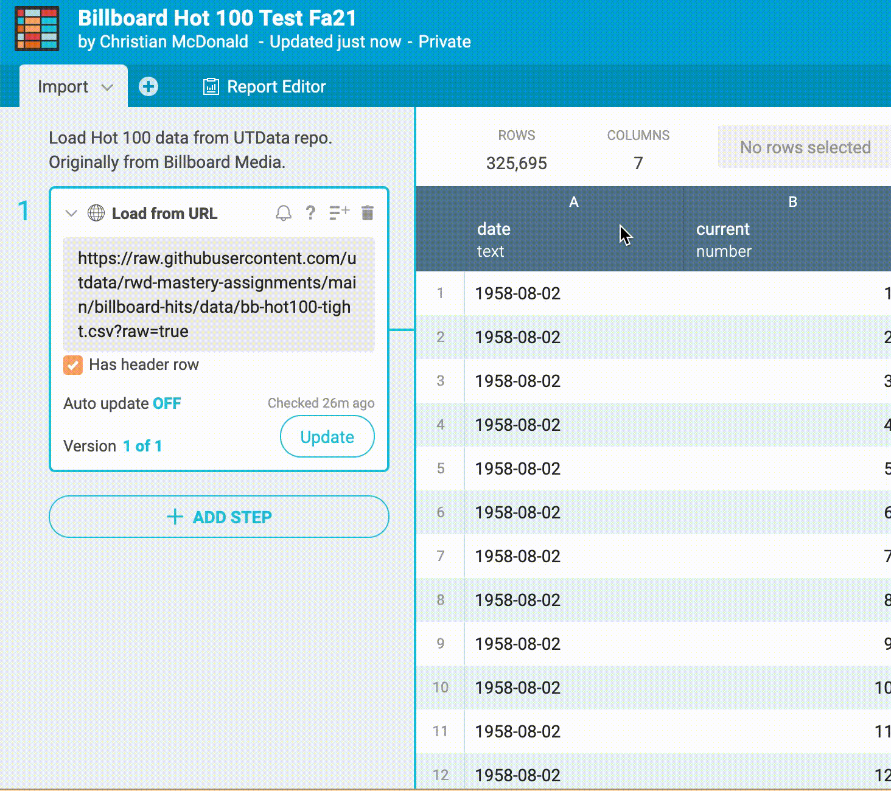

You could do the same thing using **+ ADD STEP** and filling out the options the same way.

### Fix other numbers

For the number columns that came in as text, we can fix them all at once.

- Add a step for **Convert to number**.
- In the column field add the three columns we want to convert: `previous`, `peak` and `weeks`.
- For **Integer or decimal** we want to choose _Only integer_. In all cases for these three columns, these will be whole numbers. (_Any number_ would probably be fine, too.)
- For **Thousands and decimal separators** we want the _United States_ version.
- We want to **Convert errors to null**. This will make our "NA" columns blank, which is what we want in this case.
- Display as _Integer, no commas_.

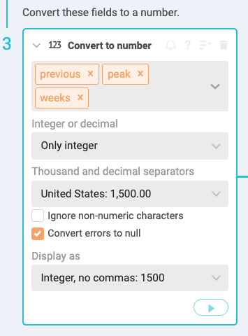

When you do this step, you might notice that the **previous** column shows _null_ for the first 100 values. That is because started as _NA_, which is not a number. That is because this was the first week of the chart and there was no _previous_ value for those songs. In short, this is OK and as expected, but generally you need to watch out for such things.

## Top 10 Artists

Now to find the most popular artist in the history of the Hot 100. Who did you guess?

Since each row of data is an appearance on the chart, we just need to group the data by `artist` and then count how many rows each performer has.

### Import data from a tab

- Start a new tab. (Each _answer_ we seek will be at the end of a tab, though sometimes we'll use multiple tabs to get to an answer. If we started grouping our data on the **Import** tab then we wouldn't be able to use our cleaned data for the other answers.)
- Use **Start from tab** function and choose the **Import** tab. (This will give you the last step from the Import tab.)
- Name your tab **Top Artists**.

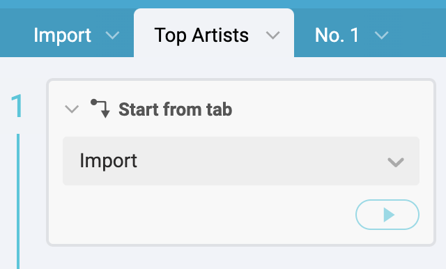

### Group and aggregate

Most data science languages separate [Group and Aggregate](https://vimeo.com/showcase/7320305/video/435910349) into separate terms because you define values in each part separately. Workbench does the same, but they are in the same "Step" in the graphical interface. The function is called **Group** and the aggregation is called the **Operation** within the step.

- Start a new step and choose the **Group** function.
- For **Select column** type in `artist`. (Also note the type-assist as you enter the column name. Once you've typed enough of a column name to select it, you can hit **Return** on your keyboard to select that field.)
  - (A little explanation: When we Group by `artist`, we are organizing the data to put all the rows with the same Artist together before we perform some kind of math on them: Counting, Summing or whatever. So we are organizing the data to have all the ABBA rows together, then all the B.B. King rows, etc.)
- For **Operations** keep the _Count_ selection, but go ahead and click on that menu to see the other possibilities. (This is the **Aggregation** step. Workbench combines aggregations with Group because you typically aggregate after grouping.)
- Name the new column **Appearances** because that is what we are doing: Counting the number of weeks this artist has appeared on the Hot 100 for each song.
- **Add a note** to the step that explains what you are doing. If you roll your cursor over the step title you'll get icons, including the note button outlined below. Use notes like this to explain to your future self or readers what you are doing in the step. (Go ahead and add notes to your previous steps, too.)


We could add more aggregations here by clicking on the **+ ADD** icon at the bottom of the Operations sub-step. In doing so, we could add new columns to our table with using different methods in the Operations dropdown. This is much like a Pivot Table in Excel or Sheets. You'll likely need to use multiple aggregations in later assignments.

### Sorting data

Now we have a list of artists and how many times they've been on the chart, but we want to know who has been there the most. For this we need to [Sort](https://vimeo.com/showcase/7320305/video/435910315) the data. (This simple operation comes in many different names in data science languages: "Arrange" in R, "Order by" in Python and SQL.)

- Add a new step and choose the **Sort** function.
- Add the column we need, `Appearances`, in the **By** menu.
- Click on the **Descending** button. (Journalists usually want the _most_ of everything.)
- For the **Keep top** item, type in `10`. (We are going to keep only the top 10 records of our list so we can make a chart later.)
- Don't forget to add your note to the step! (I want you to do this for each step, but I'm not going to remind you anymore.)


> Note you could also do this from the drop-down on the column like we did when we converted the date.

### Making a chart

We have data for the 10 artists with the most weeks on the Hot 100. It might be easier to see the difference in popularity if we made a simple bar chart from the data.

We are going to use the **Column Chart** function in Workbench.

> Workbench's charting tools are really only good enough for internal use to _see_ your analysis. If you want to publish a chart for the public, then I suggest you use [Datawrapper](https://www.datawrapper.de/) which we will get do later in the semester.

- Add a new step and choose **Column Chart**.
- For the **X axis** use the `artist` column.
- For the **Y axis** use the `Appearances` column.
- Give your chart a descriptive title.
- Rename you Y axis to "Artist" so it will be capitalized.


Congrats! You have made a chart of the most popular Artists in the history of the Hot 100. A little bit of history here ... Taylor Swift overcame Elton John for the top spot in 2019. Elton's been around for a long time, but Taylor popularity at a young age has rocketed her above him.

## Most songs at No. 1

So, Taylor Swift is the top queen of pop. (Don't worry, Madonna makes an appearance later). But who has had the most No. 1 songs on the charts? Any guesses?

Before we dive in, I'll explain the concept of how we will get there. Our goal is to count the number of titles each artist has had to reach No. 1. To do that, we'll filter out data to just No. 1 songs, then deduplicate it so we don't overcount songs that were on the chart more than one week, then we can group and count the artist. Simple, right?

OK, into the pool we go:

- Start a new tab and call it **No. 1**.
- Use the **Start from tab** function and again start from the **Import** tab.

### Filtering data

To get our answer, we need to consider only No. 1 songs from our table. We'll do this using another Basic Data Journalism Function [Filter](https://vimeo.com/showcase/7320305/video/435910359). We'll take the list of songs at any position and we'll choose only the songs that have "1" as their `current` position. (Or we could use `peak` since you can't get any "higher" than No. 1.)

There are two types of filters in Workbench: **Filter by condition** and **Filter by value**.

_Filter by condition_ allows you to define a rule that must be true to keep or delete rows, and the rules you can set depend on the datatype. You can filter before or after dates, greater than or less than numbers, and pick characters out of text, etc.

_Filter by value_ allows you to pick from the values in a column, typically handy when there are a limited number of selections. It can be very precise, though, where filter by condition can sometimes catch or exclude unwanted values if you aren't careful defining your rules.

- Start a new step and choose **Filter by condition**.
  - In the **IF** field, select the `current` column.
  - For **Select condition**, choose **Number is**.
  - For **Value** type in `1`.
  - On the radio buttons below the step, choose to **Keep** the rows and play the step.

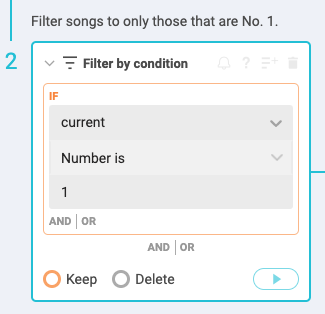

Now we have a list of songs when they were No. 1 on the charts.

Note in the **Filter by condition** step that you can have more than one condition within each IF statement by clicking on the "AND|OR" within the IF box. You can also add a new IF statement by clicking on the  **AND|OR** button below the IF box. This allows you to control the order of operations of some pretty complex conditional statements.

And, by having the choice to Keep or Delete rows, you can either find things you want to focus on, or find things you want to exclude.

### Deduplicating data

Right now we have all information about songs that are No. 1 for each week since Aug. 1958. (Like Ricky Nelson's _Poor Little Fool_ is listed twice.) Before we can count the number of times an Artist has had a No. 1 song, we need to adjust our data to show each No. 1 Artist/Title combination only once. (Right now it is listed for each week the song is at No. 1.)

There are a couple of ways to achieve this and both take multiple steps. The method we will use is a little easier to follow, IMHO.

- Start a new step and choose the **Select columns** function.
- For **Select columns** dropdown, add `title` and `artist`.

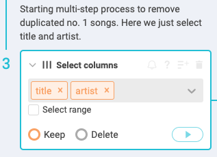

You've used yet another "Basic function of data journalism" by "Selecting" columns.

Look through the resulting list and you'll see that Title/Artist combinations are listed more than once. We need to deduplicate that list so they only appear once so we can count the Artist only once per Title.

- Add a step and choose the **Deduplicate** function.
  - For the **Find duplicate in** list, add `title` and `artist`.
  - In the **and** function, choose to **Delete duplicate rows**.
  - Play the step.

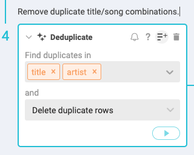

Now each Title/Artist combination is only listed once. You might notice in the results that when an Artist collaborates with another performer, they are listed with their collaborators. 50 Cent has at least three No. 1 hits, but only one of them by himself. We're going to leave this like this and consider collaborators together. (If we wanted to count all contributions to No. 1 songs, we would have to go a different route.)

### Group and count

Now that we have our deduplicated list of Title/Artists, we simply have to Group and Count the number of times an Artist appears on our data.

- Start a new step and choose the **Group** function.
  - For columns, select `artist`.
  - Keep the **Count** aggregation.
  - Name your new column "No. 1 hits".

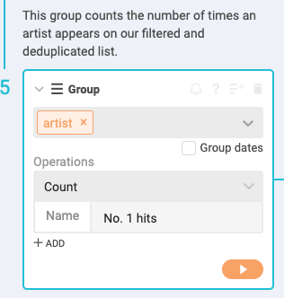

### Sort the list

Now we have the number of No. 1 hits by each performer, but we need to **Sort** to find out who had the most.

- Start a new step and choose the **Sort** function.
- For **By** choose your `No. 1 hits` column.
- For **Keep** add in `10` rows.
- Choose **Descending** and play the step.

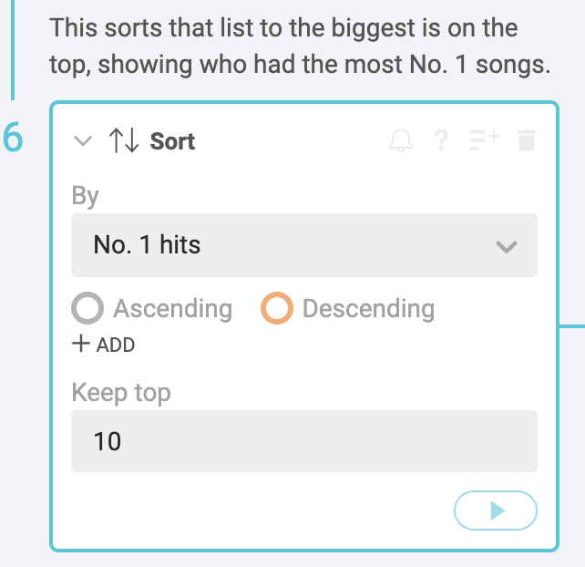

How was your guess? Are you surprised? Which artists in the list have the best chance of overcoming the top performer in this list? That might serve as an angle for your data drop.

## Most No. 1 hits in past five years

Our next quest is quite similar to our last one: We want to find who has had the most No. 1 hits in the past five years. We can save ourselves some work by duplicating our last workflow and then modifying it to get our new answer.

> Have some care when duplicating tabs. You don't want to re-import data into your project. Your Import tabs should always stop with cleaned data and then you use that result in new tabs for any further analysis.

### Add a filter in mid-workflow

- Click on the dropdown in the "No. 1" tab name and choose **Duplicate**.
- Rename this tab **No. 1 recent**.

Now look at all the steps of this workflow and think where you can add a filter for on `date` to only consider the past five years. It definitely needs to be before we use **Select columns** because we lose the `date` field at that point.

- Put your cursor just under the first Import step and click the orange **+** sign to add a new step.
- Choose the **Filter by condition** function.
  - Add the `date` to the column selector.
  - For Select condition, choose **Date is after**.
  - Type in 2015-12-31 in the **Value** field.

The condition "Date is after" does _not_ include the date we are using, so we actually have to pick the day BEFORE the date we want to start keeping data. If we wanted to also add bounds of an end date to consider, we could add an "AND" to our IF statement and use "Date is before". Our data only goes through 2020 so we only need to set the lower bounds.

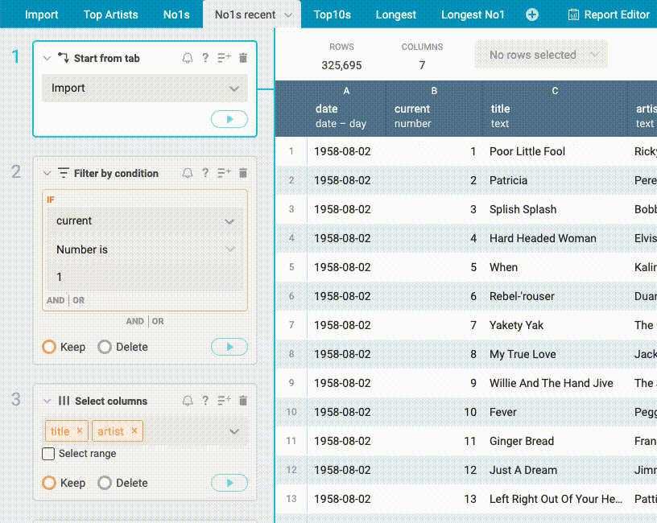

Now you can go to the last step in the workflow and see how the answers have changed compared to our previous tab.

## Most Top 10 hits

Now that you've seen that we can duplicate a workflow and make changes to it, consider this: If we wanted to find which artist had the most Top 10 hits on the charts (as opposed to just No. 1 hits), how could we use our earlier tab for No. 1s?

I'm going to let you do this on your own, but here is a pretty big hint: Duplicate the "No. 1" tab and then look through the steps and see how you could adjust the workflow to look at songs in the Top 10 instead of just No. 1. Note that the "top" of the chart includes smaller `current` numbers, not larger ones.

Name the tab **Top 10 hits** so I can find your answer.

## Title/Artist combo longest on the charts

Next we want to learn which song has been on Hot 100 the most number of weeks at any position. Again, this is a simple "Group and Count" challenge. Each row is a song on the chart, right? We want to count them based on the combination of `title` and `artist`. First, make a guess. I'll be **shocked** if you guess correctly.

> Try this on your own before following the steps below to see if you can figure it out own your own. It's similar to our first quest to find the performer with the most appearances, but this time you have to consider both the title and artist.

- Start a new tab and call it **Longest**.
- Use **Start from tab** and use the Import tab.
- Start a new step and choose the **Group** function.
  - For the columns, add `title` and `artist`.
  - For the **Operation**, keep **Count** since we are just counting how many times this title/artist combination appears on the data.
  - Name the new column "Appearances".

Now we have how many times a song has appeared, but who has appeared the most? That's a simple **Sort**.

- Add a new step and choose the **Sort** function.
  - Choose `Appearances` for your columns.
  - Set the order to **Descending** and run the step.

How was your guess?

## Longest at No. 1

History was made in the summer of 2019, and it's time to put it into perspective. What title/artist combination was at No. 1 for the most weeks?

This is pretty similar to our last quest, but we need to consider songs only at No. 1 instead of all songs. Figure this one out on your own, but consider what we've done for other questions like this.

## Make your Workflow public

- Click on the **Share** button at the top-right of Workbench.
- Click the first checkbox that shares your workflow with the world.
- When you start the writing part of this assignment, add that **Public link** URL to your story.


## Make a Report

Reports in Workbench are online notebooks where you can collect all your "answers" from your data and explain what they are. These are super useful to share with editors and collaborators, but can also be used as a methodology to explain to readers how we arrived at our answers.

You write reports to an audience, so they need to have complete sentences and such. You don't have to explain **How** you got your answers (You could link to the workflow), but you do need to explain your findings along with any caveats that should be noted. Workbench allows you to also embed the tables and charts you make right into the document.

This Report feature uses a popular documentation syntax called [Markdown](https://www.markdownguide.org/getting-started/). Markdown is a way you can write with plain text but the result can be easily converted into a nice-looking HTML page, which Workbench does. Markdown is not hard to learn, but you might open the [cheat sheet](https://www.markdownguide.org/cheat-sheet/) as a guide or maybe oven do a [tutorial](https://commonmark.org/help/tutorial/) when you get a chance.

> FWIW, this tutorial was written in Markdown, and Github converted into this pretty page automagically!

It's probably easier to show you how the report works than write about it, but let me say this:

- Click on the tab called **Report Editor**. You'll see the following:

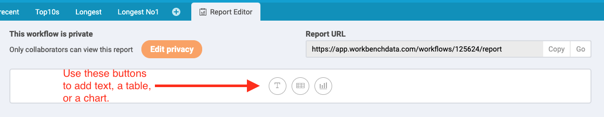

At the top you'll noticed the privacy setting and the report URL. You'll want to make your Workflow public before sharing this link with me.

You'll next notice the three buttons for text, tables and charts.

- Click on the **T** button to create a text block.
- Add a headline like this: `# Billboard Hot 100 Analysis`.
- Add a blank line, and then on another line add your name like a byline: `By Your Name`.
- Add another blank line then the next paragraph of text: `Here we take a look at the Billboard Hot 100 since it debuted in August, 1958 through the year 2020. The data comes from Billboard Media, gathered through their API by Sean Miller and cleaned by Christian McDonald.`

It should look like this:

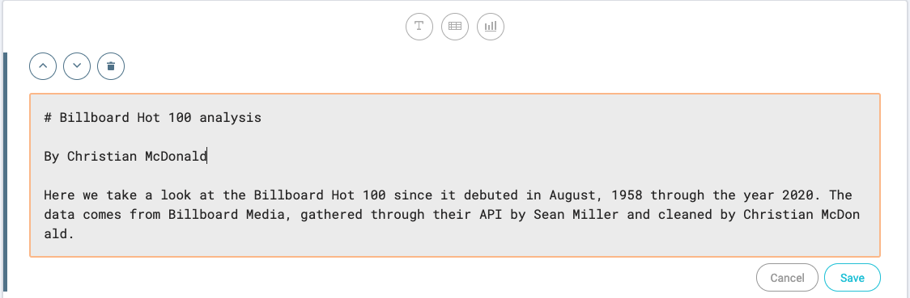

- Click the **Save** button.

Once you click save your text will be rendered as nice, pretty text.

A bit about the Markdown you used:

1. The single `#` at the beginning of the first line makes that an `<h1>` in HTML, which is the biggest headline. The more `##` you add the smaller the headline.
2. You should have a blank line between each element, like headlines and text.

- Add another text chunk and add the following text:

```txt
## Artist with most appearances

This look at the data counts the number of songs an artist has had on the Hot 100 at any position. One caveat is it counts artist by unique name so it won't catch collaborations. In other words, all Taylor Swift songs are counted together, but not songs like _Bad Blood_ by "Taylor Swift and Taylor Swift Featuring Kendrick Lamar".
```

- Now click on the **table** button and choose your **Top Artists** tab. This will add the last table from that tab.
- Now choose the **chart** button and choose the same **Top Artists** tab and it will insert the chart.

Pretty easy, right? A few more things to note:

1. If you have a text box open for editing and then click over to another tab in the workflow, you'll lose your changes. Save the text block first.
2. You can rearrange blocks with the up and down arrows.
3. You can use the **Go** button at the top to see what your finished report will look like. And you can share that link with your editors, collaborators or the public.

### Finish the report

- Go ahead and add new text blocks that explain each "finding" in this workflow and include any necessary caveats to make your findings clear. Embed tables as necessary.

## Write a data drop

Now for part II of this assignment.

Write a "Data Drop" (a short story based on the data) that includes your findings. In this case (and this is the only case for this class) you can add some personal flavor in the story. Do use AP Style, limiting numbers in the story and all the things we've learn about in writing about data, including describing the source of the data.

Some specifics:

- You need at least four of the six data points (or alternatives you've found on you own) in your story.
- Five to six paragraphs is sufficient length if your data points are explained well. You can write more if you like, but make sure you have the data points.
- Please, for the love of the data gods: Craft your lede around a data point!!
- Again, you can have a personal flavor to this, but don't forget the data. That's what I'm grading.

## Turning in your assignment

A couple of notes before you submit to Canvas:

- Turn in your story as a Microsoft Word Doc
- Include a headline that fits your story
- Include links to your Workflow and report at the top of the Word doc.
- Upload the doc to the Canvas assignment.

## Soundtrack for this assignment

This lesson was constructed with the vibes of [The Bright Light Social Hour](https://www.thebrightlightsocialhour.com/home). They've never had a song on the Hot 100 (at least not through 2020).

## Ignore this

- [For the instructor](https://app.workbenchdata.com/workflows/125624/).
