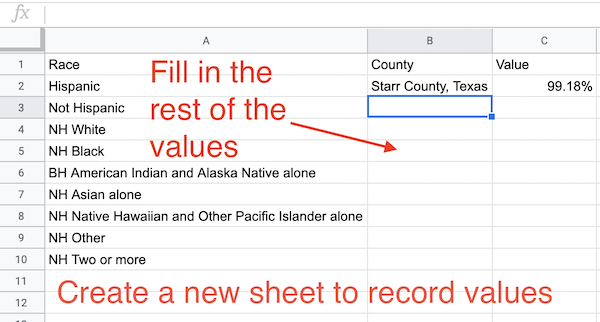

# Rubric for Google Sheets assignment

Knowing how to do math within data is an important concept in data journalism. While many of the "Excel" formulas used here in Sheets can also be applied in Workbench, the concept carries over to most data tools with differing syntax.

The assignment is not hard and even a bit manufactured, but the purpose is to expose you both to "Excel" formulas (which work in Sheets) and the concept of creating values from other fields in a row of data.

## Goal of this assignment

The goal here is to find which counties in Texas have the highest proportion of a specific race. To do this, you'll need to create columns that find the percentage of the total for each race, then sort by those columns to find the answers and write them out on a new sheet.

> Note that the margin of error columns have been removed from this dataset for clarity and ease. This is not normal practice, and we'll talk about it in class.

> You might review the [Google Sheets tutorial](https://multimedia.journalism.berkeley.edu/tutorials/spreadsheets/) by Berkeley for concepts on importing, creating formulas, etc.

> In addition, [this screencast](https://drive.google.com/open?id=1wJEJH71tPgLu0r7Uvz7iwElXhlALnuGX) shows the first few steps for reference.

## Download the data

See the [main README.md](README.md) for more information on where the data came from.

- Download [the data](ACSDT5Y2017.B03002.csv?raw=true), then import it into a new Google Sheets file.
- As you import, choose NOT to convert to numbers. The `id` column should start with one or more `0`'s. If it doesn't, it's wrong.

## Create percentage columns

- Lock the header row and columns after the county name. I'll count off if you don't.
- For each race, create a new column that shows the percentage (to hundredths) of that race for each county.
- As you do so, use the `$` method to lock the `Total` column so you can copy the formula to additional columns. Points counted off if you don't.

## Record the answers

- After you've added all the columns, sort by each percentage and find the county with the highest population for that race. After sorting a race, write those answers out on another sheet with the Race, County Name and Percentage. HINT: Cmd-option-V will paste values only.

- Share the sheet with me or make it viewable by all and submit the URL in canvas.

## Ignore this

[A link for me](https://docs.google.com/spreadsheets/d/1unx5IuH-fNcZZcHEPD_5w74XFixtmSPXmOPuEGOdrwM/edit#gid=245873501).
