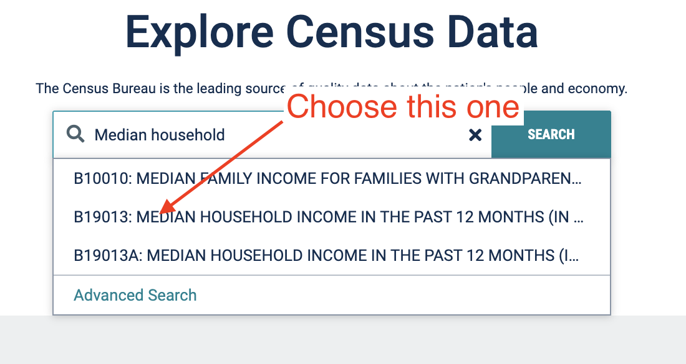

# Median Income from the Census Bureau

## Find the data

As noted in the Census lecture, data.census.gov is a work in progress. Directions given here may get outdated as the platform is improved.

- Go to [data.census.gov](https://data.census.gov) and search for "Median Household Income". As you search, you'll see some results in the dropdown, hopefully like this:

Choose the table "B19013: MEDIAN HOUSEHOLD INCOME IN THE PAST 12 MONTHS (IN 2018 INFLATION-ADJUSTED DOLLARS)" from the dropdown.

> NOTE: If you hit the **Search** button to complete the search, you'll get a listing of many tables that could include that value, but unfortunately this table is not among them. The Advanced Search is also frustrating. We can only hope it gets better. If you have trouble, [this is the link](https://data.census.gov/cedsci/table?hidePreview=true&q=B19013%3A%20MEDIAN%20HOUSEHOLD%20INCOME%20IN%20THE%20PAST%2012%20MONTHS%20%28IN%202018%20INFLATION-ADJUSTED%20DOLLARS%29&table=B19013&tid=ACSDT1Y2018.B19013&lastDisplayedRow=0&g=0400000US48.050000).

You should end up with the table like this:

## Selecting Geographies

Our default view gives us the Median Household Income "Estimate" and "Margin of Error" for the entire United States. What we want is the counties in Texas, so we will have to adjust our Geography.

- Click on the **Geographies** button in the toolbar.
- For **Geography**, choose _County_.
- For **County**, we want to filter down to _Texas_, so choose that from the list.
- Under **Texas**, choose _All counties in Texas_.
- Click the **Hide** button at the top-right.

Once the Geographies box goes away, you'll see the data is divided into counties.

## Download the data

- Click on the **Download** button from the toolbar. You should see a window like below.
- Choose the 1-year dataset for the two most recent years.

> NOTE ON ACS 1-YEAR VS 5-YEAR: As noted in the lecture, the American Community Survey releases data every year for geographic populations of 65,000 people or more, but for smaller populations they combine surveys over five years. We want to compare the two most recent years, so we'll be working with the 1-year data set. Unfortunately, that means we'll only the largest 53 counties out of 254 in Texas.

- Click the **Download** button at bottom-right. This only _prepares_ your data for download.
- Click the **Download now** button to start the actual download.

The data will download as a `.zip` file which you will need to extract. On a Mac, you can just double-click it and a folder will appear with all your files. On Windows, you might have to right-click on the file to select Extract All, and then follow the instructions.

## Tour the downloaded files

There will be six files download, three for each year:

- The data is in `ACSDT1Y2017.B19013_data_with_overlays` with the download date and time following.
  - The filename starts with the ACSDT1Y because it is the ACS 1-year data table.
  - Then the year of the release, 2017 in my example.
  - After the dot is the table ID B19013.
  - If you peek at the data, you'll fnd file has two headers, hence the "data_with_overlays". The first row is a header of codes. The second is a very long description. Having these two headers is a headache in every possible sense when you want to import the data into any other program.

- The `_metadata_` file has a listing of all the headers in the data file. This is useful if it is a really wide table.
- the `_table_title_` file describes the data sources.

Make sure you know where this data is on your hard drive, as we'll be accessing it in the next lesson.

## Rubrics

- [Sheets/Workbench](rubric-wb.md)
