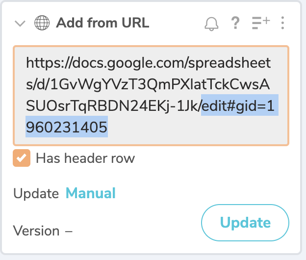

# Median Income using Sheets/Workbench

## Goals of this assignment

- To find and download Median Household Income data from the data.census.gov for the two most recent years. We want Texas' largest counties using the 1-year ACS. Download instructions are in the main [README.md](README.md).
- To import that data into Google Sheets and clean up the header rows.
- To connect to the Google Sheets data from Workbench.
- To find the counties were income rose or fell.

## Import into Google Sheets

To be honest, we could just upload our census files directly into Workbench, but we have to deal with the double header rows. (I do have directions for that below for reference). But instead we are going to go through Sheets because we need to clean up the headers AND I want to show you a neat trick to import Sheets into Workbench, which could prove useful for you some day in the future.

- Start a new Google spreadsheet. (The quickest way is to type `sheets.new` in a new browser window.
- Use **File > Import** and find your first `data_with_overlays` file and import it. BE SURE you _do not_ convert the numbers.
- You'll see the first row has headers, but they are IDs that aren't very understandable. Use the values in the second row to rename your column headers to something short and understandable, like **MHI2017** and **MHIMOE2017**. (That's **M**edian **H**ousehold **I**ncome.)
- Now you can delete the second row.
- Title your workbook "Median Household Income by County 2017".
- Use the **Share** button and the **Advanced** tab to make your sheet available to anyone with the link. If you don't share the document, Workbench won't be able to find it.
- Repeat the stops above for your 2018 data (or whatever your two years are.)

## Import from Sheets into Workbench

- Launch [Workbench](https://app.workbenchdata.com) and start a new workflow.
- Name the workflow as "Yourname median income".
- For the import choose **Add from URL**.
- Copy and paste your Sheets URL here, but don't click OK yet.
- Look at the URL you pasted and delete the end where it starts with `edit`. I've highlighted the section to delete below.

- Now append this to the end of the URL:

`gviz/tq?tqx=out:csv`

- Go ahead and run the import and it should bring you data into workbench.
- Follow the same steps in a new tab for the other data set.

> If you put your two data sets into the same Sheets workbook, you might have to amend your URL like this: `gviz/tq?tqx=out:csv&sheet={sheet_name}` where `{sheet_name}` is the name of your sheet without the curly braces. Make that a simple name that starts with a letter and has no spaces to save headaches.
> How did I know this would work? I just guessed there must be a way to access a Google Sheet as a csv file, so I [Googled it](https://www.google.com/search?ei=S5uPXYGtBMjwtAWlprrADg&q=View+google+sheet+as+csv+url&oq=View+google+sheet+as+csv+url&gs_l=psy-ab.3..33i22i29i30l2.1863.3505..3934...0.2..0.134.416.2j2......0....1..gws-wiz.......0i71.OIkQk-bM6Dg&ved=0ahUKEwjB_tiaiPTkAhVIOK0KHSWTDugQ4dUDCAs&uact=5). One article I found was [this one](https://stackoverflow.com/questions/33713084/download-link-for-google-spreadsheets-csv-export-with-multiple-sheets), which allowed me to figure it out after a little trial and error.

## Import directly into Workbench

> Don't do this if you have already imported from Sheets. Skip to the next section. This is just for reference.

You can import the census files directly into Workbench with a little effort. This covers a file for 2017, but adjust the years accordingly.

- Workbench won't understand the filename of the downloaded file because it has a `.` in the name. Rename the `data_with_overlays` file to something more simple like `data2017.csv`.
- In a new tab, use the **Upload** option using the "Data has headers" option.
- You'll notice the second header is treated as data. Before you delete it, you might first rename your columns "B19013_001E" to **MHI2017** and "B19013_001M" to **MHIMOE2017** or something you understand.
- Now you can delete the extra header row by clicking on row `1` and then using the **1 row selected** button dropdown to choose **Delete Selected Rows**.
- Now you have to convert columns `C` and `D` to numbers since they were imported as text. You can do that on the dropdowns for those columns.

## Join the data

Before we can do math to compare the median incomes for both years, we have to have both sets of data in the same sheet. We'll do that with a join.

- To preserve any changes we might have to later do to the original data, we'll **Start a new tab** from the older data set.
- Use a **Join tab** step set to connect to the newer data set.
  - Join on both the GEOID and NAME columns.
  - Add both your columns from the newer data set.
  - Choose a **Left** Join Type.

> We chose a Left join to make sure we have the same counties in both data sets. We would end up with some NULL values if the left table had more counties than the right table.

## Find the answers

We can use Excel/Sheets formulas in Workbench to create new columns. This is how we'll figure out if income has gone up or down in different counties. Here is what we'll find out:

- What is the difference between incomes from one year to the next?
- What is the percent change in that income?
- How many counties went up or down?
- Which counties have a median income estimate with a large margin of error?

As an overview, when you use [Formulas](http://help.workbenchdata.com/en/articles/1963882-formulas) in Workbench, the process will create a new column with the result of the formula. You write the formula as if you were doing it on the first row, but Workbench will apply it to all the rows when you use the **Apply to all rows** option.

As we do these formulas, your column numbers may differ from mine, so pay close attention to the **values** that are referenced as opposed to the column numbers.

### Difference between two columns

The first column we'll create is the difference (subtraction) of the "new year" minus the "old year".

- At the end of your "Combined" tab, add a new step using **Formulas**.
- It should default to **Excel**.
- For the Formula, you should start it with `=` and then start with the new income column and then subtract the older income column. Here is mine, but make sure you are using the correct columns in your data set:

`=E1-C1`

- For the Output column, name it "Diff2018v2017" (or whatever your years are).
- **CHECK THE ANSWER:** Go look at the new column and make sure the values are correct and you didn't flop the column numbers. If the median income went up in the new year, it should be a positive number. If it went down, it should be a negative number.

With this value, you could write about the dollar amount the median household income went up in a given county in the data: The 2018 median household income for Angelina County climbed to $47,519, up from $45,326 the previous year.

### Percent change in median income

If a county had a large median income to begin with, a larger difference might not mean much when compared to the original. We'll use **percent change** to see the relative difference between the two years.

The formula for percent change is: `=((new_year - old_year) / old_year)`. I [looked this up](https://www.robertniles.com/stats/percent.shtml) each time for years, but I remember the order now with this question: Do journalists like math? NOO! New - Old / Old.

- Create a new **Formula** step.
- Include a new name for the column, like "PrcChng17to18".
- For the formula, use the one listed above. For me it is this:

`=((E1-C1)/C1)`

This gives us a very long percentage value like "0.04838282663372016", which might be nice to convert to a real percent. Luckily there is a function for that in Workbench.

- Either by choosing the dropdown on the new column or creating a new step, choose **Format numbers**.
- Choose to display as **Percentage**.

Now you can write about the relative change of income in a given county: Travis County's median household income rose to $76,392 in 2018, a 4.8% increase from the previous year.

### How many counties went up or down in income?

To see how many of the 54 largest counties in Texas gained or lost in their median income, we have to somehow categorize the change as "Up" or "Down". Then we can group by that category to count them.

#### Create the up/down column

First, we'll create the category column. We can do this with an `IF` formula. If our Diff2018v2017 column is greater than zero, the value when "Up". If not, it went "Down".

The IF works like this:

`=IF(test, value_if_true, value_if_false)`

- Create a new step and choose **Formula**.
- For the "test" we want to check if our Diff2018v2017 column is greater than zero.
- For the true value, we want to print the text `"Up"`.
- For the false value we want to print the text `"Down"`.

For me, the formula looks like this:

`=IF(G1>0, "Up", "Down")`

- Name your column "UpOrDown".
- **CHECK YOUR RESULTS:** It should be pretty easy to make sure you got your formula right by comparing the results to the Diff2018v2017 or PrcCng columns.

> BONUS: In the 2017 and 2018 data, the median income didn't stay exactly the same for any county. But what if it did? You could use a nested IF statement that first tested if the values were the same. If that answer is false, you could then test again to see if the value is larger and print your values accordingly. [This article explains how](https://www.techonthenet.com/excel/formulas/if_nested.php).

#### Group the up/down

To count how many counties when up or down, now we can group on our new column.

- Create a new tab and start from the Combined tab.
- Rename the new tab "UpOrDownCount".
- Use a Group step on the UpOrDown column and **Count** the rows.

Now you know how many columns gained or lost in median household income: Thirty-five of the 54 largest counties in Texas saw some increase in the median household income from 2017-18.

## Checking margins of error

One thing about the American Community Survey is the data is based on a random sample of the population and is subject to a margin of error. For example, Bastrop County in 2018 had a median household income of $69,067 +/- $13,636. That means if you asked anyone in the county their household income, nine times out of 10 their answer would fall between $55,431 and $82,703. That is a huge range, making the $69,067 kinda squishy.

A rule of thumb with the ACS is to not base a story or important value on a number that has a margin of error greater than 10% of the original. For this Bastrop example, that percentage is almost 20%: (13636/69067 = 0.197). I would not feel comfortable basing a story on that number, or if I did I would certainly point out the high margin of error, which is a concept difficult for readers to digest.

So, how many other MOE's in this data set are above 10%? We can check this by using some of the same skills we've already learned.

- At the bottom of the Combined tab, start a new **Formulas** step.
- Divide your MOE value for your newest year by the Estimate for your newest year.
- Convert the result to a percentage.
- Do the same steps for the older year.

Look over those values (maybe sort them) to see how many fall above 10%. Be careful basing any story on those values.

I would still include these values in a chart or map, but I would note somewhere prominent that some of the values have a large margin of error due to sampling.

## Turn in your work

* Share your workbook with my email.
* Copy the link and submit it to the Canvas assignment.

## For Instructor reference

[Private answers here](https://app.workbenchdata.com/workflows/34231/)
