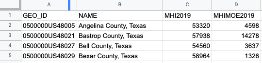
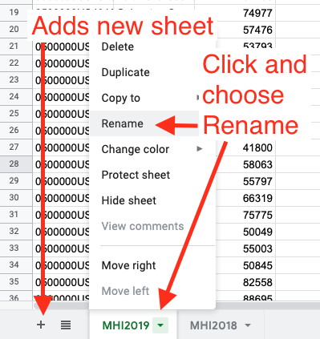
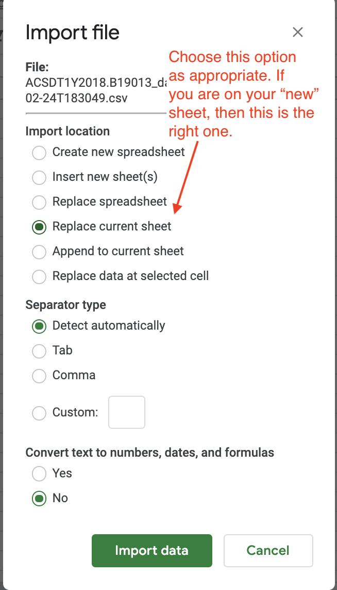
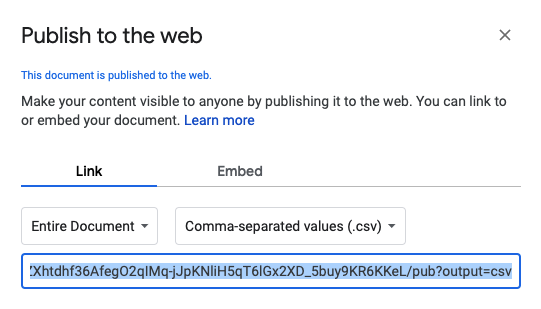
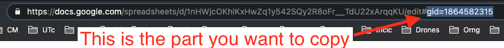
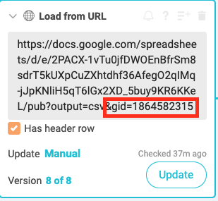
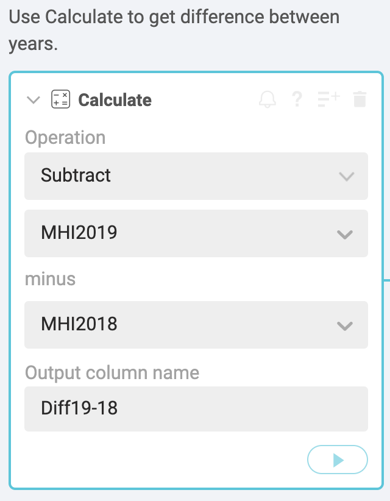
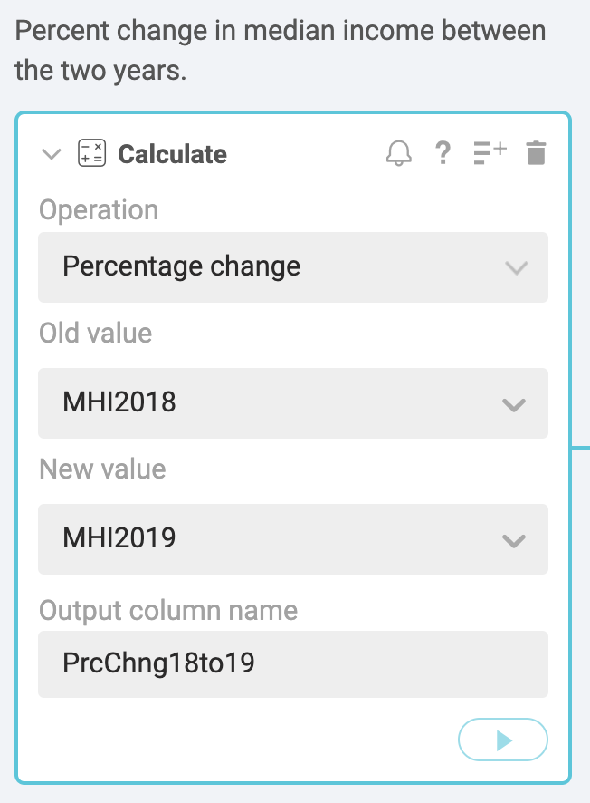

# Median Income using Sheets/Workbench

## Goals of this assignment

- To find and download Median Household Income data from the data.census.gov for the two most recent years. We want Texas' largest counties using the 1-year ACS. Download instructions are in the main [README.md](README.md).
- To import that data into Google Sheets and clean up the header rows.
- To connect to the Google Sheets data from Workbench.
- To find the counties were income rose or fell.

## Import into Google Sheets

To be honest, we could just upload our census files directly into Workbench, but we have to deal with the double header rows. (I do have directions for that below for reference). But instead we are going to go through Sheets because we need to clean up the headers AND I want to show you a neat trick to import Sheets into Workbench, which could prove useful for you some day in the future.

- Start a new Google spreadsheet. (The quickest way is to type `sheets.new` in a new browser window.
- Title your workbook "Median Household Income by County".
- Use **File > Import** and find your first `data_with_overlays` file and import it. BE SURE you _do not_ convert the numbers.
- You'll see the first row has headers, but they are IDs that aren't very understandable. Use the values in the second row as a guide to rename your column headers to something short and understandable, like *MHI2019* and *MHIMOE2019*. (That's **M**edian **H**ousehold **I**ncome and **M**argin **O**f **E**rror.) Make sure you use the year at the end of the column name because you'll eventually end up with two different years for these values.
- Now you can delete the second row of headers. You should now have actual data as your second row.

- Rename your sheet to *MHI2019* (or whatever year) by clicking on the dropdown next to the long sheetname and choosing **Rename**.

### Import the other year to a new sheet

- Within the same workbook, click the **+** button at the bottom-left of sheets to create a new sheet within the same workbook. (See image above.)
- Again, use **File > Import** and find the other year of data. When you get to the import screen, look at it carefully:

- Make the same changes to the header and sheet names as you did above, but use the other year in the names.

### Publish

Next, we'll publish this workbook to the web as a .csv. Here is how you do that.

- Go to **File > Publish to Web**.
  - For **Link**, choose *Entire Document*.
  - For **Embed**, choose *Comma-separated values (.csv)*.
- Once you hit **Publish** you'll be asked to confirm and then that you want to, you'll get a URL back like in the screenshot below.

You'll need that URL for Workbench.

## Import from Sheets into Workbench

- Launch [Workbench](https://app.workbenchdata.com) and start a new workflow.
- Name the workflow as "Yourname median income".
- For the import choose **Add from URL**.
- Copy and paste your Publish to Web URL from Sheets into here.
- Go ahead and run the import and it should bring you data into workbench.
- Rename the tab to *MHI2019* or whatever year you have.

Now that is a skill you might use again ... to import a Google Sheets data into Workbench. You can actually continue to make changes to your data, then come here and click the **Update** button to get the freshest data.

### Importing the second year of data

For the second year of data, we need to do something a little bit different because that Sheet URL only gets you the first sheet of the workbook. We need to make a slight change to get the second sheet with the new year.

- Start a new Workbench tab and name it for your new year.
- Also use **Load from URL** and put in the same url, but we are going to append something to the end of it.
- Go to your Google Sheets doc and click on the second sheet, then look at your URL in your browser bar. We want to copy the last part that is something like this: `gid=1864582315`.

- Now you'll go back to Workbench to that URL in the **Load to URL** section and append a `&` and then your `gid=xx` value. You need both an *ampersand* `&` and your `gid=` bit. Like the part highlighted in red below.

> Your numbers will be different!!!

## Join the data

Before we can do math to compare the median incomes for both years, we have to have both sets of data in the same sheet. We'll do that with a join.

- Create a new tab in Workbench.
- Use **Start from tab** option and choose the older data set.
- Use a **Join tab** step set to connect to the newer data set.
  - Join on both the GEOID and NAME columns.
  - Add both your columns from the newer data set.
  - Choose a **Left** Join Type.

> We chose a Left join to make sure we have the same counties in both data sets. We would end up with some NULL values if the left table had more counties than the right table.

## Find the answers

We can use Excel/Sheets formulas in Workbench to create new columns. This is how we'll figure out if income has gone up or down in different counties. Here is what we'll find out:

- What is the difference between incomes from one year to the next?
- What is the percent change in that income?
- How many counties went up or down?
- Which counties have a median income estimate with a large margin of error?

As an overview, when you use [Formulas](http://help.workbenchdata.com/en/articles/1963882-formulas) in Workbench, the process will create a new column with the result of the formula. You write the formula as if you were doing it on the first row, but Workbench will apply it to all the rows when you use the **Apply to all rows** option.

As we do these formulas, your column numbers may differ from mine, so pay close attention to the **values** that are referenced as opposed to the column numbers.

### Difference between two columns

The first column we'll create is the difference (subtraction) of the "new year" minus the "old year".

- Use the **Calculate** function to subtract the old year from the new year.
- Name the new column *Diff19v18*.

Now you could write a sentence about the dollar amount the median income when up or down in a given county: Travis County's median income increased $80,726 in 2019, $4,334 more than the previous year.

### Percent change in median income

- Use **Calculate** to find the percent change from the old year to the new year.
- Name the new column *PrcChng18to19*.

Now you can write about the relative change of income in a given county: Travis County's median household income rose to $80,726 in 2019, a 5.7% increase from the previous year.

> NOTE: Both of the sentences we've written are subject to a margin of error, which we'll get to in a minute.

## Excel formulas in Workbench

For our next answer, there isn't a pre-configured calculation in Workbench, so we will use an Excel formula.

### How many counties went up or down in income?

To see how many of the 54 largest counties in Texas gained or lost in their median income, we have to somehow categorize the change as "Up" or "Down". Then we can group by that category to count them.

#### Create the up/down column

First, we'll create the category column. We can do this with an `IF` formula. If our Diff18v19 column is greater than zero, the value when "Up". If not, it went "Down".

The IF works like this:

`=IF(test, value_if_true, value_if_false)`

- Create a new step and choose **Formula**.
- For the "test" we want to check if our Diff18v19 column is greater than zero.
- For the true value, we want to print the text `"Up"`.
- For the false value we want to print the text `"Down"`.

For me, the formula looks like this:

`=IF(G1>0, "Up", "Down")`

- Name your column "UpOrDown".
- **CHECK YOUR RESULTS:** It should be pretty easy to make sure you got your formula right by comparing the results to the Diff2018v2017 or PrcCng columns.

> WHAT IF THEY ARE EQUAL? In the 2018 and 2019 data, the median income didn't stay exactly the same for any county. But what if it did? You could use a nested IF statement that first tested if the values were the same. If that answer is false, you could then test again to see if the value is larger and print your values accordingly. [This article explains how](https://www.techonthenet.com/excel/formulas/if_nested.php).

#### Group the up/down

To count how many counties when up or down, now we can group on our new column.

- Create a new tab and start from the Combined tab.
- Rename the new tab "UpOrDownCount".
- Use a Group step on the UpOrDown column and **Count** the rows.

Now you know how many columns gained or lost in median household income: All but three of the states largest 54 counties saw some increase in the median household income from 2017-18.

## Checking margins of error

One thing about the American Community Survey is the data is based on a random sample of the population and is subject to a margin of error. For example, Bastrop County in 2019 had a median household income of $57,938 +/- $14,278. That means if you asked anyone in the county their household income, nine times out of 10 their answer would fall between $43,660 and $72,216. That is a huge range, making the $57,938 kinda squishy.

A rule of thumb with the ACS is to not base a story or important value on a number that has a margin of error greater than 10% of the original. For this Bastrop example, that percentage is almost 25%: (57938/14278 = 0.246). I would not feel comfortable basing a story on that number.

So, how many other MOE's in this data set are above 10%? We can check this by using some of the same skills we've already learned.

### Create MOEMargin column for newer year

- At the bottom of the Combined tab, start a new **Calculate** step.
- Divide your MOE value for your newest year by the Estimate for your newest year.
- Use **Format numbers** on your new column to show it as a percentage.

### Create MOEMargin column for the older year

- Do the same steps for the older year.

Look over those values (maybe sort them or group them) to see how many are at or above 10%. Be careful basing any story on those values.

> I would still include these values in a chart or map, but I would note somewhere prominent that some of the values have a large margin of error due to sampling.

## Turn in your work

- Make you Workbench workflow public or share with my email.
- Copy the link and submit it to the Canvas assignment.

---

## Import directly into Workbench

> This is just a reference on how to import the census files directly into Workbench if you wanted to, skipping the Sheets part. You don't need to do this because you already accomplished it above. This is just for reference.

You can import the census files directly into Workbench with a little effort. This covers a file for 2019, but adjust the years accordingly.

- Workbench won't understand the filename of the downloaded file because it has a `.` in the name. Rename the `data_with_overlays` file to something more simple like `data2019.csv`.
- In a new tab, use the **Upload** option using the "Data has headers" option.
- You'll notice the second header is treated as data. Before you delete it, you might first rename your columns "B19013_001E" to **MHI2019** and "B19013_001M" to **MHIMOE2019** or something you understand.
- Now you can delete the extra header row by clicking on row `1` and then using the **1 row selected** button dropdown to choose **Delete Selected Rows**.
- Now you have to convert columns `C` and `D` to numbers since they were imported as text. You can do that on the dropdowns for those columns.

## For Instructor reference

---

[For my eyes only](https://app.workbenchdata.com/workflows/34231/)
