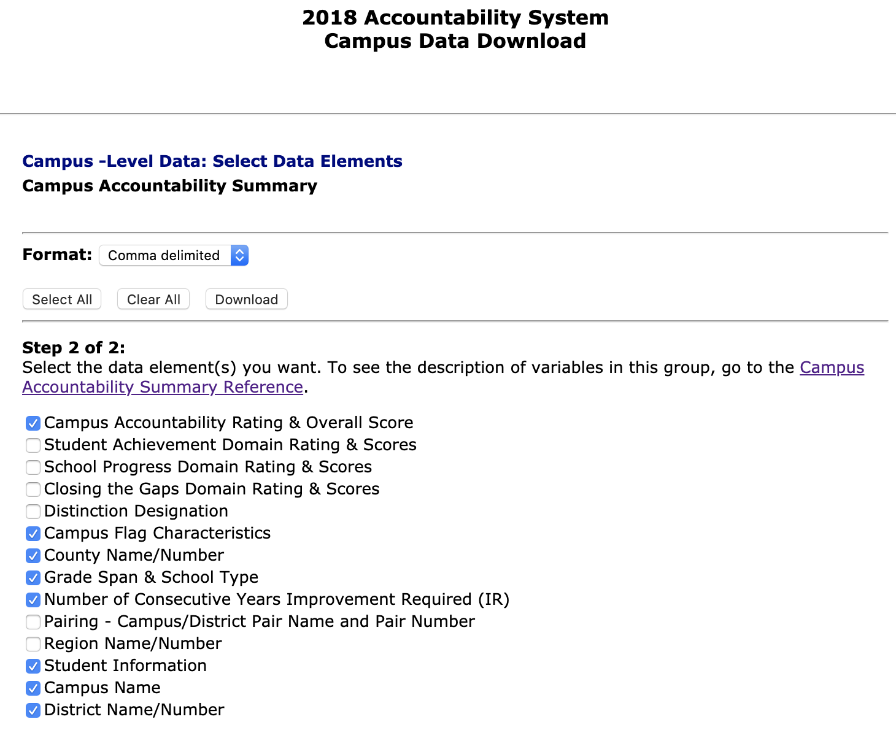

# School accountability ratings

Each year the Texas Education Agency rates public schools based on test scores and other factors. This lesson is based on the 2018 ratings. You will download the data, find the answers to a series of questions and write a short "data drop" about what you learned.

> Note that in 2018 TEA debuted a nice reporting tool at [txschools.gov](https://txschools.gov/). We'll be looking into some questions that can't be answered with this tool alone.

This section will cover downloading and understanding the data. Below you'll find a link to the specified tool to use to find the answers.

## Downloading data

- Start at the [2018 Accountability Ratings site](https://tea.texas.gov/2018accountability.aspx).
- Look for (and use) the [Data Download](https://rptsvr1.tea.texas.gov/perfreport/account/2018/download.html) link.
  - Choose **Campus-level Data**
  - Choose **Accountability Summary**
  - Hit the **Continue** button.
- Choose the columns as follows. Note the Format of comma-delimited:

- While you are on this screen, open in a new tab the link [Campus Accountability Summary Reference](https://rptsvr1.tea.texas.gov/perfreport/account/2018/download/camprate.html). You'll want that.
- **Rename the downloaded file** to `CAMPRATE.csv` (vs the `.dat` extension).

> Note that it is possible to used the Excel download format, but the size of the file is much larger: 9.1 MB vs 1.8 MB. Let's stick with the csv.

## Lessons

- [For Google Sheets](rubric-gs.md)
