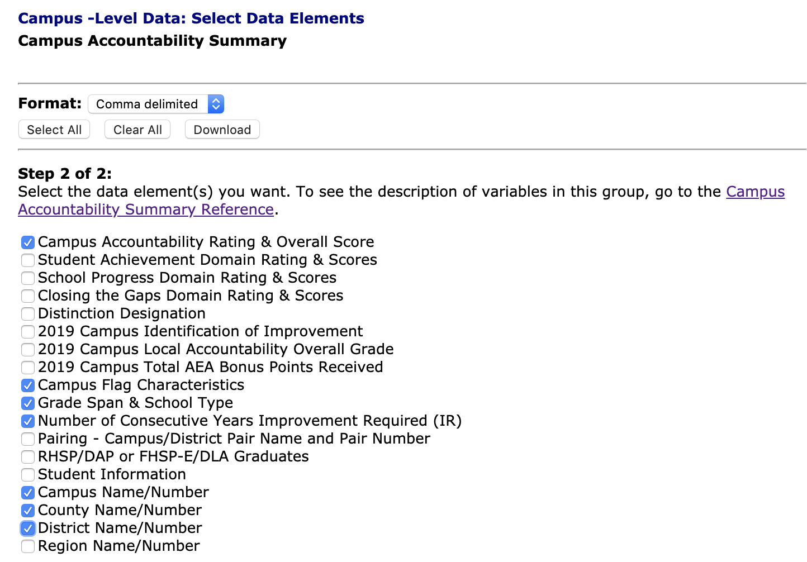

# School accountability ratings

Each year the Texas Education Agency rates public schools based on test scores and other factors. This lesson is based on the 2019 ratings. You will download the data, find the answers to a series of questions and write a short "data drop" about what you learned.

This section will cover downloading and understanding the data. Below you'll find a link to the specified tool to use to find the answers.

## Downloading data

- Start at the [2019 Accountability Ratings site](http://tea.texas.gov/Student_Testing_and_Accountability/Accountability/State_Accountability/Performance_Reporting/2019_Accountability_Rating_System).
- Look for (and go to) the [Data Download](https://rptsvr1.tea.texas.gov/perfreport/account/2019/download.html) link.
  - What type of data would you like to download? Choose **Campus-level Data**.
  - Subset data by selecting the category of information you wish to download: Choose **Accountability Summary**. Click **Continue** to get to the next screen.
  - For _Format_, choose **Comma-Delimited**.
  - You'll need to make a series of selections before downloading.

- Once you've made the selections, go back up and use the **Download** button.
- Hit the **Continue** button.

This will download a file called `CAMPRATE.dat`. **Rename this file** to `CAMPRATE.csv` (vs the `.dat` extension). It's important to change the file extension to `.csv` as Sheets and Workbench don't understand the`.dat` file type. If you can't see the file extensions, then adjust your computer. [Mac](https://support.apple.com/guide/mac-help/show-or-hide-filename-extensions-on-mac-mchlp2304/mac) | [Windows](https://www.thewindowsclub.com/show-file-extensions-in-windows).

> Note that it is possible to used the Excel download format, but the size of the file is much larger: 20.8 MB vs 1.3 MB. Let's stick with the csv.

- While you are on this screen, open in a new tab the link [Campus Accountability Summary Reference](https://rptsvr1.tea.texas.gov/perfreport/account/2019/download/camprate.html), which tells you what each column means.

## Lessons

- [For Google Sheets](rubric-gs.md)
