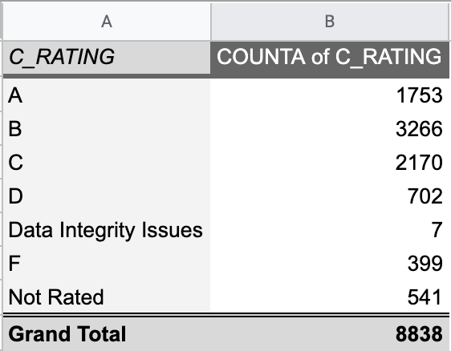
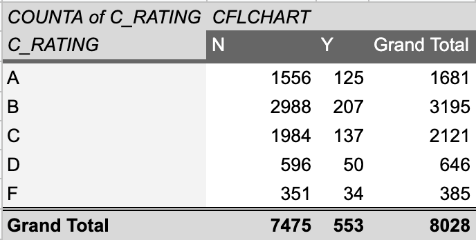

# School ratings for Google Sheets

> See the [main README](README.md) to see how to download the data.
> This assignment provides experiences with pivot tables.

## Our scenario

Today you are the education reporter for an Austin-area media outlet. The Texas Education Agency has released school ratings for all schools and districts in the state. Your editor would like a story posted ASAP with some specific details before you continue to report out the story. (I call these short stories a [Data Drop](https://docs.google.com/document/d/1gd5RR5YK43N3uE0o1vBoJfnkSo5S0JJFUCJmFsa75FM/edit#heading=h.k2b1zvdn1534).)

You editor would like the following details in this first version:

1. Statewide, what percentage of charter schools received an "F" rating, compared to traditional public schools?
2. Which traditional public schools in the Austin/Round Rock MSA received a "F" rating?
3. Which schools in Austin ISD received a "F" rating?

The Austin/Round Rock MSA: Bastrop, Caldwell, Hays, Travis and Williamson counties.

> Of note: We would look further into which local charter schools failed to meet standards, but some schools from other cities like Dallas and San Antonio are listed as Austin because their parent organization is based in Austin (or at least I presume that is why.)

## Import the data into Google Sheets

- Move your data into your project folder
- Start a new Google Sheet.
- Under File, use Import and upload your data file.
- At the import screen, choose the following:

> The part about converting text to numbers can be important. TEA data includes IDs that start with `0`, which you will lose if you don't do this. While not as important for this story, it is a prime example of this type of situation.

## Using Pivots to find our answers

### Create the first pivot table: Ratings

You will use a pivot table to get this answer. Note that you'll be filtering out some schools that are rated on "alternative" standards.

Look through the [Campus Accountability Summary Reference](https://rptsvr1.tea.texas.gov/perfreport/account/2019/download/camprate.html) data dictionary and find the column name that represents this year's "Overall Rating".

- Start a new pivot table: Data > Pivot table.
- Set up the pivot table to "count" the rows based on the "Overall Rating" value.

> Be patient with Sheets while using this data. It's a pretty big data set and each action you do in a pivot table takes a couple of seconds to happen.

You should now have a table that shows the number of schools that got each rating.

### Filter out non-letter-grades

You'll see that there are still schools that were "Not Rated" or otherwise don't have a letter grade. For this story we want to remove those from our overall percentages.

- Use Filters to remove all the non-letter grades from the ratings list. You'll use the same ratings column in your filter to achieve this.

### Filter out alternative ratings

We want to filter out the non-traditional schools that were judged on an alternative standard, like juvenile detention centers and the like. Look through the data dictionary to find the column that notes if a school was "Rated under AEA Procedures". If the field says `Y`, then that school was rated under alternative standards.

- Use Filters to exclude schools "Rated under AEA Procedures".

### Add charter school columns

Lastly, we want to split this table to show charter schools vs other schools. Look through the data dictionary to find the column that denotes if a school is a "Charter School".

- Use Columns to split the count by "Charter School".

Now you have a breakdown of grades for charter schools vs traditional public schools (non-charters).

- In the open cells below the table, create a formula to give you the percentage of non-charter schools that got an "F", and then copy that to create the same for charter schools.
- Label those formulas in another cell so your future self will remember it.
- Name the sheet "Fails charter".

You now have your answer to the first question. Think about how you might write a sentence about that fact.

## Filtering for the Austin MSA

Now that you've created a pivot table that filters all the right things, you don't need to do all that work again to answer the other questions. You can duplicate this sheet and then continue to work on it.

- Click the drop-down on the sheet name and use **Duplicate** to make a copy of your last pivot table sheet and name the new one "Austin MSA".
- Look through the data dictionary to find the column that denotes the County of each school.
- Use the County column in Filters to find just schools in our coverage area, which is the five counties in the Austin/Round Rock MSA: Bastrop, Caldwell, Hays, Travis and Williamson.

> Pro tip on filter lists: There are a lot of counties to look through when adjusting the filter. The best way to handle that is the "Clear" all the selections, then search for each county and select it to add to the collection.

## List traditional public schools in Austin MSA schools that failed

This is probably the easiest thing to find now that you have this pivot table.

- Double-click on the value of the failed schools for Non-charters. This opens a new sheet that lists the data that made up that number.
- Name the sheet Austin MSA Fails.
- Sort this sheet by DISTNAME so you can easily find schools by district.

You now have the answers for Questions 2 & 3. Also note the `C_YRS_IR` column in the data. Look up what the value is in the data dictionary as you will want to include it in your story when we get to that.

## Your deliverables for the assignment

There are two parts to this assignment. The first is just the data:

- Share your Google Sheet with me **as an editor** AND submit the link in Canvas for the assignment _GS02.1 pivot tables: School Ratings_.

## Write a data drop

The second part of the assignment (after we've talked about writing with numbers) you will write a short story (three to five paragraphs) based on the details you've found. Since you're acting as an Austin-area reporter, you should lead with information about AISD, but also mention in your story how other local districts fared. Close your story with a paragraph about how charter schools fared vs traditional public schools statewide. (It's true that writing about this difference "for real" would require more reporting to provide context, but just write the data-centric sentence for now that describes the fact.)

- Using Google Docs is required. Share your story with with me **as an editor** and submit the link in Canvas to the assignment _GS01.2 Data Drop: School Ratings_.

## Large files and working in Google Sheets

There are a couple of disadvantages to working with Google Sheets vs Microsoft Excel. We are working with a file that 1.3 MB with 8,800 rows by 24 columns. That's a large file but not huge by any standard. Excel could handle this without breaking a sweat, but Google Sheets starts to struggle a little. For instance, you can't edit this file with Offline editing as it is too large.

## Ignore this

A [link just for me](https://docs.google.com/spreadsheets/d/1x6ZHnNHmqPkGhOtHMvVOR1Ns1Vt4OCHU_hrgOzfwSnY/edit#gid=456844573).
