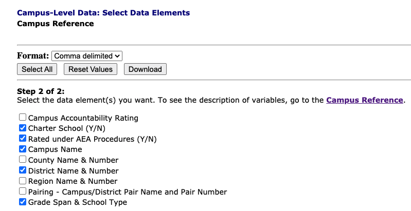

# Leftovers

Things I had before and might want again.

## Campus locations

There are a number of ways to get the schools names, but we'll use the same TAPR data to get campus information, using almost the same steps as above.

- Go to the [TAPR](https://tea.texas.gov/perfreport/tapr/index.html) for the most recent year.
- Go to **Data Download**.
- Go to **TAPR Data in Excel (Rates Only)**.
- Click on **Campus Download**, then Continue.
- Choose **Campus Reference** (instead of School Information).
- For format, choose **Comma delimited**.
- Choose the following fields:
  - Charter School (Y/N)
  - Rated under AEA Procedures (Y/N)
  - Campus Name
  - District Name & Number
  - Grade Span & School Type
- Click **Download**.

- Rename the file to `CREF20.csv`.
- You should also note the [Campus Reference](https://rptsvr1.tea.texas.gov/perfreport/tapr/2020/xplore/cref.html) link there that explains the fields.

---

## CREF cleaning steps

The CREF data is in good shape once we apply the Python fix to the `CAMPUS` field.

- Make sure you have applied the Python
- You can remove the `DISTRICT` column that came in as a number but is really supposed to be a 00-filled value like Campus, but we don't need it.

---

## Filter for "regular" schools

For this list of schools, we want to use some of the columns to filter out charter and alternatively-rated schools.

- Add a step and choose the **Filter by Condition** function.
  - In **Select column**, choose the `CFLATED` column.
  - For **Select condition**, choose "Text is exactly".
  - For **Value**, type in the letter `N`.
- Click on the **AND** that is INSIDE the IF box to get a new condition option.
  - For **Select column**, choose `CFLCHART`.
  - For **Select condition**, choose "Text is exactly".
  - For **Value**, type in the letter `N`.
- Make sure the button at the bottom is set to **Keep** the records.

---

[^1]: While working through this data I created a list of the schools that had data for both 2015 and 2019, but didn't have school names. I did this by using and **inner join** between the 2015 and 2019 data, but a **left join** with the LOC file. I then filtered that data for rows that did not have a `School_Name`. I've gathered [those here](https://docs.google.com/spreadsheets/d/1r1cC5W9eFJ-ecMJAJkf2y1j5R0yb2fCFQHVhjOqGsX4/edit?usp=sharing) and looked up many of them through TEA's TAPR search. There are no Austin ISD schools based on the `CAMPUS` id, but any analysis of other districts must that this list under consideration.

----

### Fix the datatype, if necessary

There is a bug in Workbench which sometimes makes the result of an number formula a TEXT column instead of a Number. It will sort incorrectly as such, so we _may_ have to convert it to a number.

Look through your new columns to see if any are text, and if so do the following steps:

- Add a step **Convert to numbers**.
- Add your text columns.
- Leave the value "Any number".
- Leave the format as "United States".
- Change the **Display as** to "Decimal: 1,500.0012".

We now have a value to describe how the percentage has changed from year to year.
