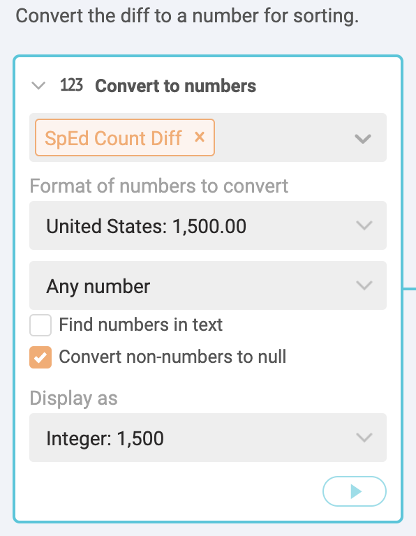

# Special Education data for Workbench assignment

Be sure to review the [README](README.md) for important information on how to download the data.

## Rubric for Workbench

The goal is to find the answer to the following questions:

- Which regular instructional campuses in Austin ISD have the highest percentage of Special Education students in 2019?
- Which regular instructional campuses in Austin ISD have the greatest percentage point change in Special Education students from 2015 to 2019?
- What are those same values statewide?

We will focus "Regular Instructional" campuses because some schools are geared toward certain populations and skew the results.

## Overview of our task

- To find these answers, we need a data source that has one row for each school, but includes the CAMPUS id and Special Ed columns from both CSTUD files, along with the School Name and District Name from the Directory file. We do this using a "join" on the CAMPUS id, which is in all three files. This allows us to extend the width of our table to include matching columns from each of the files.
- Before we do the join function, we will filter the Directory information to include only "Regular Instructional" schools, and to filter out all the Charter schools.
- Next, we will have to create some new columns that does math to show the change in values from the older year, 2015, and the newer year, 2016.

> It might make sense to draw this out on a whiteboard.

## Import and clean the data sets

Once past the hassle of downloading the data, there are still some challenges to getting the answers above. Here steps to import and prepare the data:

- Make sure you changed the filename extension of the CSTUD files from `.dat` to `.csv` or they will not import into Workbench.
- Import each data file into its own Workbench tab. Clean the data as described below. Any other work should be started with a new tab using **Start from tab**. Name the new tab "SPED".

> HINT: Keep Workbench tab names short. If they are too long, a bug prevents you from accessing some of them.

### Fix the IDs in CSTUD tabs

Since the Student and District data have just IDs instead of names of schools or districts, you'll have to join them with the Directory data. To do that you have to take special care with those ID columns, which are supposed to start with zeros. In the CSTUD files, the `CAMPUS` column is supposed to be text with the IDs starting with one or more zeros, like `001902001`. There is no Workbench function to fix that (as of yet), but since Workbench uses Python's [pandas](https://pandas.pydata.org/) package, we can use some use Python code to fix this.

- On the CSTUD data, create a new Python block and add the following:

```python
def process(table):
    table['CAMPUS'] = table['CAMPUS'].astype(str).str.replace(',', '').str.zfill(9)
    return table
```

This does two things: First, it changes the numbers to a string of text, then it looks at the number of characters in that string and fills with zeros at the beginning until there are nine characters.

### Rename the program columns in CSTUDs

Use the **Rename columns** function and the data dictionaries links to saved to give each program column a short but recognizable name instead of their funky codes like `CPETGIFC`. Include a year designation so you can tell them apart when you join the columns together.

Remember to do this in data for both CSTUD years.

### Select just the columns we need

In each CSTUD tab, use the **Select columns** function to choose just the CAMPUS, SpEd15 Count and SpEd15 Prc columns (or whatever you named those columns for Special Education.)

Again, remember to do this with both CSTUD years.

### Fix the IDs in the Directory data

For the Directory data, the `School Number` fields come in with a `'` at the beginning of the ID, which helps ensure the column imports as text. However, you have to remove that `'` to match the CAMPUS field in your school data. We'll do that by searching and replacing the `'` with nothing so it no longer includes the apostrophe.

- Create a new step using the **Search & replace** function.
- Add the `School Number` column.
- Add an apostrophe `'` to the **Search for** field.
- Leave the **Replace with** column blank.
- Use the **Rename** function to change `School Number` column name to `CAMPUS`, as the title needs to match the other files exactly.

### Filter the Directory data for regular schools

After you've fixed the CAMPUS field in the Directory tab, let's filter that data to only include "Regular Instructional" schools, and not Charter schools.

> Before doing this, we should do a quick **Group** to see all the "Instruction Type" values. Delete the step afterward.

- Add a new **Filter by condition** step to the Directory tab.
- Under the IF field, choose the **Instruction Type** column.
- Under **Select condition**, choose **Text contains**.
- In the **Value** field, type in `REGULAR INSTRUCTION`.
- Play the function and you'll notice the number of records changes.

Next, we'll filter out Charter schools.

> Again, do a quick **Group** to count the "District Type" column to see the names, then delete the step.

- Add a new **Filter by condition** step to the Directory tab.
- Under the IF field, choose the **District Type** column.
- Under **Select condition**, choose **Text does not contain**.
- In the **Value** field, type in `CHARTER`.
- Play the function and you'll notice the number of records changes.

Now our Directory only contains regular public schools. When we join to our CSTUD data, we will do so in a manner that filters out non-matching columns so we will only have schools that are in this list.

## Joining all the files together

The easiest way to do the joins is to begin with the Campus data. We'll start with CSTUD15, then join and bring over the Special Education columns from CSTUD19, then join again to bring over the "School Name" and "District Name" columns from the Directory.

### Join CSTUD files

- Start a **new tab** from the CSTUD15 cleaned data. Perhaps name the tab SPED.
- Start a new step and choose the **Join tab** function.
- For the **Select tab to join** field, choose your CSTUD19 tab.
- For the **Join on** field, choose the `CAMPUS` column.
- For the **Add columns** field, include both the Special Ed columns.
- For **Join type**, choose **Right**.

> We need to stop here and talk about join types.

We are using a "Right" join because we want to keep all the records for 2019, our latest year. There may be some cases (337, in fact) where a school opened after 2015. If we used a "Left" or "Inner" join, we would no longer have any of the new schools, which we might want to look at later.

### Join the Directory

To join our the Directory data to get the "School Name" and "District Name", we have to have matching columns titles. This is why earlier we renamed the "School Number" column in the Directory tab to "CAMPUS".

- Start a new step and choose the **Join tab** function.
- For the **Select tab to join** field, choose your Directory tab.
- For the **Join on** field, choose the `CAMPUS` column.
- For the **Add columns** field, include both the "School Name", "District Name" AND "Grade Range" columns.
- For **Join type**, choose **Inner**. This just keeps matching records.[^1]

Now you can continue on the quest to find the schools with the most change in Special Education students.

## How to describe the change

Now that we have all our data in the same tab, we can us some formulas to compare the different years.

We have two values for each year to work with: The "Count" of Special Ed students, which is the actual number of students in the program; and the "Percentage" of students in Special Education out of the total in that school.

If we want to describe the change from one year to the next. You might review the Numbers in the Newsroom chapter on Measuring Change (p26) for further study. Here are some examples:

### Describing the count changes

- We can show the **simple difference** (or actual change) in the *count* of students from one year to the next: `New Count - Old Count = Simple Difference`. Example: `10 - 4 = 6`, or "The school served six more Special Education students in 2019 (10 students) compared to 2015 (4 students)".
- We can show the **percent change** in the *count* of students from one year to the next: `((New Count - Old Count) / Old Count) * 100 = Percent change`. Example: `((10 - 4) \ 4) * 100 = 150%`. "The number of Special Education students served increased 150% from 4 in 2015 to 10 in 2019."

## Describing percentage differences

We also have the *percentage* of Special Education students in the school, which could be important. This is the share of students that are in the program.

- We can find the **percentage point difference** from one year to the next using simple change again, but we have the describe the change as the difference in percentage points: `New Percentage - Old Percentage = Percentage Point Difference`. Example: `15.5% - 11% = 4.5 percentage points` (NOT 4.5%). "The percentage of students in Special Education grew by 4.5 percentage points, from 11% in 2015 to 15.5% in 2019."
- We can find the **percent change of share** from one year to the next, but we have to again be very specific about what we are talking about ... the growth (or decrease) of the _share_ of students in Special Education. `((New Percentage - Old Percentage) / Old Percentage * 100) = Change in share of students`. Example: `((15.5 - 11) / 11) * 100 = 40.9`. "The share of students in Special Education grew 40% from 11% of students in 2015 to 15.5% of students in 2019." This describes the growth in the share of students in the program, not the number of SpEd students overall.

Describing a percentage point difference to readers can be difficult, but perhaps easier than describing the percent change of a percent.

Great, so which do we use? That depends on what you want to describe, of course. Schools that have fewer Special Education students to begin with will show a more pronounced percent change with any fluctuation. Then again, a school that has a large percentage of students could be gaining a lot of students with a small percentage change. In the end, we might need to use all of these values to describe different kinds of schools. We are talking about human beings, so perhaps the counts are important.

## Create our calculations

We'll make several of those outlined above.

### Difference in count

This will tell us the gain or drop of actual students from year to year.

- On our SPED tab, start a new tab at the bottom and choose **Formula**.
- For the formula type use **Excel**.
- For your **Formula** you need to look carefully at your columns, as yours may be in a different order than mine. We make a formula to do math on the first row, then check the box for **Apply to all rows**. You want to start with you 2019 Count, then subtract the 2015 count. For me, this is `=D1-B1`.
- For the **Output column** (which is the new name), use "SpEd Count Diff".
- **Add a note** to the step (click on the lines with a + sign) to document what you are doing in the step.


> There is currently a bug in Workbench which makes the result of this table a TEXT field, which is should not be. It will sort incorrectly as such, so we _may_ have to convert it to a number.

- Add a step **Convert to numbers**.
- Add the new "SpEd Count Diff" column.
- Leave the format as "United States".
- Leave the value "Any number"
- Change the **Display as** to "Integer: 1,500".



Now you have a column that shows the gain or loss of students from 2015 to 2019.

### Percent change in students

Now we'll create a column to show the percent change in students, again using the _count_ from each year. 

- Create a new step using **Formula**.
- For the formula type use **Excel**.
- Check the box for **Apply to all rows**.
- For your **Formula** again check your columns compared to mine. My `B1` column is 2015 count, and my `D1` column is the 2019 count. We are also applying some rounding: `=ROUND(((D1-B1)/B1*100),1)`. This is explained more below.
- For the **Output column** (which is the new name), use "SpEd Count PrcCng".
- **Add a note** to the step (click on the lines with a + sign) to document what you are doing in the step.

This formula looks complicated because we are really doing two things. In this case, we are using the percent change formula of `((New-Old)/Old) * 100)`. That gives us number with a bunch of decimal places, so we are putting it inside the ROUND formula: `ROUND(value,places)`. In our case the "value" is our percent-change formula, and the "places" is "1" to give us tenths.

> Tell me: Which is better ... to show you the complete formula first, or to do the percent change, then adapt it for rounding?

### Percent Point Difference

> This is where I stopped

## Create Austin ISD

### Sort for diff

### Sort for PrcCng

### Sort for PrcPnt Diff

## Turning in your work

With this assignment I expect two things:

> finish this

- Make your Workbench public
- Write sentences

[^1]: There are about 1,350 campuses in the CSTUD data that do not have a matching CAMPUS value in the Directory data. By using Inner join, we can exclude those schools. I spot checked about 10 of those non-matches and they were all special or charter schools. If we were doing this for publication, we would want to look more into that. There is a file `data/Campus_Data_Download_Drop_2016.xlsx` that I found somewhere (I don't remember where) that has some of these missing CAMPUS ID values which can be used to research the "missing" schools.

## Ignore this

> updated

A [link just for me](https://app.workbenchdata.com/workflows/46812/).