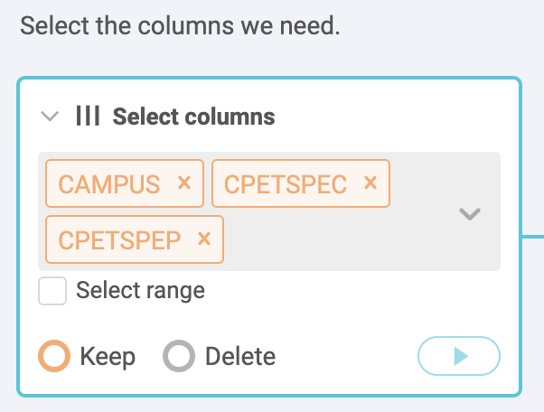
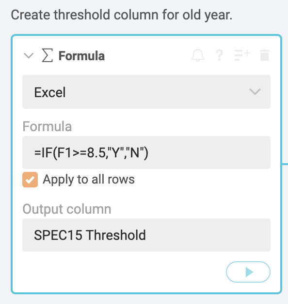
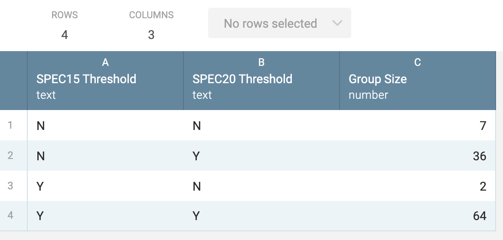

# Special Education data for Workbench assignment

Be sure to review the [README](README.md) for important information on how to download the data.

## Rubric for Workbench

The goal is to find the answer to the following questions:

- Which Austin ISD campus serves the highest percentage of Special Education students in 2019?
- Which AISD campuses had the greatest percentage point change in Special Education students from 2015 to 2019?
- How many AISD schools are at or above the previous special education "audit threshold" of 8.5%?

We will filter our list to focus on "Regular Instructional" schools and not alternative, disciplinary or schools part of the justice system.

## Overview of our task

- To get these answers, we need to build a data set that has one row for each school, but includes the CAMPUS id and Special Ed columns from both CSTUD files, along with the School Name and District Name for each school. We do this using a "join" on the CAMPUS id, which is in all three files. This allows us to extend the width of our table to include matching columns from each of the files.
- Before we do the join function, we will filter our list of campuses to include only "Regular Instructional" schools.
- Then we will have to create some new columns that does math to show the change in values from the older year, 2015, and the newer year, 2019, and how they compare to the old "audit threshold" reported on by the Chronicle.

> It might make sense to draw this out on a whiteboard.

## Import and clean the data sets

Once past the hassle of downloading the data, there are still some challenges to getting the answers above. Follow these steps for each of the three datasets you downloaded:

- Make sure you've changed the filename extension of your downloaded files from `.dat` to `.csv` or they will not import into Workbench.
- Import each data file into its **own** Workbench tab.

> HINT: Keep your Workbench tab names short. If they are too long, a bug prevents you from accessing some of them. For consistency with these directions, name them `CSTUD15`, `CSTUD19` and `CRATE`.

### Fix the CAMPUS IDs

All three data files have a `CAMPUS` column that is supposed to be text with the IDs starting with one or more zeros, like `001902001`. There is no Workbench function to fix that (as of yet), but since Workbench uses Python's [pandas](https://pandas.pydata.org/) package, we can use some use Python code to fix this.

- After importing the data, create a new **Python** step and replace the code with the following:

```python
def process(table):
    table['CAMPUS'] = table['CAMPUS'].astype(str).str.replace(',', '').str.zfill(9)
    return table
```

Here is what it looks like:


This does two things: First, it changes the numbers to a string of text, then it looks at the number of characters in that string and fills with zeros at the beginning until there are nine characters. Welcome to Python!

Lastly, add a note to the step to describe what you just did. Roll your cursor over the step, click on the symbol with lines with a + sign to get the field to add the note. Say you are fixing the CAMPUS id.

> You should add notes like this to EVERY STEP of your workbook. These annotations will help you later when you see them, and explain to your coworkers or readers what you are doing.

Remember to do the Python step for all three imported files.

## Cleaning up CSTUD files

### Rename the program columns in CSTUDs

Use the **Rename columns** function and the data dictionaries ([2015](https://rptsvr1.tea.texas.gov/perfreport/tapr/2015/xplore/cstud.html) | [2019](https://rptsvr1.tea.texas.gov/perfreport/tapr/2019/xplore/cstud.html)) to give each program column a short but recognizable name instead of their funky codes like `CPETSPEC`. Include a year designation so you can tell them apart when you join the columns together, like `SpEd15 Count` for the count and `SpEd15 Prc` for the percent.

Remember to do this in both CSTUD files.


### Select just the columns we need

In each CSTUD tab, use the **Select columns** function to choose just the CAMPUS, "SpEd15 Count" and "SpEd15 Prc" columns (or whatever you named those columns for Special Education.)

Again, remember to do this with both CSTUD years.



## Filter the CRATE data

For this list of schools, we want to use some of the columns to filter out charter, alternative, disciplinary and justice department schools. We use the [Campus Accountability Summary Reference](https://rptsvr1.tea.texas.gov/perfreport/account/2019/download/camprate.html) to figure out which columns to filter on.

### Filter for "regular" schools

We're starting with the `CFLALTED` column, which is a Yes or No column based on if it is "Rated under AEA Procedures", which means it was rated on an different standard than traditional schools. They values are "Y" for yes and "N" for no.

- Add a step with a **Filter by condition** function.
- In **Select column**, choose the `CFLALTED` column.
- For **Select condition**, choose "Text is exactly".
- For **Value**, type in the letter `N`.
- Make sure the button at the bottom is set to **Keep** the records.

Go ahead and play the step and you'll see the number of records drop from 8,838 to 8,459. What this has done is filter OUT the records that have "Y" for that column.

- Go back to the same step and click on the little **AND** symbol at the bottom of the IF box to get a new rule.
- Choose the `CFLDAEP` column and also set it to find the letter `N`. DEAP stands for "Disciplinary Alternative Education Program".
- Do the same for `CFLJJ`. The JJAEP schools are "Juvenile Justice Alternative Education Programs".
- Do the same for `CFLCHART`, which are charter schools.
- Play the step.
- Lastly, add a note at the top of the step.

The result should be 7,750 rows, and the step should look like this:


Now our CRATE data only contains regular public schools. When we join to our CSTUD data, we will do so in a manner that filters out non-matching rows so we will only have schools that are in this list.

## Joining all the files together

We'll start with the 2015 data first (CSTUD15) then join and bring over the Special Education columns from CSTUD19, then join again to CRATE to bring over the `CAMPNAME` and `DISTNAME` columns.

### Join CSTUD files

- Start a **new tab** and use **Start from tab** using the CSTUD15 tab. Name the new tab SPED.
- Start a new step and choose the **Join tab** function.
- For the **Select tab to join** field, choose your CSTUD19 tab.
- For the **Join on** field, choose the `CAMPUS` column.
- For the **Add columns** field, include both the Special Ed columns.
- For **Join type**, choose **Right**.


> We need to stop here and talk about join types.

We are using a "Right" join because we want to keep all the records for 2019, our latest year. There may be some cases (702, in fact) where a school opened after 2015. If we used a "Left" or "Inner" join, we would no longer have any of the new schools, which we might want to look at later.

### Join CRATE to get names

We'll bring in the `CAMPNAME` and `DISTNAME` columns from our CRATE data.

- Start a new step and choose the **Join tab** function.
- For the **Select tab to join** field, choose your "CRATE" tab.
- For the **Join on** field, choose the `CAMPUS` column.
- For the **Add columns** field, include both the `CAMPNAME` and `DISTNAME` columns.
- For **Join type**, choose **Inner**. This just keeps matching records, which will filter out schools that were disciplinary, etc.


Now you can continue on the quest to find the schools with the most change in Special Education students.

## How to describe the change

Now that we have all our data in the same tab, we can use some formulas to compare the different years.

We have two values for each year to work with: The "Count" of Special Ed students, which is the actual number of students in the program; and the "Percentage" of students in Special Education out of the total in that school.

We want to describe the change from one year to the next. You might review the Numbers in the Newsroom chapter on Measuring Change (p26) for further study. Here are some examples:

### Describing the count changes

- We can show the **simple difference** (or actual change) in the *count* of students from one year to the next. We'll assume there were `4` students in 2015 and `10` in 2019:
  - `New Count - Old Count = Simple Difference`.
  - Example: `10 - 4 = 6`.
  - "The school served six more Special Education students in 2019 (10 students) compared to 2015 (four students)".
- We can show the **percent change** in the *count* of students from one year to the next:
  - `((New Count - Old Count) / Old Count) * 100 = Percent change`.
  - Example: `((10 - 4) \ 4) * 100 = 150%`.
  - "The number of Special Education students served increased 150% from four in 2015 to 10 in 2019."

### Describing percentage differences

We also have the *percentage* of Special Education students in the school, which could be important. This is the share of students that are in the program compared to the total students in the school.

- We can find the **percentage point difference** from one year to the next using simple change again, but we have the describe the change as the difference in percentage points:
  - `New Percentage - Old Percentage = Percentage Point Difference`.
  - Example: `15.5% - 11% = 4.5 percentage points` (NOT 4.5%).
  - "The percentage of students in Special Education grew by 4.5 percentage points, from 11% in 2015 to 15.5% in 2019."
- We can find the **percent change of share** from one year to the next, but we have to again be very specific about what we are talking about ... the growth (or decrease) of the _share_ of students in Special Education.
  - `((New Percentage - Old Percentage) / Old Percentage * 100) = Change in share of students`.
  - Example: `((15.5 - 11) / 11) * 100 = 40.9`.
  - "The share of students in Special Education grew 40% from 11% of students in 2015 to 15.5% of students in 2019." This describes the growth in the share of students in the program, not the number of Special Education students overall.

Describing a percentage point difference to readers can be difficult, but perhaps less confusing than describing the percent change of a percent.

Great, so which do we use? That depends on what you want to describe, of course. Schools that have fewer Special Education students to begin with will show a more pronounced percent change with any fluctuation. Then again, a school that has a large percentage of students could be gaining a lot of students with a small percentage change. In the end, we might need to use all of these values to describe different kinds of schools. We are talking about human beings, so perhaps the counts are important.

## Create our calculations

We'll make new columns to help us describe several of those changes outlined above.

### Difference in count

This will tell us the gain or drop of actual students from year to year.

- On our SPED tab, start a new step at the bottom and choose **Formula**.
- For the formula type use **Excel**.
- For your **Formula** you need to look carefully at your columns, as yours may be in a different order than mine. We make a formula to do math on the first row, then check the box for **Apply to all rows**. You want to start with you 2019 Count, then subtract the 2015 count. For me, this is `=D1-B1`.
- For the **Output column** (which is the new name), use "SpEd Count Diff".
- **Add a note** to the step to document what you are doing in the step.


> There is currently a bug in Workbench which makes the result of this formula a TEXT column instead of a Number. It will sort incorrectly as such, so we _may_ have to convert it to a number.

- Add a step **Convert to numbers**.
- Add the new "SpEd Count Diff" column.
- Leave the format as "United States".
- Leave the value "Any number".
- Change the **Display as** to "Integer: 1,500".
- **Add a note** to explain the step.


Look to the far right of your table and you should now have a column that shows the gain or loss of students from 2015 to 2019. Check it against the count values in your table to make sure it is right.

### Percent change in students

Now we'll create a column to show the percent change in students, again using the _count_ from each year.

- Create a new step using **Formula**.
- For the formula type use **Excel**.
- Check the box for **Apply to all rows**.
- For your **Formula** again check your columns compared to mine. My `B1` column is 2015 count, and my `D1` column is the 2019 count. We are also applying some rounding: `=ROUND(((D1-B1)/B1*100),1)`. This is explained more below.
- For the **Output column** (which is the new name), use "SpEd Count PrcCng".
- **Add a note** to the step (click on the lines with a + sign) to document what you are doing in the step.


This formula looks complicated because we are really doing two things. In this case, we are using the percent change formula of `((New-Old)/Old) * 100)`. That gives us a number with a bunch of decimal places, so we are putting it inside the ROUND formula: `ROUND(value,places)`. In our case the "value" is our percent-change formula, and the "places" is "1" to give us tenths. So, we are nesting our percent change formula inside the rounding formula.

> Give me feedback: Which is better ... to show you the complete formula first, or to do the percent change, then adapt the formula for rounding?

Because of a Workbench bug, this new column might also end up as text instead of a number. We'll wait to change it because we can convert the next one at the same time as well.

### Percent Point Difference

Now we'll build the "Percent point difference" of the share of Special Education students. This is a simple difference between the two percents from each year.

- Create a new step using **Formula**.
- For the formula type use **Excel**.
- Check the box for **Apply to all rows**.
- For your **Formula**, start with the newer `SpEd Prc` column for 2019 and then subtract the older one from 2015. We again should nest it inside a ROUND formula: `=ROUND(E1-C1,1)`.
- For **Output column** name it "Sped Prc Pnt Diff".
- **Add a note** to explain what the step/formula is for.


### Fix the datatype, if necessary

If the Workbench bug is still present, the last two columns you created will be a datatype of "Text". We need to change both of them to Number.

- Add a step **Convert to numbers**.
- Add your last two new columns: `SpEd Count PrcCng` and `SpEd Prc Pnt Diff`.
- Leave the format as "United States".
- Leave the value "Any number".
- Change the **Display as** to "Decimal: 1,500.0012".

We now have a value to describe how the percentage has changed from year to year.

### Create audit threshold columns

Our story is a follow-up to the Chronicle's reporting in the Denied series, which found that the TEA would audit schools that had a special education rate of 8.5% or higher. Let's figure out which schools fell into that category in each year.

The formula we are using is [Excel's IF](https://support.office.com/en-us/article/if-function-69aed7c9-4e8a-4755-a9bc-aa8bbff73be2) formula. It works like this: `=IF(test, true, false)`. In the "test" field, we'll compare the percentage to 8.5%. If it is true, we will insert the text "Y" and if it is false, we'll say "N".

- On the SPED data, start a new step using **Formula** for **Excel**.
- Look closely to see which of your column letter is the "SpEd15 Prc" column, which is the one we want. Mine is the `C` column.
- For the Formula, use `=IF(C1>=8.5,"Y","N")`. Use your column instead of `C` if it is different.
- For the Output column, name it "SpEd15 Thrshld".



**On your own**: Repeat these steps for your 2019 data.

Now we have a column that tells us if the school is at or above the audit threshold. We'll use these new fields later.

## Create Austin ISD comparisons

We've been doing all this work on all the schools in the state, but we really want to look at Austin ISD. We'll create a new tab to filter down to just the Austin schools and then sort to show the schools with the most new Special Education students at the top.

- Create a **new tab** and call it "AISD Diff".
- Use **Start from tab** and choose your "SPED" tab.
- Add a new function called **Filter by condition**.
- For **Select column** add the `DISTNAME` column.
- For **Select condition** choose "Text contains".
- For **Value** type in "AUSTIN ISD".


You now have a table of just the Austin schools and there should be something like 118 of them. Now let's sort it by the most new students.

- Create a **new step** with the function **Sort**.
- For **By** select the "SpEd Count Diff" column.
- Click on the **Descending** button if not already chosen.
- You can leave the **Keep top** value blank.


Now you have a list of AISD schools  sorted by the most new Special Education students from 2015 to 2019.

### Filter out new schools

If you look at the bottom of the AISD Diff tab, there are two schools that didn't have data for 2015. One is a special school (not sure why it wasn't filtered out) and the other didn't have any special education students. Let's filter those out so they don't skew future results.

- Add a step **Filter by condition**.
- Add the `SpEd15 Count` column.
- For the condition, choose **Cell is not null**.

This filters out all the cells that do not have a value, removing those two rows.

### On your own

Create two new tabs, with each filtering to Austin but sorting for different values, one sorting by "SpEd Count PrcCng" and the other for "Sped Prc Pnt Diff".

> Pro tip: You can start new tabs from your "AISD Diff" tab and just change the sort value. I generally discourage duplicating a tab and instead use **Start from tab** unless you are sure you need different rows/values.

### Compare schools by audit threshold

The last question we need to answer is how many schools were above or below the 8.5% threshold in 2015 and 2019. We could create sorts and count the rows, but there is a better way, which is why we created those threshold columns earlier.

- Start a new tab and call it "AISD Thrshld".
- Use **Start from tab** and use the "AISD Diff" tab.
- Start a new step with a **Group** formula.
- For **Columns** choose both threshold columns from both years.
- For the **Operations** setting, leave it at **Count**.
- For the **Name**, call it "Number of schools", which is the name of the column.


What you've done here is the same as a pivot table in Google Sheets. The operation is counting the number of rows (or schools in our case) for each value combination.



So there are 14 schools that were below the threshold both in 2015 and 2019, but 31 schools climbed above that threshold in 2019.

## What you have now

So now you have all the values needed to write a followup to the Denied series for AISD schools.

If you want to know the school that gained the most Special Education students, you can look at the schools at the top of your "AISD diff" tab. If you want to know who lost the most, look at the bottom of that one (or re-sort by Ascending).

If you want to know which school gained the highest share of Special Education students within their school, you should have the tab that sorts data by "Sped Prc Pnt Diff".

You can describe how many schools climbed above the TEA's 2004 threshold, and how many were over it in 2015 before the law changed.

## Turning in your work

For the writing part of the assignment below you should already have everything you need. If you want to explore the data more, be careful not to make changes (beyond sorting) to a tab that is the source of another tab ... those changes carry forward and can lead to confusion and unexpected results. If for some reason you want to explore a new fact, you should start a new tab and pull data into it before any filtering, selecting or grouping.

### Writing assignment

Using Google Docs, write three "data nut graphs" -- a sentence (or paragraph) in a story that succinctly describes a data fact -- as if each were just a part of a complete news story. You don't need a lede. You aren't writing a whole story ... just three sentences or paragraphs, each describing of these facts. **Be sure to share the doc to me as an editor.**

- Which AUSTIN ISD school served the highest percentage of Special Education students?
- Which AUSTIN ISD school had the greatest increase in Special Education students?
- Describe how AUSTIN ISD school changed compared to the 2004 audit threshold. (You can assume that threshold has already been explained earlier in the story.)

Lastly write a paragraph that explains the source of your data and the criteria used in your analysis. Again, write this as if it were to be inserted in a larger news story.

### Questions for sources

If you were writing a news story about Special Education and you had the data above, what are the **three things you want to know next**? For each question, who would you ask? (Just titles or classes of people, not actual contacts.)

### Workbench assignment

Make your Workbench workflow public. (Click on the share button, then check the "public" box.) Copy and include the link in your story or submit the link with the assignment.

## Extending this assignment

Food for thought: How might you find similar schools in the whole state so you can compare how Austin ISD ranks against them? This is not required for the assignment, but if you try it be careful not to change the values in your SPED column, as all the AISD columns use that.

## Ignore this

A [link just for me](https://app.workbenchdata.com/workflows/46812/).