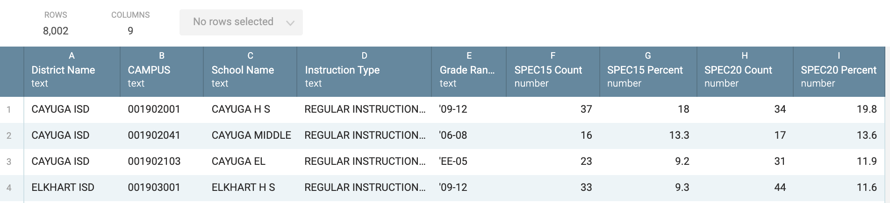

# Special education data for Workbench assignment

Be sure to review the [README](README.md) for important information on the story focus and how to download the data.

## Learning goals of this assignment

With this assignment, you'll use many of the [Basic Data Journalism Functions](https://vimeo.com/showcase/7320305) discussed earlier in the semester.

### Overview of our task

The goal is to find the answer to the following questions:

- Which AISD campuses had the greatest percentage point change in special education students from 2015 to 2019?
- How many AISD schools are at or above the special education "audit threshold" of 8.5% in 2015 and in 2019?

We will filter our list to focus on "Regular Instructional" schools to exclude alternative, disciplinary or schools part of the justice system.

- To get these answers, we need to build a data set that has one row for each school, but includes the CAMPUS id and Special Ed columns from both CSTUD files, along with the School Name and District Name for each school from the CREF file. We do this using a **join** on a CAMPUS id, which is in all three files. This allows us to add columns from different files about the same schools.
- Before we do the join function, we will filter our list of campuses to include only "Regular Instructional" schools. This will remove alternative schools that are special purpose for behavioral issues, etc.
- Then we will have to create some new columns that does math to show the change in values from the older year, 2015, and the newer year and how they compare to the old "audit threshold" reported by the Chronicle.

## Import and prepare the CSTUD files

Once past the hassle of downloading the data, there are still some challenges to getting the answers above. Follow these steps to prepare each of the datasets you downloaded.

- Before you upload the files into Workbench, make sure you've changed the filename extension of your CSTUD files from `.dat` to `.csv` or they will not import into Workbench.
- Use a new Workbench tab for each file.
- Use the **Upload** function to import the file.
- Name them "CSTUD15", "CSTUD20" (or newest year)

> HINT: Keep your Workbench tab names short. If they are too long, it can be hard to get to all your tabs. For consistency with these directions, name them `CSTUD15`, `CSTUD20`.

### Fix the CAMPUS IDs

All of the TAPR files have a `CAMPUS` column that is supposed to be text with the IDs starting with one or more zeros, like `001902001`. Instead, they are imported as a number and the zeros are lost. There is no Workbench function to fix that (as of yet), but since Workbench uses Python at its core, we can use some use Python code to fix this.

- After importing the data, create a new **Python** step and replace the code with the following:

```python
def process(table):
    table['CAMPUS'] = table['CAMPUS'].astype(str).str.replace(',', '').str.zfill(9)
    return table
```

Here is what it looks like:


This Python code does two things: First, it changes the numbers to a string of text, then it looks at the number of characters in that string and fills with zeros at the beginning until there are nine characters. Welcome to Python!

Lastly, add a note to the step to describe what you just did. Roll your cursor over the step, click on the symbol with lines with a + sign to get the field to add the note. Say you are fixing the CAMPUS id.

> You should add notes like this to EVERY STEP of your workbook. These annotations will help you later when you see them, and explain to your coworkers or readers what you are doing.

Do this for both the CSTUD tabs.

### Select just the columns we need

We only need the `CAMPUS` and special education numbers from our CSTUD data for this story. If we review our data dictionaries ([2015](https://rptsvr1.tea.texas.gov/perfreport/tapr/2015/xplore/cstud.html) | [2020](https://rptsvr1.tea.texas.gov/perfreport/tapr/2020/xplore/cstud.html)) we can see these special education columns are called `CPETSPEC` (the number of special education students) and `CPETSPEP` (the percentage of students in the school that are in special education).

> In 2020, the TEA modified how they define enrollment, so don't get confused by those figures in 2020 data and later. According to Page 31 of the TAPR Glossary ([linked from here](https://rptsvr1.tea.texas.gov/perfreport/tapr/2020/index.html)): _Please note, the Enrollment section of this report is new this year. The definitions below describe the nuances between Membership and Enrollment. **If comparing the data shown from this year’s report to previous reports, use the data displayed under Membership**_.

In each CSTUD tab, use the **Select columns** function to choose just the `CAMPUS`, `CPETSPEC` and `CPETSPEP` columns (or whatever you named those columns for special education.)


### Rename the SPEC columns

Use the **Rename columns** function and the to give the two special education program columns a short but recognizable name instead of their funky codes like `CPETSPEC`. Include a year designation so you can tell them apart when you join the columns together, like `SPEC15 Count` for the count and `SPEC15 Percent` for the percent.


Remember to do both of these steps in both CSTUD files, but name the more recent year with that year, like "20".

## Import and prepare the Directory data

As you were working with the CSTUD data, you might have noticed there were no campus names! How do we know which school they refer to? This is why we downloaded the school and district directory file.

### Import the file

- Create a new tab and call it "LOCS"
- Use the **Upload file** option to import the `Directory.csv` file you downloaded earlier.

Once uploaded, we have several issues to deal with in the Directory data:

- The LOCS file has a lot of data, some that we need and some that we don't. We'll select only the columns we need.
- It also has a `School_Number` field that matches our `CAMPUS` column from our CSTUD files, but the column has a `'` at the beginning to force it to import as text. That is good, but we'll need to remove the `'`.
- To make the match properly between our LOCS data and the CSTUD data the `School_Number` column needs to be renamed to be the same as our CSTUD data: `CAMPUS`.

### Select columns

First, let's select our columns.

- Start a new step and choose the **Select Columns** function.
- You can use the dropdown on **Select Columns** field or just start typing names for type-assist. Choose the following columns:
  - District Name
  - School Number
  - School Name
  - Instruction Type
  - Charter Type
  - Grade Level
  


### Clean School Number

Next, we need to clean the `School Number` column, which looks like this:


There are a number of ways we could fix this, but we'll use a function called **Clean text**.

- Start a new step and choose **Clean text**.
- For the columns, choose `School Number`.
- You can leave the Spaces and Capitalization fields as is, but go ahead and look at the options there.
- For **Characters**, check the _Punctuation_ box. This will remove all punctuation-type characters from the field, which would include our leading `'` character.


Now we have a clean `School_Number` field that will match up with our `CAMPUS` field in the CSTUD datasets, once we rename it.

### Rename School Number

Lastly, we have to rename the `School Number` column to `CAMPUS` so we can match them later. They have to exactly the same, capitalization and everything.

- Since we are only changing one file, the easiest way to make this change is to double-click on the column name and change it.


You could also use the drop-down menu on the column and choose **Rename** or add your own step with the **Rename** function much like we did with the CSTUD data.

## Some discussion about Joins

You might [review the video about joins](https://vimeo.com/showcase/7320305/video/435910338) for a refresher on the terms and concepts.

Our aim here is to create a single dataset with a single row for each school that includes information from each of the three datasets. We do this by **joining** on the `CAMPUS` ID. However, as we do so, we'll end up losing some rows that don't have matches in the other files.

To do the comparison for our analysis we need the schools that were open in both 2015 and 2020. However, some schools existed in only one year or the other, so we'll drop those. When we join our files, we'll use an **inner join** to keep only schools with  **matching** records from both 2015 and 2020. This will drop schools that opened after 2015 or closed before 2020.

### Steps for joining the data

We'll start with the LOCS campus data.

- Create a new tab and call it "SPEC". (This will be our working data for the rest of our analysis.)
- Use the **Start from tab** function and choose the _LOCS_ data and play the step.

### Join the 2015 data

- Add a new step and choose the **Join tab** function.
  - For the **Select a tab to join** field, choose the _CSTUD15_ data.
  - For the **Join on** field, choose `CAMPUS`. This should be your only choice.
  - For the **Add columns** field, choose all the columns.
  - For the **Join type** field, choose _Inner_. This will keep only the matching rows between the two data sets.

### Join the 2020 data

- Add a new step and choose the **Join tabs** function.
  - For the **Select a tab to join** field, choose the _CSTUD20_ data.
  - For the **Join on** field, choose `CAMPUS`. This should be your only choice.
  - For the **Add columns** field, choose all the columns.
  - For the **Join type** field, choose _Inner_. This will keep only the matching rows between the two data sets (though there likely aren't any drops this time).

The step looks like this:


The data should look like this:



## Filter for "regular" schools

For this list of schools, we want to use some of the columns to filter out charter, alternative, disciplinary and justice department schools. There is an `Instruction Type` field in the LOCS data that identifies _REGULAR INSTRUCTIONAL_ schools. We'll filter to get these.

**You don't need to do this**, but if I wanted to see how the data identifies schools in this column, I can **Group** by that column and count the rows. I don't want you to save this step as it is just exploratory so I won't write out the steps, but this is how the result would look:


I can see that most schools are "regular", but I can see the other types as well. If you did explore this, go ahead and delete the step as we don't need it anymore.

### Apply the regular school filter

- Add a step and choose the **Filter by condition** function.
- In **Select column**, choose the `Instruction Type` column.
- For **Select condition**, choose "Text is exactly".
- For **Value**, type in the letter `REGULAR INSTRUCTIONAL`.
- Make sure the button at the bottom is set to **Keep** the records.


As you play the step and you'll see the number of records drop from _8,002_ to _7,372_. What this has done is filter OUT the records that are NOT _REGULAR INSTRUCTIONAL_. You should always eyeball your column to make sure the filter did was you intended.

### Remove charter schools

If you look at the `Charter Type` column, you'll see that the field is only filled out if it is a charter school, and is left blank if not. We'll add onto our last **Filter by condition** to use this column to exclude all charter schools.

- Go back to the same step and click on the little **AND** symbol at the bottom and INSIDE the IF box to get a new rule.
- Choose the `Charter Type` column and set it to **Cell is empty**. Since we keep only rows where this is empty, it filters out the charter that have something in that field.

Again, you should see the number of records drop. The two filters combined in the same step now look like this:


As you play the step and you'll see the number of records drop from _8,002_ to _6,962_. (Providing you are comparing with 2020 data.) What we've done is filter out all Alternative, DEAP (disciplinary), JJAEP (juvenile justice) and Charter schools.

You should always double-check your data to make sure the filter did what you intended.

### Remove unneeded columns

We no longer need the `Instruction Type` or `Charter Type` columns now that we have filtered them, so we can remove them,

- Create a new step and choose **Select columns**.
- Add the `Instruction Type` and `Charter Type` columns.
- Choose the **Delete** option and play the step.

We now have our data combined and filtered. We have one row for each school and it includes only schools that were open in both 2015 and 2019, have school names, and are "regular" schools and not charter schools.

Now we can get to some analysis.

## How to describe the change

Now that we have all our data in the same tab, we can use some formulas to compare the different years.

We have two values for each year to work with: The "Count" of special education students, which is the actual number of students in the program; and the "Percentage" of students in special education out of the total in that school.

We want to describe the change from one year to the next. You might review the Numbers in the Newsroom chapter on Measuring Change (p26) for further study. Here are some examples:

### Describing the count changes

- We can show the **simple difference** (or actual change) in the *count* of students from one year to the next. We'll assume there were `4` students in 2015 and `10` in 2020:
  - `New Count - Old Count = Simple Difference`.
  - Example: `10 - 4 = 6`.
  - "The school served six more special education students in 2020 (10 students) compared to 2015 (four students)".
- We can show the **percent change** in the *count* of students from one year to the next:
  - `((New Count - Old Count) / Old Count) * 100 = Percent change`.
  - Example: `((10 - 4) \ 4) * 100 = 150%`.
  - "The number of special education students served increased 150% from four in 2015 to 10 in 2020."

### Describing percentage differences

We also have the *percentage* of special education students in the school, which could be important. This is the share of students that are in the program compared to the total students in the school.

- We can find the **percentage point difference** from one year to the next using simple difference again, but we have the describe the change as the difference in percentage points:
  - `New Percentage - Old Percentage = Percentage Point Difference`.
  - Example: `15.5% - 11% = 4.5 percentage points` (NOT 4.5%).
  - "The share of students in special education grew by 4.5 percentage points, from 11% in 2015 to 15.5% in 2020."
- We can find the **percent change of share** from one year to the next, but we have to again be very specific about what we are talking about ... the growth (or decrease) of the _share_ of students in special education.
  - `((New Percentage - Old Percentage) / Old Percentage * 100) = Change in share of students`.
  - Example: `((15.5 - 11) / 11) * 100 = 40.9`.
  - "The share of students in special education grew 40% from 11% of students in 2015 to 15.5% of students in 2020." This describes the growth in the share of students in the program, not the number of special education students overall.

Describing a "percentage point difference" to readers can be difficult, but perhaps less confusing than describing the "percent change of a percent".

Great, so which do we use for this story? That depends on what you want to describe. Schools that have fewer special education students to begin with will show a more pronounced percent change with any fluctuation. Then again, a school that has a large percentage of students could be gaining a lot of students with a small percentage change. In the end, we might need to use all of these values to describe different kinds of schools. We are talking about human beings, so perhaps the counts are important.

## Create our calculations

We'll make new columns to help us describe several of those changes outlined above.

### Difference in count

This will tell us the gain or drop of actual students from year to year. We'll start with our newest year the subtract our older year.

- On our SPEC tab, start a new step at the bottom and choose **Calculate**.
- For **Operation**, choose _Subtract_.
- For the first value, choose `SPEC20 Count`
- For **minus**, choose `SPEC15 Count`.
- For **Output column name**, call it "SPEC Count Diff".


Look to the far right of your table and you should now have a column that shows the gain or loss of students from 2015 to 2020. Check it against the count values in your table to make sure it is right.

### Percent change in students

Now we'll create a column to show the percent change in students, again using the _count_ from each year.

- Again start a **Calculate** step.
- For **Operation**, choose _Percent change_.
- For **Old value**, choose `SPEC15 Count`.
- For **New value**, choose `SPEC20 Count`.
- For **Output column name**, call it "SPEC Count PrcCng".


Our two new columns look like this:


Now we know the exact number of special education student growth (or decline) and the percent change between the two years.

### Percent Point Difference

Now we'll build the "Percent point difference" of the share of special education students. This is a simple difference between the two percents from each year.


## Create audit threshold columns

Our story is a follow-up to the Chronicle's reporting in the Denied series, which found that the TEA would audit schools that had a special education rate of 8.5% or higher. Let's figure out which schools fell into that category in each year.

There isn't a Workbench Calculate option for this action, so we'll be using the **Formula** function which supports Excel and Python.

The formula we are using is [Excel's IF](https://support.office.com/en-us/article/if-function-69aed7c9-4e8a-4755-a9bc-aa8bbff73be2). It works like this: `=IF(test,"value_if_true","value_if_false")`.

Our "test" will be checking if the percentage is equal-or-greater-than 8.5, and we will insert the text "Y" if it is true, and "N" if it is false.

- On the SPEC data, start a new step using the **Formula** function and choose **Excel**.
- **Look closely to see which of your column letter is the "SPEC15 Percent" column**, which is the one we want. Mine is the `F` column.
- For the Formula, use `=IF(F1>=8.5,"Y","N")`. Use your column letter if instead of `F` if it is different.
- For the Output column, name it "SPEC15 Threshold".


### 2020 threshold on your own

**On your own**: Repeat these steps for your 2020 data (or newest year). It will be very similar to above, but you'll be using the column with your 2020 percentage instead.

Now we have a column that tells us if the school is at or above the audit threshold. We'll use these new fields later.

## Create Austin ISD comparisons

We've been doing all this work on all the schools in the state, but this story's focus is really Austin ISD. (We did the cleaning on the whole state because it takes the same amount of time and we could do comparisons later if we wanted to.)

We'll create a **new tab** to filter down to just the Austin schools and then sort to show the schools with the most new special education students at the top.

- Create a **new tab** and call it "AISD Diff".
- Use **Start from tab** and choose your "SPEC" tab.
- Add a new function called **Filter by condition**.
- For **Select column** add the `District Name` column.
- For **Select condition** choose "Text is exactly".
- For **Value** type in "AUSTIN ISD".


You now have a table of just the Austin schools and there should be something like 109 of them. Now let's sort it by the most new special eduction students.

- Create a **new step** with the function **Sort**.
- For **By** select the "SPEC Count Diff" column.
- Click on the **Descending** button if not already chosen.
- You can leave the **Keep top** value blank.


Now you have a list of AISD schools sorted by the school that gained the most new special education students from 2015 to 2020. If you sort in **Ascending** order, you'll have the school that lost the most special education students.

Consider the sentence you might write based on this list? How might that be phrased?

### On your own

Create two new tabs, with each filtering to Austin but sorting for different values, one sorting by "SPEC Count PrcCng" and the other for "SPEC Prc Pnt Diff".

> **Pro tip**: You should start new tabs from your "AISD Diff" tab and just change the sort value. I generally discourage duplicating a tab and instead use **Start from tab** unless you are sure you need different rows/values.

You'll be asked to write sentences based on these values, too.

### Compare schools by audit threshold

For this next step, you might review the [Group & Aggregate](https://vimeo.com/showcase/7320305/video/435910349) lesson from earlier in the semester.

The last question we need to answer is how many schools were above or below the 8.5% threshold in 2015 and 2020. We could create sorts and count the rows, but there is a better way, which is why we created those threshold columns earlier.

- Start a new tab and call it "AISD Threshold".
- Use **Start from tab** and use the "AISD Diff" tab.
- Start a new step with a **Group** formula.
- For **Columns** choose both threshold columns from both years.
- For the **Operations** setting, leave it at **Count**.
- For the **Name**, call it "Number of schools", which is the name of the column.


What you've done here is the same as a pivot table in Google Sheets. The operation is counting the number of rows (or schools in our case) for each value combination.

Remember: The "N" means they didn't meet the 8.5% threshold, and the "Y" means they did. So the first row shown below are the count of schools below the threshold in both years.


So there are 7 schools that were below the threshold both in 2015 and 2020, but 36 schools climbed above that threshold in 2020. Two schools dropped below the threshold by 2020.

## Assignments from this data

There are two parts to this project: The data and the writing.

## Turn in Workbench

Make your Workbench workflow public. (Click on the share button, then check the "public" box.) Copy and include the link in your story or submit the link with the assignment.

If you want to explore the data more, be careful not to make changes (beyond sorting) to a tab that is the source of another tab ... those changes carry forward and can lead to confusion and unexpected results. If for some reason you want to explore a new fact, you should start a new tab and pull data into it before any filtering, selecting or grouping.

## Writing assignment

For the writing part of the assignment below you should already have everything you need.

You are writing "data nut graphs" -- a sentence (or paragraph) in a story that succinctly describes a data fact -- as if each were just a part of a complete news story. You don't need a lede. You aren't writing a whole story ... just describe the facts.

Here are the questions I want you to write about:

1. Which AUSTIN ISD school (or schools) had the greatest **percentage point change** in special education students from 2014-15 to 2019-20? Describe the change in the **share** of students.
2. Which Austin school had the **greatest increase in the number of special education students** from 2015 to 2020?
3. Describe how the number of Austin schools that met the "8.5% audit threshold" changed between 2015 and 2020. (You can assume that threshold has already been explained earlier in the story so you don't need that detail.)
4. Write a paragraph that explains the **source** of your data and the **criteria** (like filtering) used in your analysis. Again, write this as if it were part of a story ... written for the reader in language they can understand.

---

## Ignore this

- [Workbench](https://app.workbenchdata.com/workflows/134755/)
