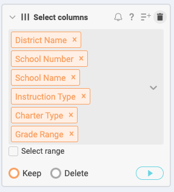
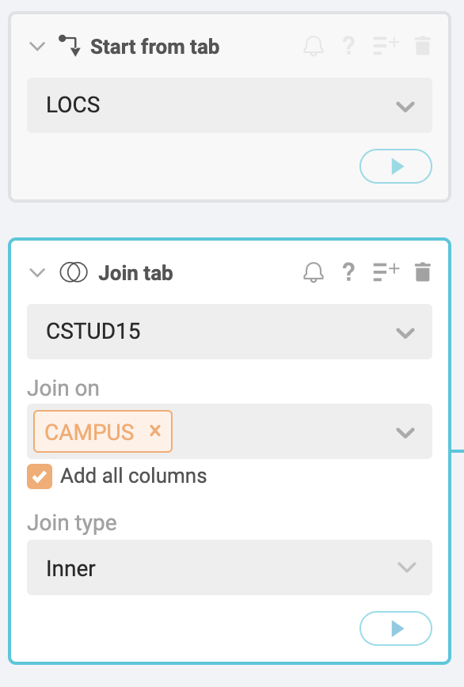
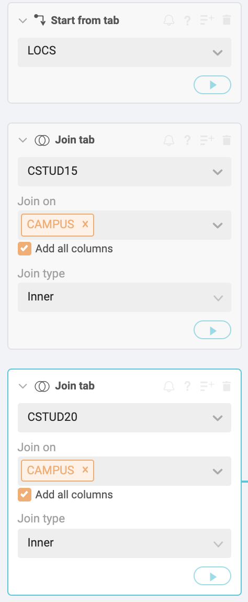
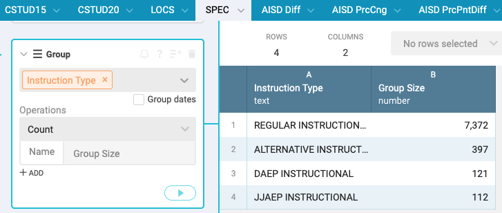
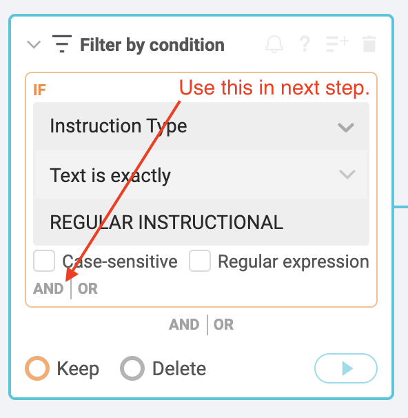
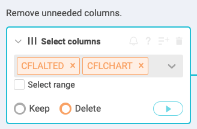
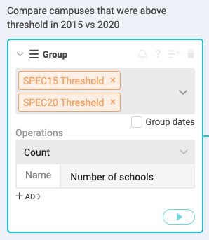

# Special education data for Workbench assignment

Be sure to review the [README](README.md) for important information on the story focus and how to download the data.

## Learning goals of this assignment

With this assignment, you'll use many of the [Basic Data Journalism Functions](https://vimeo.com/showcase/7320305) discussed earlier in the semester.

## Overview of our task

The goal is to find the answer to the following questions:

- Which AISD campuses had the greatest percentage point change in special education students from 2015 to 2019?
- How many AISD schools are at or above the special education "audit threshold" of 8.5% in 2015 and in 2019?

We will filter our list to focus on "Regular Instructional" schools to exclude alternative, disciplinary or schools part of the justice system.

- To get these answers, we need to build a data set that has one row for each school, but includes the CAMPUS id and Special Ed columns from both CSTUD files, along with the School Name and District Name for each school. We do this using a **join** on a CAMPUS id, which is in all three files. This allows us to add columns from different files about the same schools.
- Before we do the join function, we will filter our list of campuses to include only "Regular Instructional" schools. This will remove alternative schools that are special purpose for behavioral issues, etc.
- Then we will have to create some new columns that does math to show the change in values from the older year, 2015, and the newer year, 2019, and how they compare to the old "audit threshold" reported by the Chronicle.

## Import the three data sets

Once past the hassle of downloading the data, there are still some challenges to getting the answers above. Follow these steps to prepare each of the datasets you downloaded:

- Before you upload the files into Workbench, make sure you've changed the filename extension of your CSTUD files from `.dat` to `.csv` or they will not import into Workbench.
- Use a new Workbench tab for each file.
- Use the **Upload** function to import the file.

> HINT: Keep your Workbench tab names short. If they are too long, a bug prevents you from accessing some of them. For consistency with these directions, name them `CSTUD15`, `CSTUD19` and `LOCS`.

### Fix the CAMPUS IDs

The CSTUD have a `CAMPUS` column that is supposed to be text with the IDs starting with one or more zeros, like `001902001`. Instead, they are imported as a number and the zeros are lost. There is no Workbench function to fix that (as of yet), but since Workbench uses Python at its core, we can use some use Python code to fix this.

- After importing the data, create a new **Python** step and replace the code with the following:

```python
def process(table):
    table['CAMPUS'] = table['CAMPUS'].astype(str).str.replace(',', '').str.zfill(9)
    return table
```

Here is what it looks like:


This Python code does two things: First, it changes the numbers to a string of text, then it looks at the number of characters in that string and fills with zeros at the beginning until there are nine characters. Welcome to Python!

Lastly, add a note to the step to describe what you just did. Roll your cursor over the step, click on the symbol with lines with a + sign to get the field to add the note. Say you are fixing the CAMPUS id.

> You should add notes like this to EVERY STEP of your workbook. These annotations will help you later when you see them, and explain to your coworkers or readers what you are doing.

Do this for both the CSTUD files.

## Cleaning up CSTUD files

### Select just the columns we need

We only need the `CAMPUS` and special education numbers from our CSTUD data for this story. If we review our data dictionaries ([2015](https://rptsvr1.tea.texas.gov/perfreport/tapr/2015/xplore/cstud.html) | [2019](https://rptsvr1.tea.texas.gov/perfreport/tapr/2019/xplore/cstud.html)) we can see these special education columns are called `CPETSPEC` (the number of special education students) and `CPETSPEP` (the percentage of students in the school that are in special education).

In each CSTUD tab, use the **Select columns** function to choose just the CAMPUS, "CPETSPEC" and "CPETSPEP" columns (or whatever you named those columns for special education.)


### Rename the SPED columns

Use the **Rename columns** function and the to give the two special education program columns a short but recognizable name instead of their funky codes like `CPETSPEC`. Include a year designation so you can tell them apart when you join the columns together, like `SpEd15 Count` for the count and `SpEd15 Percent` for the percent.


Remember to do both of these steps in both CSTUD files, but name the 2019 files with "19" instead of "15".

## LOCS cleaning steps

We have several issues to deal with in the locations data:

- The LOCS file has a lot of data, some that we need and some that we don't. We'll select only the columns we need.
- It also has a `School_Number` field that matches our `CAMPUS` column from our CSTUD files, but the column has a `'` at the beginning to force it to import as text. That is good, but we'll need to remove the `'`.
- To make the match properly between our LOC data and the CSTUD data the `School_Number` column needs to be renamed to be the same as our CSTUD data: `CAMPUS`.

### Select columns

First, let's select our columns.

- Start a new step and choose the **Select Columns** function.
- You can use the dropdown on **Select Columns** field or just start typing names for type-assist. Choose the following columns:
  - District_Name
  - School_Number
  - School_Name
  - Instruction_Type
  - Charter_Type
  - Grade_Level
  


### Clean School Number

Next, we need to clean the `School_Number` column, which looks like this:


There are a number of ways we could fix this, but we'll use a function called **Clean text**.

- Start a new step and choose **Clean text**.
- For the columns, choose `School_Number`.
- You can leave the Spaces and Capitalization fields as is, but go ahead and look at the options there.
- For **Characters**, check the _Punctuation_ box. This will remove all punctuation-type characters from the field, which would include our leading `'` character.


Now we have a clean `School_Number` field that will match up with our `CAMPUS` field in the CSTUD datasets.

### Rename School Number

Lastly, we have to rename the `School_Number` column to `CAMPUS` so we can match them later. They have to exactly the same, capitalization and everything.

- Since we are only changing one file, the easiest way to make this change is to double-click on the column name and change it.


You could also use the drop-down menu on the column and choose **Rename** or add your own step with the **Rename** function much like we did with the CSTUD data.

## Some discussion about Joins

You might [review the video about joins](https://vimeo.com/showcase/7320305/video/435910338) for a refresher on the terms and concepts.

Our aim here is to create a single dataset with row for each school, but to include information from each of the three datasets in each row. We do this by **joining** on the `CAMPUS` ID (renamed from `School_Number` in the LOC data). However, as we do so, we'll end up losing some rows that don't have matches in the other files.

To do our comparison we need the schools that were open in both 2015 and 2019. However, some schools existed in only one year or the other, so we'll drop those. When we join our files, we'll use an **inner join** to keep only schools with  **matching** records from both 2015 and 2019. This will drop schools that opened or closed after 2015.

Unfortunately, our LOC file doesn't have a name for _every_ school. Data is dirty, folks. (There are 72 such records[^1].) In addition, when we join our combined CSTUD data to the LOC data, we use a similar **inner join** that will drop the unmatched records. See the footnote at the bottom for more information.

While we are only looking at Austin ISD schools for this assignment, we'll prepare the data for ALL the matching schools so we can come back to the full dataset later to explore other districts if desired.

### Steps for joining CTUD

First, we'll join the special education data.

- Create a new tab and call it **SPED**.
- Use the **Start from tab** function and choose the _CSTUD15_ data and play the step.
- Add a new step and choose the **Join tab** function.
  - For the **Select a tab to join** field, choose the _CSTUD19_ data.
  - For the **Join on** field, choose _CAMPUS_. This should be your only choice.
  - For the **Add columns** field, choose all the columns.- For the **Join type** field, choose _Inner_. This will keep only the matching rows between the two data sets.

The first two steps should look like this:



The data should look like this:


### Join the LOC data

- Add a new step and choose the **Join tabs** function.
  - For the **Select a tab to join** field, choose the _LOC_ data.
  - For the **Join on** field, choose _CAMPUS_. This should be your only choice. If you don't have a column to join on here, then you didn't rename `Student_Number` to `CAMPUS` and you'll need to go back and do that.
  - For the **Add columns** field, choose all the columns.
  - For the **Join type** field, choose _Inner_. This will keep only the matching rows between the two data sets.

The step looks like this:



And now you should see the `School_Name` and other fields.


## Filter for "regular" schools

For this list of schools, we want to use some of the columns to filter out charter, alternative, disciplinary and justice department schools. There is an `Instruction _Type` field in the LOC data that identifies _REGULAR INSTRUCTIONAL_ schools. We'll filter to get these.

If I wanted to see how the data identifies schools in this column, I can **Group** by that column and count the rows. I don't want you to save this step as it is just exploratory so I won't write out the steps, but this is how the result would look:



I can see that most schools are "regular", but I can see the other types as well. If you did explore this, go ahead and delete the step as we don't need it anymore.

### Apply the regular school filter

- Add a step and choose the **Filter by condition** function.
- In **Select column**, choose the `Instruction _Type` column.
- For **Select condition**, choose "Text is exactly".
- For **Value**, type in the letter `REGULAR INSTRUCTIONAL`.
- Make sure the button at the bottom is set to **Keep** the records.



As you play the step and you'll see the number of records drop from _8,064_ to _7,417_. What this has done is filter OUT the records that are NOT _REGULAR INSTRUCTIONAL_. You should always eyeball your column to make sure the filter did was you intended.

Now we are going to add onto our **Filter by condition** step and exclude any Charter schools. If a school is a charter school, the type is listed in the `Charter_Type`. If it is NOT a charter school, it has the term "NULL". ("NULL" us a term for a blank field and usually they are, well, blank. This data set uses the actual word NULL.)

- Go back to the same step and click on the little **AND** symbol at the bottom of the IF box to get a new rule.
- Choose the `Charter_Type` column and also set it to  _Text is exactly_ and add the term "NULL". This filters out the other schools, which were the charter schools.

Again, you should see the number of records drop. The two filters combined in the same step now look like this:


### Remove the charter and type columns

Now that we've filtered, the `Instruction_Type` and `Charter_Type` fields aren't useful for us. We can "remove" those columns. (We don't really delete them ... Workbench still knows they are there and we can always go back to this step and put them back if we need them.)

- Add a new step and choose the **Select columns** function.
- For **Select columns**, add the `Instruction_Type` and `Charter_Type` columns.
- At the bottom of the step, select the **Delete** button instead of "Keep" and play the step.



We now have our data combined and filtered. We have one row for each school and it includes only schools that were open in both 2015 and 2019, have school names, and are "regular" schools and not charter schools.

Now we can get to some analysis.

## How to describe the change

Now that we have all our data in the same tab, we can use some formulas to compare the different years.

We have two values for each year to work with: The "Count" of special education students, which is the actual number of students in the program; and the "Percentage" of students in special education out of the total in that school.

We want to describe the change from one year to the next. You might review the Numbers in the Newsroom chapter on Measuring Change (p26) for further study. Here are some examples:

### Describing the count changes

- We can show the **simple difference** (or actual change) in the *count* of students from one year to the next. We'll assume there were `4` students in 2015 and `10` in 2019:
  - `New Count - Old Count = Simple Difference`.
  - Example: `10 - 4 = 6`.
  - "The school served six more special education students in 2019 (10 students) compared to 2015 (four students)".
- We can show the **percent change** in the *count* of students from one year to the next:
  - `((New Count - Old Count) / Old Count) * 100 = Percent change`.
  - Example: `((10 - 4) \ 4) * 100 = 150%`.
  - "The number of special education students served increased 150% from four in 2015 to 10 in 2019."

### Describing percentage differences

We also have the *percentage* of special education students in the school, which could be important. This is the share of students that are in the program compared to the total students in the school.

- We can find the **percentage point difference** from one year to the next using simple change again, but we have the describe the change as the difference in percentage points:
  - `New Percentage - Old Percentage = Percentage Point Difference`.
  - Example: `15.5% - 11% = 4.5 percentage points` (NOT 4.5%).
  - "The percentage of students in special education grew by 4.5 percentage points, from 11% in 2015 to 15.5% in 2019."
- We can find the **percent change of share** from one year to the next, but we have to again be very specific about what we are talking about ... the growth (or decrease) of the _share_ of students in special education.
  - `((New Percentage - Old Percentage) / Old Percentage * 100) = Change in share of students`.
  - Example: `((15.5 - 11) / 11) * 100 = 40.9`.
  - "The share of students in special education grew 40% from 11% of students in 2015 to 15.5% of students in 2019." This describes the growth in the share of students in the program, not the number of special education students overall.

Describing a percentage point difference to readers can be difficult, but perhaps less confusing than describing the percent change of a percent.

Great, so which do we use? That depends on what you want to describe. Schools that have fewer special education students to begin with will show a more pronounced percent change with any fluctuation. Then again, a school that has a large percentage of students could be gaining a lot of students with a small percentage change. In the end, we might need to use all of these values to describe different kinds of schools. We are talking about human beings, so perhaps the counts are important.

## Create our calculations

We'll make new columns to help us describe several of those changes outlined above.

### Difference in count

This will tell us the gain or drop of actual students from year to year.

- On our SPED tab, start a new step at the bottom and choose **Formula**.
- For the formula type use **Excel**.
- For your **Formula** you need to look carefully at your columns, as yours may be in a different order than mine. We make a formula to do math on the first row, then check the box for **Apply to all rows**. You want to start with you 2019 Count, then subtract the 2015 count. For me, this is `=D1-B1`.
- For the **Output column** (which is the new name), use "SpEd Count Diff".
- **Add a note** to the step to document what you are doing in the step.


Look to the far right of your table and you should now have a column that shows the gain or loss of students from 2015 to 2019. Check it against the count values in your table to make sure it is right.

### Percent change in students

Now we'll create a column to show the percent change in students, again using the _count_ from each year.

- Create a new step using **Formula**.
- For the formula type use **Excel**.
- Check the box for **Apply to all rows**.
- For your **Formula** again check your columns compared to mine. My `B1` column is 2015 count, and my `D1` column is the 2019 count. We are also applying some rounding: `=ROUND(((D1-B1)/B1*100),1)`. This is explained more below.
- For the **Output column** (which is the new name), use "SpEd Count PrcCng".
- **Add a note** to the step (click on the lines with a + sign) to document what you are doing in the step.


This formula looks complicated because we are really doing two things. In this case, we are using the percent change formula of `((New-Old)/Old) * 100)`. That gives us a number with a bunch of decimal places, so we are putting it inside the ROUND formula: `ROUND(value,places)`. In our case the "value" is our percent-change formula, and the "decimal places" is "1" to give us tenths. So, we are nesting our percent change formula inside the rounding formula.

### Percent Point Difference

Now we'll build the "Percent point difference" of the share of special education students. This is a simple difference between the two percents from each year.

- Create a new step using **Formula**.
- For the formula type use **Excel**.
- Check the box for **Apply to all rows**.
- For your **Formula**, start with the newer `SpEd Prc` column for 2019 and then subtract the older one from 2015. We again should nest it inside a ROUND formula: `=ROUND(E1-C1,1)`.
- For **Output column** name it "Sped Prc Pnt Diff".
- **Add a note** to explain what the step/formula is for.


### Fix the datatype, if necessary

There is a bug in Workbench which sometimes makes the result of an number formula a TEXT column instead of a Number. It will sort incorrectly as such, so we _may_ have to convert it to a number.


Look through your new columns to see if any are text, and if so do the following steps:

- Add a step **Convert to numbers**.
- Add your text columns.
- Leave the value "Any number".
- Leave the format as "United States".
- Change the **Display as** to "Decimal: 1,500.0012".

We now have a value to describe how the percentage has changed from year to year.

### Create audit threshold columns

Our story is a follow-up to the Chronicle's reporting in the Denied series, which found that the TEA would audit schools that had a special education rate of 8.5% or higher. Let's figure out which schools fell into that category in each year.

The formula we are using is [Excel's IF](https://support.office.com/en-us/article/if-function-69aed7c9-4e8a-4755-a9bc-aa8bbff73be2) formula. It works like this: `=IF(test, true, false)`. In the "test" field, we'll compare the percentage to 8.5%. If it is true, we will insert the text "Y" and if it is false, we'll say "N".

- On the SPED data, start a new step using **Formula** for **Excel**.
- Look closely to see which of your column letter is the "SpEd15 Prc" column, which is the one we want. Mine is the `C` column.
- For the Formula, use `=IF(C1>=8.5,"Y","N")`. Use your column instead of `C` if it is different.
- For the Output column, name it "SpEd15 Thrshld".


### 2019 threshold on your own

**On your own**: Repeat these steps for your 2019 data.

Now we have a column that tells us if the school is at or above the audit threshold. We'll use these new fields later.

## Create Austin ISD comparisons

We've been doing all this work on all the schools in the state, but we really want to look at Austin ISD. We'll create a **new tab** to filter down to just the Austin schools and then sort to show the schools with the most new special education students at the top.

- Create a **new tab** and call it "AISD Diff".
- Use **Start from tab** and choose your "SPED" tab.
- Add a new function called **Filter by condition**.
- For **Select column** add the `District_Name` column.
- For **Select condition** choose "Text is exactly".
- For **Value** type in "AUSTIN ISD".


You now have a table of just the Austin schools and there should be something like 111 of them. Now let's sort it by the most new students.

- Create a **new step** with the function **Sort**.
- For **By** select the "SpEd Count Diff" column.
- Click on the **Descending** button if not already chosen.
- You can leave the **Keep top** value blank.


Now you have a list of AISD schools sorted by the school that gained the most new special education students from 2015 to 2019. If you sort in **Ascending** order, you'll have the school that lost the most special education students.

Consider the sentence you might write based on this list? How might that be phrased?

### On your own

Create two new tabs, with each filtering to Austin but sorting for different values, one sorting by "SpEd Count PrcCng" and the other for "Sped Prc Pnt Diff".

> Pro tip: You can start new tabs from your "AISD Diff" tab and just change the sort value. I generally discourage duplicating a tab and instead use **Start from tab** unless you are sure you need different rows/values.

You'll be asked to write sentences based on these values, too.

### Compare schools by audit threshold

For this next step, you might review the [Group & Aggregate](https://vimeo.com/showcase/7320305/video/435910349) lesson from earlier in the semester.

The last question we need to answer is how many schools were above or below the 8.5% threshold in 2015 and 2019. We could create sorts and count the rows, but there is a better way, which is why we created those threshold columns earlier.

- Start a new tab and call it "AISD Thrshld".
- Use **Start from tab** and use the "AISD Diff" tab.
- Start a new step with a **Group** formula.
- For **Columns** choose both threshold columns from both years.
- For the **Operations** setting, leave it at **Count**.
- For the **Name**, call it "Number of schools", which is the name of the column.



What you've done here is the same as a pivot table in Google Sheets. The operation is counting the number of rows (or schools in our case) for each value combination.


So there are 13 schools that were below the threshold both in 2015 and 2019, but 31 schools climbed above that threshold in 2019. Three schools dropped below the threshold in 2019.

## What you have now

So now you have all the values needed to write a followup to the Denied series for AISD schools.

If you want to know the school that gained the most special education students, you can look at the schools at the top of your "AISD diff" tab. If you want to know who lost the most, look at the bottom of that one (or re-sort by Ascending).

If you want to know which school gained the highest share of special education students within their school, you should have the tab that sorts data by "Sped Prc Pnt Diff".

You can describe how many schools climbed above the TEA's 2004 threshold, and how many were over it in 2015 before the law changed.

## Writing assignment

For the writing part of the assignment below you should already have everything you need. If you want to explore the data more, be careful not to make changes (beyond sorting) to a tab that is the source of another tab ... those changes carry forward and can lead to confusion and unexpected results. If for some reason you want to explore a new fact, you should start a new tab and pull data into it before any filtering, selecting or grouping.

1. Using Google Docs, write three "data nut graphs" -- a sentence (or paragraph) in a story that succinctly describes a data fact -- as if each were just a part of a complete news story. You don't need a lede. You aren't writing a whole story ... just three sentences or paragraphs describing of these facts, and then another to describe the data set.
2. Also note the reporter questions that follow. **Be sure to share the doc to me as an editor.**

Here are the questions I want you to write about:

- Which AUSTIN ISD school (or schools) had the greatest **percentage point change** in special education students from 2014-15 to 2018-19? Describe the change in the **share** of students.
- Which Austin school had the greatest increase in the number of special education students from 2015 to 2019?
- Describe how the number of Austin schools that met the "8.5% audit threshold" changed between 2015 and 2019. (You can assume that threshold has already been explained earlier in the story so you don't need that detail.)
- Write a paragraph that explains the **source** of your data and the **criteria** (like filtering) used in your analysis. Again, write this as if it were part of a story ... written for the reader in language they can understand.
- Lastly ... If you were writing a news story about special education and you had the data above, what are the **three things you want to know next**? For each question, who would you ask? (Just titles or classes of people, not actual contact information.)

## Turn in Workbench assignment

Make your Workbench workflow public. (Click on the share button, then check the "public" box.) Copy and include the link in your story or submit the link with the assignment.

[^1]: While working through this data I created a list of the schools that had data for both 2015 and 2019, but didn't have school names. I did this by using and **inner join** between the 2015 and 2019 data, but a **left join** with the LOC file. I then filtered that data for rows that did not have a `School_Name`. I've gathered [those here](https://docs.google.com/spreadsheets/d/1r1cC5W9eFJ-ecMJAJkf2y1j5R0yb2fCFQHVhjOqGsX4/edit?usp=sharing) and looked up many of them through TEA's TAPR search. There are no Austin ISD schools based on the `CAMPUS` id, but any analysis of other districts must that this list under consideration.

---

## Ignore this

- [Workbench](https://app.workbenchdata.com/workflows/76665/)
