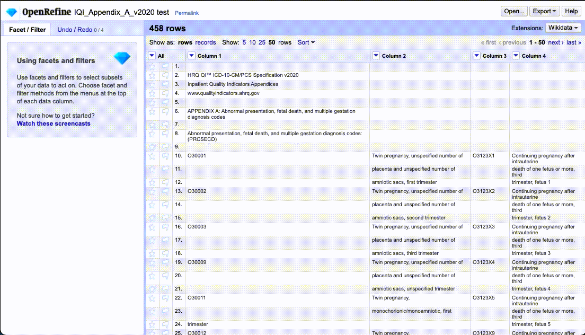

# Case study: AHRQ diagnosis codes

In this case study, I needed to pull a series of diagnostic codes from an 11-page definition booklet. There were about 275 of these alphanumeric codes split into two columns, with definitions, so using some kind of cleaning tool was preferred to avoid manual cleaning errors.

## The original PDF

The original document was a PDF document of 11 pages that looked liked this:

## Cometdocs for conversion

I used the website [Cometdocs](https://www.cometdocs.com/) to convert the PDF into an Excel spreadsheet. Free accounts of Cometdocs allow for a limited number of conversions each month, but you can get an unlimited free version through [joining IRE](https://www.ire.org/join-ire/member-benefits/).

This is the how the conversion came out:

Still quite a bit of cleanup to do.

## OpenRefine challenges

This is how the Spreadsheet looked when imported into OpenRefine:

I needed to accomplish several things:

1. Remove the definition columns.
2. Remove the leftover rows that still had definition text. I did this by using a regular expression to find rows in the first column that started with the letter "O" followed by a number, as these are our diagnostic codes. I then used the inverse of the filter so I could remove the "other" rows.
3. Use Transpose to combine the two columns into a single one and sort it.

The gif below runs through all the steps. Note that in reality, I was more methodical, testing each filter and step to make sure I was not removing data I needed to keep or vice versa.

This is the finished data and record of the steps:

