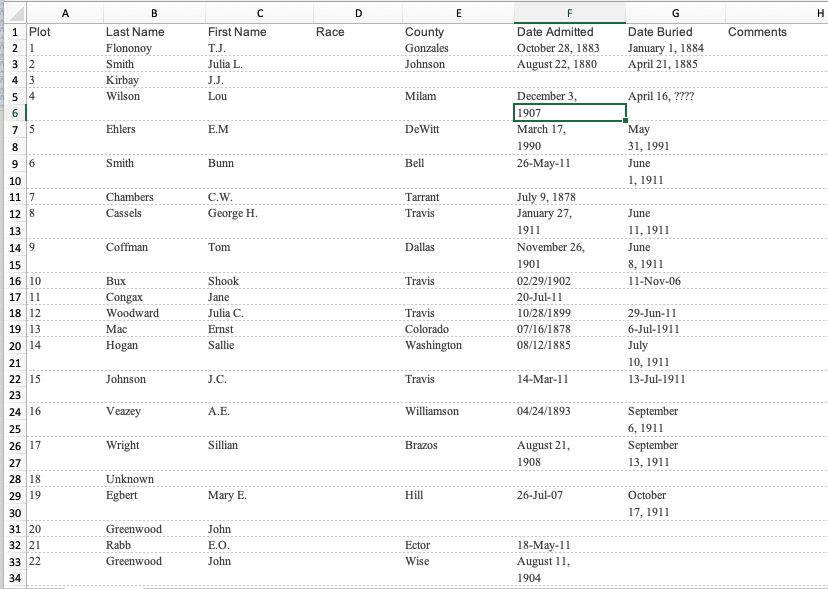
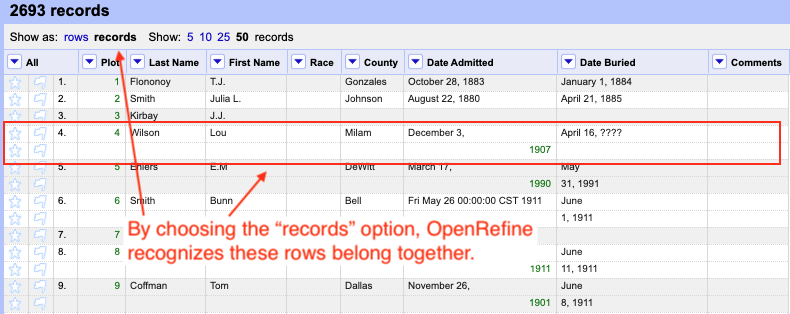
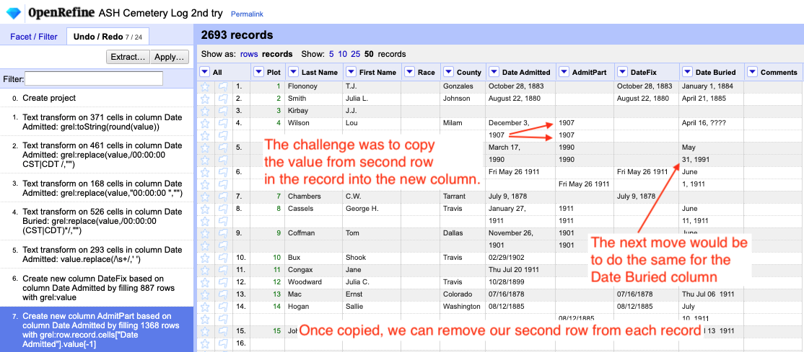
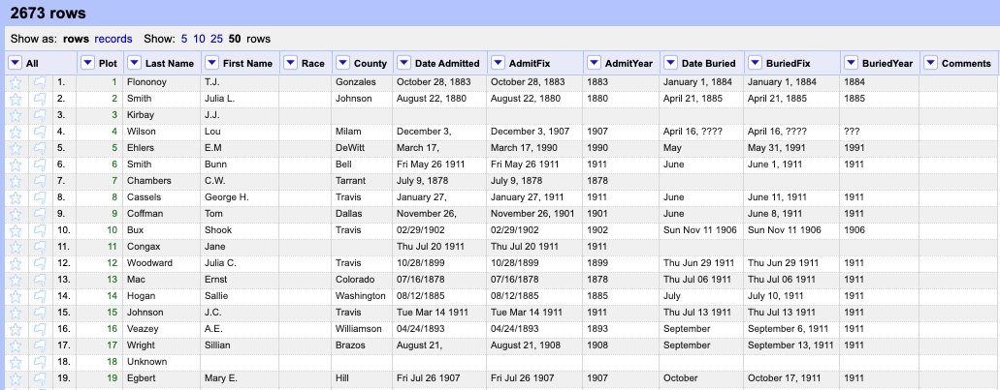

# Case study: ASH cemetery

An Austin news organization had a list of burials at the Austin State Hospital cemetery and wanted to summarize how many people were buried each year. When the data came to me it was in a spreadsheet but it might have been converted from a PDF or some other format.

## The original data

Note on "Plot 4" of the data that the *Date Admitted* breaks into two lines, creating a new spreadsheet row. We needed to get the "year" value for each date in *Date Admitted* and *Date Buried* so we could count the records by year.

(We didn't need a full date so I didn't go through the effort to fix them, just to extract the year.)

## Records vs rows

OpenRefine has an option that allows us to show related rows as single records, opening up some additional programming options for us. Once imported, I choose to show as records:

I was able to use [GREL functions](https://docs.openrefine.org/manual/expressions/#record) to copy the second "row" for the record into a new column so I could get the entire date on a single row to manage later.

I used Add new column based on this one with the following expression:  `row.record.cells["Date Admitted"].value[-1]`.

## Just needed the year in the end

I was able to create parts of dates and put them back together again to get a common-enough date format to extract the last four characters -- the year -- from the fixed date.

If the full date was important, more work could've been done to normalize those.
s