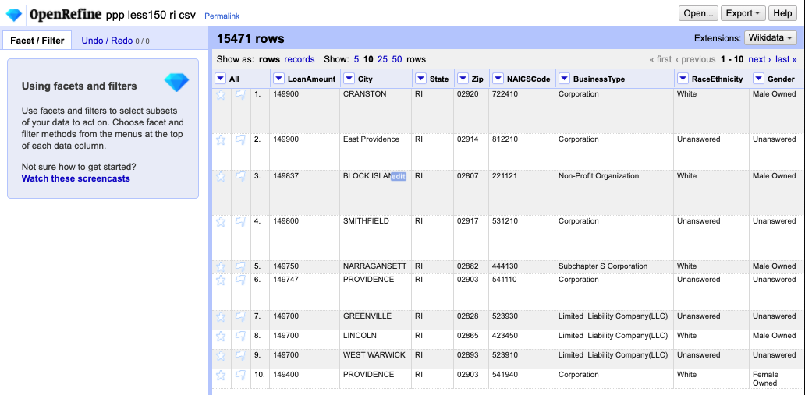
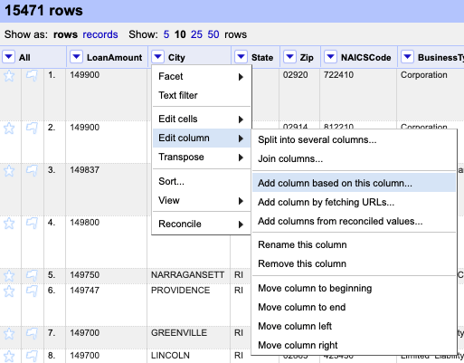
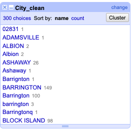
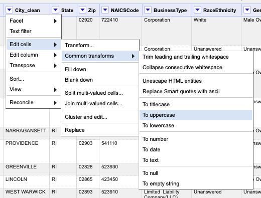
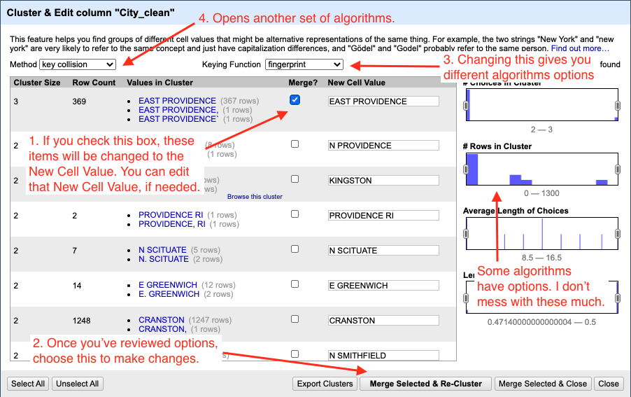
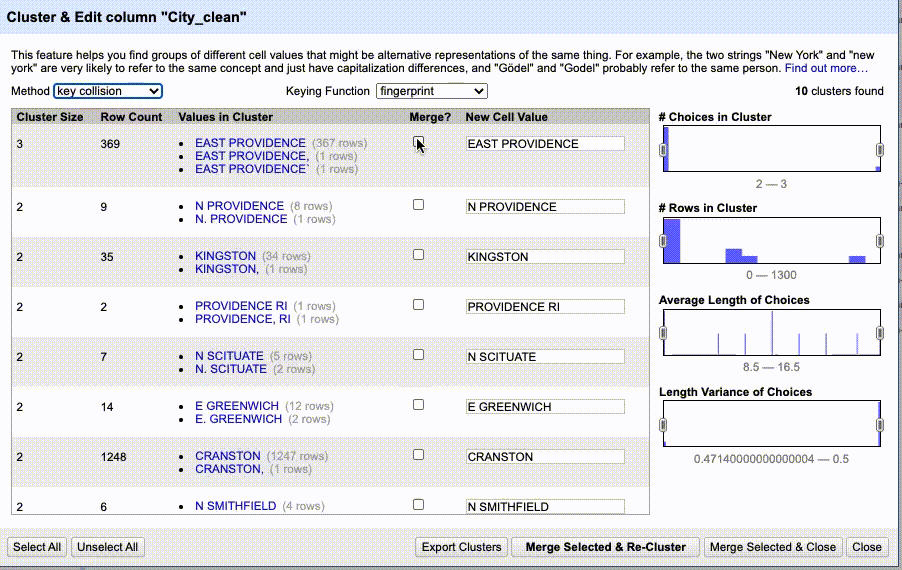
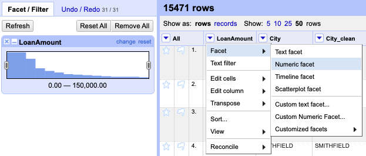

# Clustering in OpenRefine

This lesson assumes you've gone through the [Facets demo](demo-facets.md) or have at least some familiarity with OpenRefine.

## Our story and goal

With this tutorial we will use the clustering technique in OpenRefine to clean up city names in some Paycheck Protection Program data. The data is notoriously dirty. We can't accurately count or sum the loan values by city until this data has been cleaned.

## Download the data

We're going to use Rhode Island's list of PPP loans up to $150,000. We're using Rhode Island because the data set is relatively small a 15,472 rows (compared to Texas at 365,168 rows.) OpenRefine could handle the larger data, but performance really starts to suffer with larger files.

- Go to the [RI PPP data](data/ppp-less150-ri.csv) page in the repo and download the file.
- Put the file someplace where you can find it, perhaps in a well-organized project folder ;-).

## Create a new project

- Launch OpenRefine if not already open. If you do have it open, click on the OpenRefine log at the top-left to get to the "home" page.
- Choose **Create project**.
- Choose **This Computer** if not already chosen.
- Use **Choose files** and find your downloaded data, `ppp-less150-ri.csv`.
- Click **Next**.
- The defaults on the Parse screen should be fine. Click **Create project**.

You should end up here:

You can already see that some cities are in UPPERCASE and some are not. Woe, if that were our only problem.

## Make a new city column

- Use the dropdown on the *City* column to choose **Edit column > Add column based on this column ...**.

- Name the new column **City_clean** and click **OK** as the other values should be correct.

We created a new column that has the same values as *City*. We made a copy so we can always refer back to the original data.

- Then use the dropdown on the new  *City_clean* to choose **Facet > Text facet**.

We can see that the cities are a mess.

We have a mixture of cases, many misspellings and cases where the data is not a city at all.

## Change to uppercase

- Use the dropdown on *City_clean* to choose **Edit cells > Common transforms > To uppercase**.

.

This helps us some, combining 300 different variations to only 162 choices, but doesn't do anything for the outright misspelling of city names.

## Cluster

OpenRefine has a concept called **Cluster** that will use algorithms to find similarly-constructed or even similar sounding words. We'll use a series of these help us clean these city names.

- In the text facet box for *City_clean*, click on the **Cluster** button at the top-right. This brings up the **Cluster and edit column** tool.

The idea here is to work through all the results methodically:

- Look through all the values for a particular **Keying function**.
- If you want to merge **all** the values in the cluster, check the **Merge** box and set the **New Cell Value** to the desired result.
  - If even one of the values in the cluster does not belong together, then DON'T MERGE IT. You'll have to deal with them independently later. Take notes and edit from the text facet, perhaps.
- Once you've reviewed all the clusters, choose **Merge Selected & Re-Cluster**.
- After a quick double-check, change the **Keying Function** to the next algorithm.
- Rinse and repeat for all the keying functions.
- Then change the **Method** from "key collision" to "nearest neighbor" and follow all the above steps again.
  - With **nearest neighbor** and **levenshtein** it might be worth reducing the value in **Block Chars** to see if there are more matches that help you.

Following is a gif of me going through a couple of keying functions, merges and new algorithms. I'm not fixing all the values, just showing enough of the process to give you an idea of how it works.

### Practice cleaning up City_clean

As you cluster and clean data like this, you'll likely have to do some research and make style decisions (N PROVIDENCE vs NORTH PROVIDENCE? Is it PEACE DALE or PEACEDALE?)

- Go through all the algorithms and clean up the city names.
- Remember: Don't merge unless all values in a cluster should be the same.
- Once through all the algorithms, double-check through the facet list to see if there are values the algorithms missed. It is quite possible.

You would typically use text facets on all the text-based columns to check for other inconsistencies.

## Numeric facets

Since the PPP data is all about money, we should make sure that our number fields are not out of whack.

- Use the dropdown on the *LoanAmount* field to choose **Edit cells > Common transforms > To number**.

This sets the values in that column to be numbers so we can do numbery things on them.

- Use the dropdown on *LoanAmount* to choose **Facet > Numeric facet**.

This shows you where the menu is along with the resulting histogram:

You can use the sliders on the histogram to filter the data based on the value.

### Practice numeric facet

- Go through the same process as above, but for the *JobsReported* column.

## Timeline facets

The *DateApproved* column appears to be a date/time field but was imported as text. Given how you were able to convert and facet number fields, I bet you can poke around and figure out how to convert this a real date field and then do a timeline facet on it.

## Export

Once you've done all your cleaning, use the Export dropdown button at the top-right of the app to export the data in your filetype of choice.

---

We're done with this lesson. Perhaps head back to the [README](README.md).
