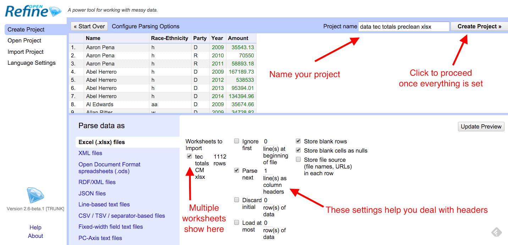
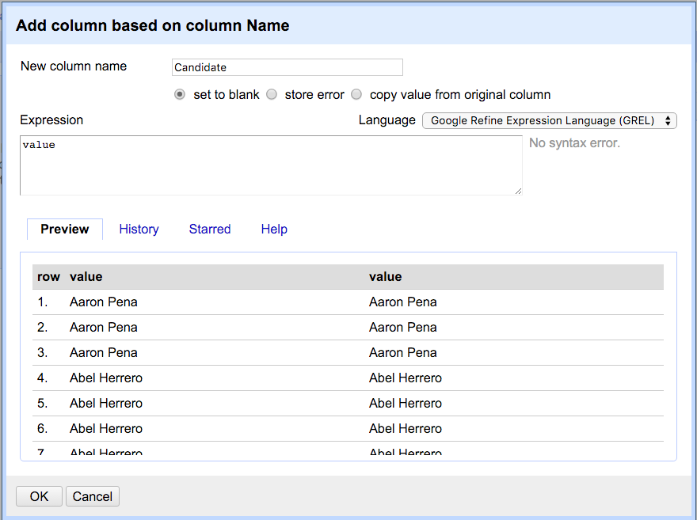
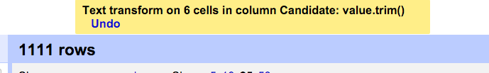
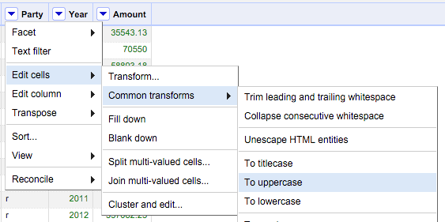
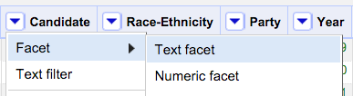
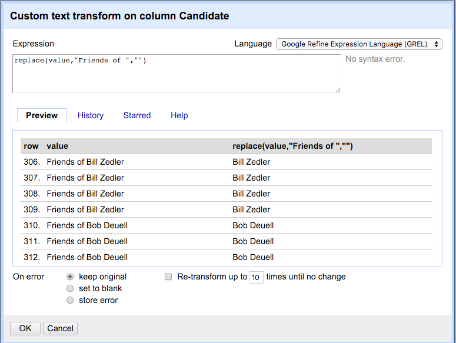

# Open Refine: Cleaning

This lesson assumes you have already [installed OpenRefine](installation.md).

## Start with some data

> CHECK LINK BELOW

- Download this [TEC campaign finance data](data/tec-totals-preclean.xlsx) and put it somewhere you can find it later.
- Open the file in Excel and review it.

There are several things we'd like to do with this data:

1. Create a new "Candidate" field to clean up PAC names and such.
2. Create a new "Election Cycle" column, which run over two years.
3. Normalize the "Race-Ethnicity" and "Party" columns.

### The story behind the data

For this story we wanted to see summarize candidate election campaign contributions by race and party. Before doing that, we had to clean up the campaign fund names and normalize some other columns in the data.

## Start an OpenRefine project

When you launch OpenRefine it loads in your default browser at `http://127.0.0.1:3333/`. That is normal. If you quit the OpenRefine program, you can't just go back to the URL ... both the program and the browser need to run.

When you launch OpenRefine you'll see a number of menu items to the left.

- Choose the **Create Project** item.
- Make sure you are on the **This Computer** option.
- Click the **Choose Files** button and go select the TEC Excel file you downloaded.

- Once you've found your file, click on the **Next** button.

There are several options you can adjust here. This workbook only has one sheet, but if your source file had more than one you could choose it here. You can also choose to ignore rows at the top fof the file and such.

- Click on the **Create Project** button to get started.

### Getting around

Once in our project, there are a couple of controls:
Change the number of rows you can see
Page through the data using next, last, previous, first.

## Create a new column

You usually want to keep your original data so you can refer back to it, so we’ll make a new column before we change our data significantly.

- On the Name column, use the dropdown to Edit Column > Add a column based on this column. Like this:

You'll next get a window where we can define what we want in this new column.

You can do a LOT more with this window than we do here, but take note of the "Expression" window here. Inside of that is just the word value, which means we are creating a new column based on the value of the cell on our source column. It is possible to make changes to the values (the content) as you create the new column using [GREL](https://docs.openrefine.org/manual/grelfunctions), a programming language specific to Refine.

In our case here, just click OK to create the new column.

## Common transforms

Sometimes cells in data have spaces at the beginning or end of the values that you can't see, and this can cause problems later. We can fix that quickly with Trim.

### Trim

- Click on the dropdown for the Candidate column and go to Edit cells > Common transforms > **Trim leading and trailing whitespace**.

When you do you'll get a message about how many fields changed.

### Change to uppercase

You may have notice the other things you can do here, like changing everything to UPPERCASE, or removing extra spaces and such.

Let's use this to change all the "d" and "r" in the Party field to uppercase.

- Use the dropdown on the "Party" column to choose Edit cells > Common transforms > **To uppercase**.

Now you have "D" and "R" for Party.

## Undo

Note at the top left of OpenRefine there is an Undo / Redo panel.

OpenRefine keeps track of every move you do, and you can go back in time. This should give you great freedom to try things because you can always back out of it.

You can also Extract the steps and Apply them later if you want to save steps to perform again. (This can be a way to have a record of how you cleaned your data so others or your future self can repeat your work.) The format is a JSON file.

## Text facets

One of the most useful skills in OpenRefine is find and change many cells of data in a column at once. The Text facet function gives you a list of all the unique values in your data and tells you in how many rows it shows up.

- Go to the dropdown for Candidate to Facet > **Text facet**.

That will make a list of the values on the left of your screen.

OpenRefine found that there are 319 unique values for Candidate in your data, along with a number in grey after it to tell you how many rows have that value.

The values are listed alphabetically, which can be helpful to find records that are not quite alike but should be.

- Click on **Sort by count** link in the facet header to show the facets that have the most values.
- Click **Sort by name** to return to the alphabetical list.

### Edit value from a text facet

Notice that when you roll your cursor over a value in the facet list you get a link where you can edit that value.

- Find "Citizens For Joe Crabb (DISSOLVED)" and choose **edit**.
- Change the text to say just "Joe Crabb" and hit **Apply**.

Once you change that value, the list resorts and Joe is down by the J's.

### Practice editing from a text facet

A little work on your own to get some practice:

- Close the Candidate text facet by **clicking the `X`** that is to the left of the facet title.
- Clean up the Race-Ethnicity values to spell out those values to Asian, Black, Hispanic, White. This is straightforward facet editing: Create the facet, then edit the values.

Once you are done:

- **Close** your *Race-Ethnicity* facet.
- Add back a **text facet** for *Candidate*.

## Text filter

You'll notice there are a bunch of Candidate records that start with "Committee to ...". We'll use a Text filter to help find those.

- Choose the dropdown from Candidate and choose Text filter.

This puts a box in the left pane under the Candidate facets.

- Type in "committee" and you'll filter the facet list (and the Matching rows pane at right) so you can more easily find the ones to change.
- Go ahead and edit all those records to just the candidate's name.

There is a "case sensitive" option if that is helpful for your filters. If you are familiar with "regular expressions" you can check that box and built your match based on patterns instead of text strings.

You should search for other common terms:

- "Texa" to catch both Texas and Texans
- "Campaign"

But when it comes to "Friends", let's do this in a better way by changing them all at once.

## Search and replace with Transform

Set your Text filter to "Friends of" so we can see them, but don't fix them. We'll instead edit all the rows at once using Transform. Click on the Candidate dropdown and go to Edit cells > Transform:

This will bring up a window much like the one we used when we created a new column.

In the screenshot above, I've typed in the GREL expression we are going to use to make this Transform: `replace(value,"Friends of ","")`

Let's break this down:

1. "replace" is a [function in the GREL language](https://docs.openrefine.org/manual/grelfunctions#replaces-s-or-p-find-s-replace). It takes three arguments, which are inside the parentheses separated by commas:
2. The first argument is the string we are changing. In our case, we are using the variable "value", which refers to the value of the current cell.
3. The second argument is the sting we are searching for. In our case we are searching for "Friends of ". Note we are including the space after "of" since we don't want to leave it.
4. The last argument is what we are replacing that text with, which in our case is nothing, but we have to explicitly say that as a string, hence the "".

You can see in the preview that we are removing that text from multiple rows. Click OK when you are ready to execute.

## Adding values based on other columns

Now that you've learned text facets and text filters, we'll use those skills to create a column called Election Cycle that has values of 2009-2010, 2011-2012 and 2013-2014 based on the Year.

### Create a blank column

- Use the Year column dropdown to choose **Edit Column > Add column based on this column**.
- Name the column **"Election cycle"**.
- In the expression field, just add two quotes with nothing between them: `""`.
- Click **OK**.

This will create a new column, but there will be **nothing in it** because we filled it with an "empty" string.

## Filter with regular expressions

This isn't a lesson on regular expressions but [I do have one here](https://docs.google.com/document/d/1DvAM4lnGJLefo9skD8GgM-_9S1BEhpjJfV86yhJavI0/edit?usp=sharing) if you are interested. However, we'll use a simple one here just to show the power of them.

Our aim here is to add the text "2009-2010" in the **Election cycle** anytime a row has a year of **either** 2009 **or** 2010.

### Set up the filter

- Create a **text facet** on the *Year* column.
- Create a **text filter** on the *Year* column.
- In the text filter, add the text `2009|2010`.
- In the text filter, check the box next to **regular expression**.

> That `|` character between the two years is called a "pipe". You can find it as the Shift of `\` on your keyboard, right above the Return key.

This regular expression is used to search patterns of characters instead of actual text. The `|` key means "or". So we are filtering for "2009 or 2010".

### Fill text with Transform

Now that we only have 2009 and 2010 rows selected, we can fill our *Election cycle* column with the text we want.

- Use the dropdown on **Election cycle** to choose Edit cells > Transform.
- Enter the following into expression field: `"2009-2010"`
- Click **OK**.

> Don't forget the quotes. That is what tells Refine to insert this as text.

You'll see that we now have our Election cycle filled in.

### Practice filter and fill

On your own, repeat this process for the year collections of "2011-2012" an "2013-2014". You'll want to adjust the filter to capture the years you want, then use Edit cells > Tranform to fill in the proper cycle.

## Exporting your cleaned data

Once you cleaned everything the way you want it, you'll want to export your changed data to get it out of OpenRefine so you can use it elsewhere.

- Go under the Export button at top-right and choose the export type of your choice.

This will download your file to your **Downloads** folder. Don't forget to move the file to a safe place where you can find it again.

That's the end of this example. We'll handle [Clustering](demo-cluster.md) with a different data set.
