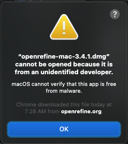
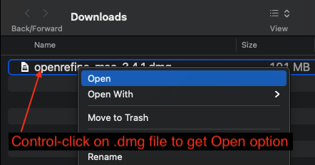
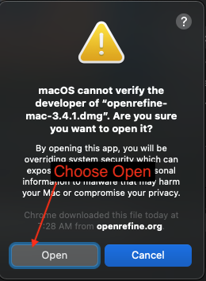
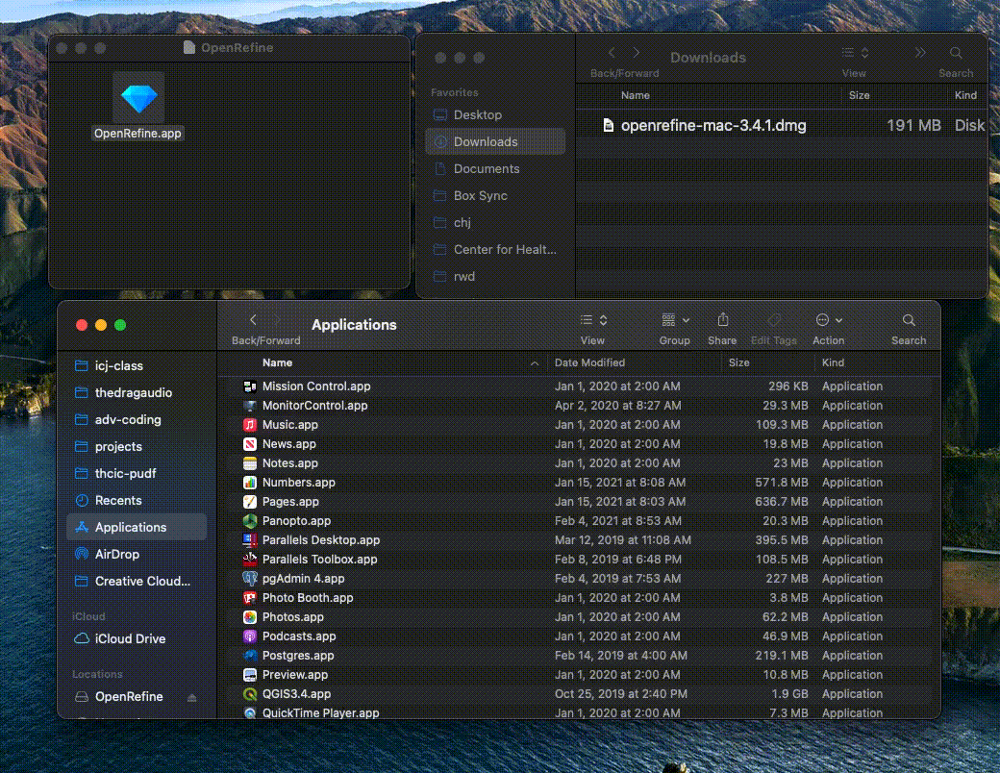

# Installing OpenRefine on a Mac

Sometimes applications acquired outside of Apple's official App Store can be a challenge to install.

## Download the installer

- Go to OpenRefine's [Downloads](https://openrefine.org/download.html) page and find the **Mac kit**.
- The installer will likely go to your **Downloads** folder.
- Double-click the installer to see if it opens.

### If you can't open the install

You _might_ get this warning:

If you do:

- Click **OK** to get out of this window.
- Go back to your downloads and hold down the control key on your keyboard while clicking once on the installer. You should get a pop-up menu like this:

This will bring up the warning window again, but now you should have the option to **Open** anyway.

This should now open the installer.

## Copy to Applications

When the installer window opens, it will just have the app sitting there. It doesn't have the Applications alias folder like many installers do. You have to manually find and drag the app into the folder.

- Find and open your Applications folder
- Drag the OpenRefine icon from the installer into your Applications folder.

Once copied over into Applications, you need to try launching the app. If the installer gave your problems, then the application will do the same.

- Double-click on the OpenRefine app in the Applications folder and see if it launches.
- If you get the warning, close the window, then control-click on the app and choose **Open** from the menu.
- Now you get an **Open** button option on the warning and should be able to launch the app.

Here is a gif of copying the installer and launching the application, including getting past the warning.

Once you've cycled through the open warning at launch once, it shouldn't ask you again. You'll be able to launch from your Launcher at usual.
