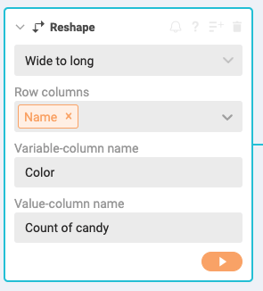
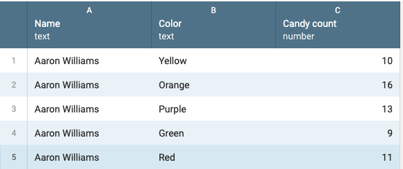

# Distribution of Skittles

Students in several classes have contributed to a dataset that counts the number of different colored Skittles in a traditional 61.5g package. We want to know:

- Are candy colors evenly distributed within a package of Skittles?
- Does the candy color distribution change over a series of packages?

If you participated in the data gathering exercise then you likely know the answer to the first question. The candy counts vary, sometimes widely.

But what is the average count per color over a number of packages?

We are going to find this answer using Workbench, and then visualize the results as a simple bar chart using Datawrapper.

## Visualize success

Since we are using Datawrapper as our charting tool, we need to first consider how that tool wants our data as we will likely need to "reshape" it.

First, lets look over the [Datawrapper Academy entry for bar charts](https://academy.datawrapper.de/article/7-bar-chart).

Their example there shows a bar chart of voter turnout by country in Europe.


 We want to build a similar chart, but instead of country, we want color of Skittles. And instead of voter turnout percentage, we want the average number of Skittles found through all the packages.

Our chart will be something like this:


### The data shape

But most importantly, look at how Datawrapper wants the data to make a bar chart like this:

| Country               | Turnout |
|-----------------------|---------|
| Romania (2016)        | 39.8    |
| Kosovo (2017)         | 40.0    |
| Slovenia (2017)       | 43.6    |
| United Kingdom (2017) | 68.7    |
| Germany (2017)        | 76.2    |
| Belgium (2014)        | 88.5    |
| Luxembourg (2013)     | 91.4    |
| Malta (2017)          | 92.1    |

They want one column for the category, and another column for the numerical value.

Take a look at [our data](https://docs.google.com/spreadsheets/d/1JHS1yIbbVg7lUZzTMzJIlQGaZsEzWtNuM9_xKGHOknk/edit?usp=sharing).


We have raw data where every line is one bag of Skittles. This is perfect for Workbench or R or even Tableau, but this is not what Datawrapper wants. Datawrapper wants us to do all our of our aggregations first. Like this:

| Color  | Average |
|--------|---------|
| Green  | 10.7    |
| Orange | 12      |
| Purple | 13.2    |
| Red    | 9.5     |
| Yellow | 11.1    |

> These values are just examples and not the real answers you are looking for.

Those numbers represent the average count of each color across all the bags of skittles. We have to do the math and get our data into this format BEFORE we can work in Datawrapper.

Workbench is the perfect tool for this. Here's an overview of what we'll do next:

1. We'll import our data into Workbench
2. We'll reshape the data so we can work with the numbers
3. We'll group and aggregate to do the math
4. We'll export it for Datawrapper

> To be fair, we could do the above in a pivot table in Sheets, but we can do so much more in Workbench it is worth going there.

## Preparing data in Workbench

Since we collected this data using a Google Form that ends up as a Google Sheet, we can import the data directly from the sheet. We can even update it as more data comes in.

- Start a new Workbench workflow and title it **YourName - Skittles**.
- Start a new tab and use **Import from URL** and name it `Import`.
- Enter this URL. Make sure you copy the whole URL if it scrolls off the screen:

``` text
https://docs.google.com/spreadsheets/d/e/2PACX-1vTxm9NxK67thlGjYOQBo_0JRvx2d137xt0nZGffqR6P1vl8QrlTUduiOsDJ2FKF6yLgQAQphVZve76z/pub?output=csv
```

> We got this URL by viewing the form reponses as a Google Sheet and then using "Publish to web" to make available as a csv.

### Reshaping the data for grouping

This data is in a "wide" format where each row has many observations and the columns headers describe them.

For us to consider all of these observations together we need to reshape the data as "long" data so we can use **Group** by `Color` to do aggregations like averages, sums and counts. We need each row to consider only one color and value from each bag.

- Start a new tab and name it `Color stats`.
- Start from the **Import** tab.
- Delete the `Timestamp` column as we don't need it and it will get in the way.
- Start a **Reshape** step.
  - Choose **Wide to long**.
  - For _Row columns_ choose **Name**.
  - For _Variable-column name_ call it **Color**.
  - Fpr _Value-column name_ call it **Candy count**.



This reshaped our data so there is one row for each observation: The count of one color from one bag.



### Aggregations by color

Now to get the average count for each color, we need to do some grouping. This _might_ be the first time we've grouped and aggregated by something other than **Count**. In this case we want to average the value.

- Start a new **Group** step.
  - For _Column_ choose `Color`
  - For _Operations_ choose `Average (Mean)`.
  - In the column dropdown, choose the `Candy count` column.
  - Name the field `Average`.


### Export the data

Now we need to export the data as a .csv file so we can use it next in Datawrapper.

- Click on the **Export** button.
- Use the **Download icon** to save the file to your Downloads folder on your computer.
- Go **rename the file** to something that makes sense so you know what it is later.


## Make a Datawrapper bar chart

Now you have the data you need to make a bar chart in Datawrapper. Since Datawrapper has their own tutorials, I'm not going to go through every step here. Just follow the tutorials below, but use your Skittles data.

- [Create a bar chart](https://academy.datawrapper.de/article/7-bar-chart)
- [Customize a bar chart](https://academy.datawrapper.de/article/33-customizing-your-bar-chart)

A couple of things to consider along the way:

- When you start, you'll use the **XLS/CSV upload** button and find your file to upload.
- At the Visualize step you'll choose **Bar chart**.
- While you are on the **Refine** step, be sure to explore all the options so you can see what they do. Use this as an opportunity to learn what Datawrapper can do.
- At the **Annotate** step, make sure you have a Title and Description that describes what this chart is. Don't assume the reader knows anything ... they don't know what class we are in, how the data was collected, how many bags of Skittles were considered or anything. Include your name for the byline.

## Going further with the data

This isn't required, but I find this data fascinating. (OK, we've established that I'm a data dork.) Some other things you might explore in Workbench and/or Datawrapper if you want:

- What was the most or least of any color of candy in a bag? Who got them?
- Who got the least and most total number of candies?

## Turn in your work

- Share your Workbench workbook and submit the link to the assignment.
- Publish your Datawrapper chart and submit the PUBLISHED link to the assignment.
