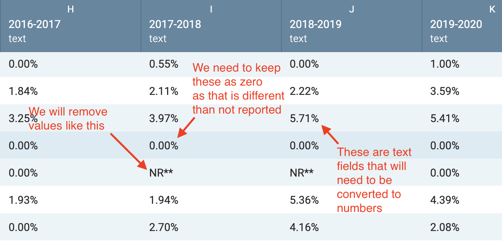

# Vaccination exemptions by county

> Perhaps later I can add screen grabs of each step.

Texas law allows for an exemption from immunizations for reasons of conscience, including a religious belief. A student's parent or guardian submits an official DSHS affidavit form to the child's school.

This is a soup-to-nuts study at how the use of exemptions have changed over time by county, from Excel data through Workbench to Tableau to create an online interactive visualization. This is one of those cases where the easy part is creating the visualization. Most of the work comes in preparing and understanding the data.

## Download and explore the data

Visit the the Texas Department of State Health Services' [Conscientious Exemptions Data - Vaccination Coverage Levels](https://www.dshs.texas.gov/immunize/coverage/Conscientious-Exemptions-Data.shtm) web page and look for the file [2010-2020 Conscientious Exemptions by County (XLS)](https://www.dshs.texas.gov/immunize/coverage/docs/2010-2020-Conscientious-Exemptions-by-County.xls).

This is just one of several data sets that can be explored concerning statewide vaccination rates. Download and open it. Ask yourself the following:

- What can we learn from this file?
- Take a look at the columns and rows and formulate questions. What might you want to learn or explore?
- What charts might we make? How might they work together in a dashboard?
- What shape (wide vs long) does this data have to be to get what you need?

## Import into Workbench

There are a number of cleaning steps we need to do and Workbench is the perfect tool for this.

- Start a new Workbench workflow and start by uploading the Excel file.
- This first thing you'll notice is we have a bunch of errors because don't have a header row. Those are instead on row 3. You can select that row and then use the **1 row selected** dropdown to select **Move rows to table header**.
- Scroll all the way down to the bottom to row 256, which is a note about the data that we need to remove. Select that row then use the **1 row selected** dropdown to delete the row.
- You might also that now all the values are text instead of number and they include the % sign. We also have some "NR**" values. We'll take care of both of those after we reshape the data.

## Remove Loving County

If you look at the row for Loving County, you'll notice that every answer is "NR**". Let's delete that row since it is of no use to us. It would cause some confusion later in Tableau.

- Create a **Filter** step.
- Choose **Filter by condition**.
- For the column, choose `County`.
- For the operation, choose **Text is exactly**.
- For the value, type in: Loving
- Select the **Delete** button so the row will be removed.
- Play the step.

## Reshaping

If we want to compare exemptions over time (by their school year), then we must have one column called "School year" instead of a column for _each_ school year, and one column that has all the "Exemption rate" values. You might recall this concept from the [reshape](http://help.workbenchdata.com/en/articles/1634563-reshape) from our Workbench tutorials.

- Start a new tab and call it Reshape. (We are doing this in case we someday wanted the current data shape. We probably won't need it but we are just being cautious and smart.)
- Use the **Reshape** function to change the data _Wide to long_ using `County` as the Row variable.
- Rename the new columns as "School year" and "Exemption rate".

## Cleaning the data

Some of our Exemption rates are a value of "NR**". We can't import data like that into Tableau or it won't consider it a number. We need to replace all those values with a blank value. (I'll do some sorting in class to show you these values.)

### Remove values with NR or NA

We want to remove the rows that have "NR**" or "#N/A" so they don't show up in our visualizations later in Tableau.

- Use the function **Filter by Condition** on the `Exemption rate` column.
- For the operation, choose **Text contains**.
- For the value field insert: N
- Choose to **Delete** the rows and **play** the step.

### Fix the Exemption rate values

Before we convert our `Exemption rate` to a number, we need to remove the parenthesis or all the values will become Null.

- Use the **Search and Replace** function again on `Exemption rate` to search for "%" and replace it with nothing.
- Convert the `Exemption rate` column to a number. You can find the function on the dropdown for that column.

## Adding a real date column

You next need to create a new column that includes a _real_ date based on the `School Year` date so we can build a line chart in Tableau. (Tableau won't let you make a line chart based on a non-date dimension like "2018-2019".)

We are choosing to make a "Year" column, but we have to pick an actual date to represent this. We'll use June 1, which is typically around the end of the school year. We concatenate the text "06/01/" with the last four characters of our `School Year` column to get our valid date format.

- Use the **Formula** function as an Excel function. The formula is `="06/01/"&RIGHT(B1,4)`. Call the column "Year".
- Now convert that "Year" column to a date format.

## Export the file

- Click the **Export** button and click the download button under CSV.
- You should **rename the downloaded file** to something like "exemptions.csv" or something that describes the file. Leaving it as as the Workbench name like "Workflow 62289 - convert-date-290688.csv" won't help you later when you are looking for the file.

## Assignments

Share this Workbench workflow with me or make it public. You'll also need the link when you turn in the assignment.

- [rubric-tableau](rubric-tableau.md)

## For instructor use only

- [Ignore this](https://app.workbenchdata.com/workflows/62289/)