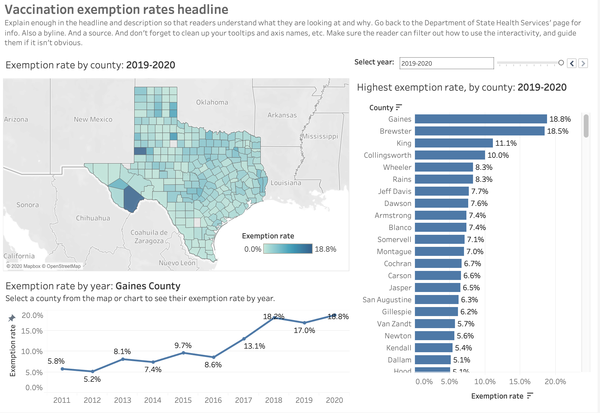
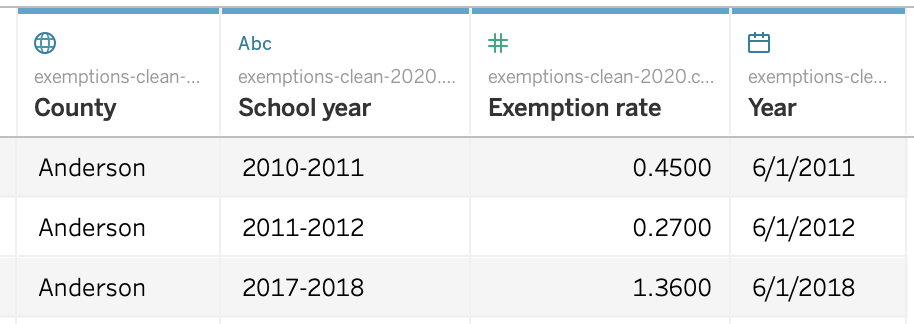
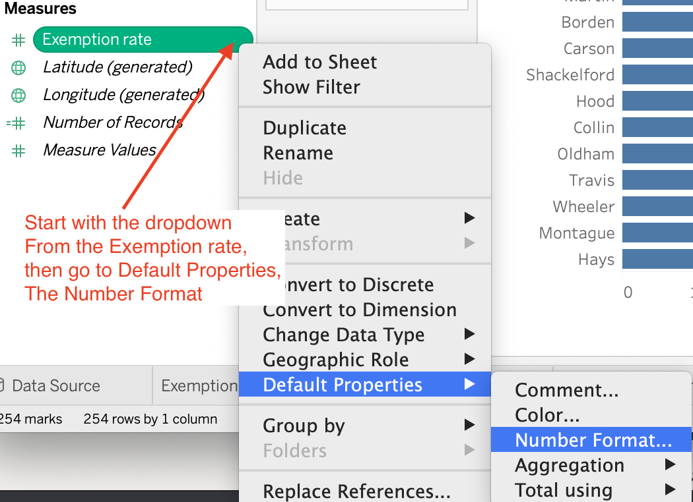
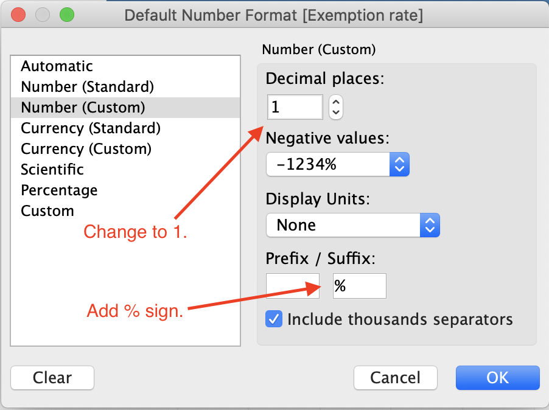
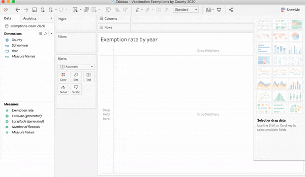
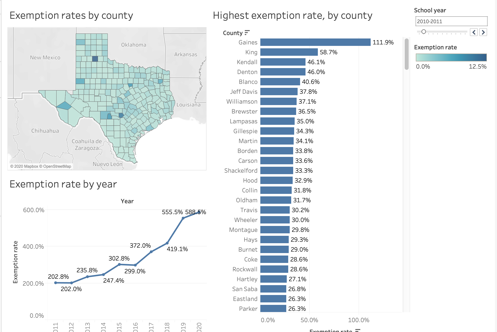
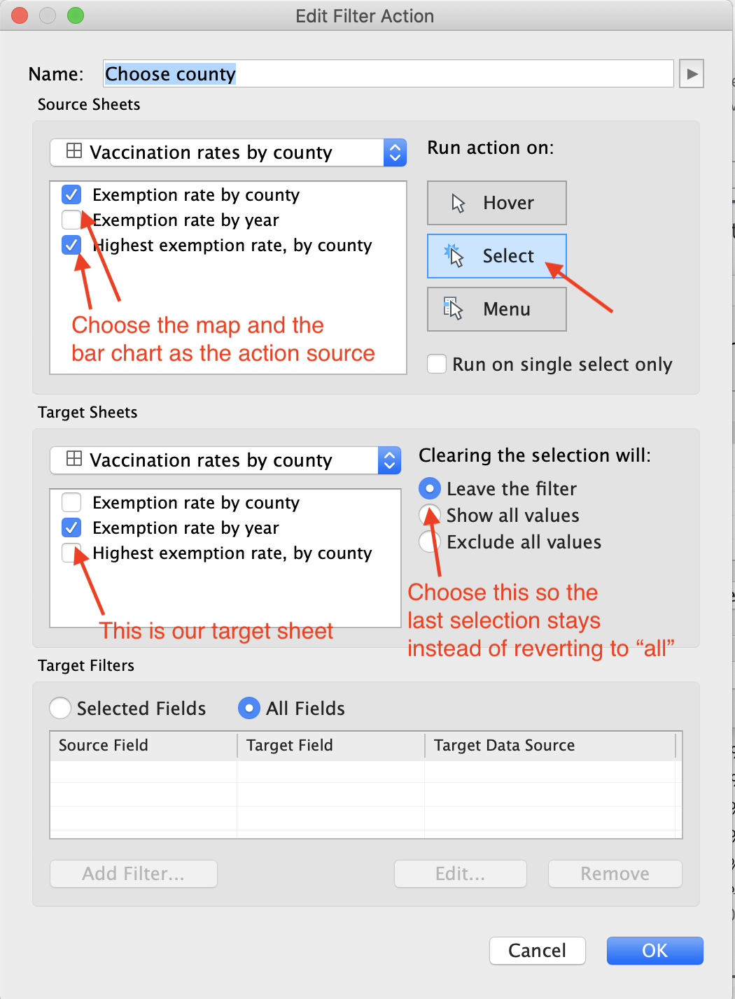
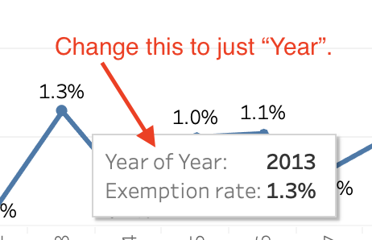

# Vaccination exceptions, Tableau

This assignment uses the vaccinations exemptions data that you [cleaned in the previous lesson](README.md) to build an interactive dashboard in Tableau that allows readers to explore this data over time by county.

You'll build three charts:

- A map of Texas counties that show the exemption rates by year.
- A bar chart that ranks counties by their rate.
- A line chart that shows the rate change over time for each county.

Interactive filters will be an important part of this dashboard.

To give you an idea of the goal, this is a [dashboard on vaccination exemptions](https://public.tableau.com/profile/statcomdata#!/vizhome/Vacinationexceptions/Vaccinationexemptions) I did in 2013. We're doing only the first dashboard of three.

Your version will look something like this:

## Connect to the data

- You should've renamed your exported CSV file from Workbench and moved it into a project folder.
- Launch Tableau and for **Connect to Data** use **Text File**.
- Locate and import your csv file.
- Review the data types and make sure they are OK.
  - `County` should be a geography.
  - `Exemption rate` should be a number.
  - `Year` should be a date.

## Map by county

We'll make a map of Texas counties showing the exemption rate. We'll use a filter to show just one `School year` at a time.

- Create a new sheet and name it "Exemption rate by county".
- Select the `County`, `Exemption rate` fields.
- Use the **Show Me** tab to find the choropleth map. It's on the second row in the middle. Close the Show Me tab when you are done.
- Go to the filter at the right and use the dropdown there to choose the **Single value (slider)** option.
- Note there is **102 unknown** indicator at the bottom right of the map. If you click on the indicator and the choose **Edit Locations** and you'll see that Tableau doesn't understand that all of these counties are in Texas, so we have to tell it so.
- Choose **State/Province**, then choose **Fixed** and then choose **Texas**. Note there is still the state value for "Texas" which we won't show on the map. Click OK.
- Now there is a **1 unknown** indicator for the "Texas" value. Click on the indicator and choose **Filter data** to remove it from this view.
- Click on the dropdown for the `School year` field and choose **Show Filter**.

>[View a screen cast of the steps to make this map](https://drive.google.com/open?id=1AZZt8yOtzMmOCpUmbTK9Tsh3Ss3UvrUV)

Later when we make a dashboard we'll remove the "All" option from that filter because we don't want to ever add the Exemption rates together on the map.

## Ranking counties by rate

Next we'll make a bar chart that shows a ranked list of the counties by their exemption rate.

- Start a new sheet and name it "Highest exemption rate, by county".
- Choose the `County` and `Exemption rate` fields.
- From the **Show Me** tab, choose the bar chart.
- Choose the **Sort descending** tool button to sort by highest rate at the top. The tool icon is about in the middle of the tools list, and looks like a bar chart with a downward arrow.
- Drag `Exemption rate`from Dimensions to the **Label** mark to add the rate to the end of the bars for each county.

**NOTE:** The rates are whacked (some more than 100%) because the rate for all the years are by default added together. That's not good for us, but we'll add a dashboard filter later to show only one school year at a time.

[View screen cast of steps to make this chart](https://drive.google.com/open?id=1YL_Yy6k7hH_i-cs1xsA0AObH9anj5j06)

## Adjust the Exemption Rate display

The `Exemption rate` display on the chart is already converted to a percentage, but it doesn't appear like that on the chart. Let's make an adjustment to that display to show precision to tenths and add the "%" sign.

- On the `Exemption rate` value in the Measures pane, choose the dropdown and negotiate to **Default Properties** and then **Number Format**.

- Choose **Number (custom)**.
- Then set the decimal to 1.
- Add the "%" to the suffix field.

Doing these steps will change that display everywhere we use it, which is good for us.

## County rate over time

Our next view is to build a chart that shows a county's rate by year. Even though we will show only one county's values at a time, let's do a line chart. Again, it will look like a mess until we filter it on the dashboard.

- Start a new sheet and name it "Exemption rate by year"
- Choose `Year` (the _real_ date) and `Exemption rate` from the Dimension and Measure panel.
- Use **Show me** to select the **Discrete line chart**, which is on the fifth row in the middle.
- Add the `Exemption rate` to the **Label** Mark.

Again, the values are off because all counties are being summed together. We'll fix that with a dashboard filter.

> [View screen cast to make the line chart above](https://drive.google.com/open?id=1k9Zx7wFVyxmMApW-WDPpwAvPdhHHA-lu)

## Create dashboard

We have the basics of three charts, though they will still need a lot of cleanup. Let's get them onto a dashboard so we can add Dashboard Actions to  get the functionality we want.

- Create a new dashboard. Call it "Vaccination exemptions by county".
- Arrange the charts on the dashboard something like the image below, with the map and line chart stacked on the left and the bar chart to the right. We'll do all the fine tuning later.

## Applying filters to multiple sheets

When you placed the map on the dashboard, you should've gotten the filter for "School year" along with it. We want that filter to apply not only to the map, but also to the bar chart ranking of the counties.

- Choose the dropdown from the **School year filter** and choose **Apply to Worksheets** and then **Selected Worksheets**.
- A pop-up window comes up that allows you to select which sheets you want the filter to apply to. Add the bar chart, which should be named "Highest exemption rate, by county".

We also want to remove the "All" option from the filter so users can't add the rates together.

- Go to the School Year **filter dropdown**.
- Go to **Customize**, then _uncheck_ **Show "All" value**.

> [Screen cast showing how to modify filters](https://drive.google.com/open?id=1qeHaflGD3muhsT97GL2G1T1AnxUTKDXi)

## Dashboard actions

With Dashboard Actions we can use one chart to change or highlight values on other charts on the dashboard. In this case, we want users to be able to choose a county from either the map or the bar chart to change which county the line chart is showing. We'll set the action to keep the last value, so it will make the line chart show only one county at a time.

- Go to the **Dashboard** menu and choose **Actions**.
- Click the blue **Add Action** button and then choose **Filter**.
- Naming the action helps you find it later if you have more than one.
- For the **Source Sheets** choose your bar chart and map.
- For the **Target Sheets** choose your line chart.
- For **Run Action on** choose **Select**.
- For **Clearing the selection** choose **Leave the filter**. If you leave it at "Show all values" the chart will go back to adding all the rates, which we don't want.
- Click **OK** on both the resulting windows.

Here is a look at the Dashboard Action Filter settings:

Read more about [Dashboard filter actions](https://help.tableau.com/current/pro/desktop/en-us/actions_filter.htm).

> [Watch a screen cast of creating the dashboard action](https://drive.google.com/open?id=1pMG6mlUd6kSXGikDttrf2K-VUUiwm2hO).

## Adding variables to sheet headlines

Now that we have filters and actions that change the values on the sheets, it would be nice if the headline on the sheet included the `School year` or `County` that is chosen. We'll add those now.

- Right-click on the map title and choose **Edit Title**.
- Inside the title is the variable name `<Sheet Name>`. After that, add a colon and space then click the **Insert** button and choose **School year** from the list.
- Highlight all the content and then change the **text size** to `12`.
- Highlight the `<School year>` variable  (It might look at first like it is already highlighted, but it isn't) and then make it bold. Click OK.
- **Do the same steps** for the "Highest exemption rate" title.
- **Do the same steps** for the "Exemption rate by year" title, but insert the **County** variable.

> [Watch a screen cast of adding variables to titles](https://drive.google.com/open?id=1NrBv0J5dZBnFpH3zUEaXkvV69c7BezJj)

## Arranging dashboard filters and legends

Next, we'll gain some space on our dashboard by moving our legends and filters out of their special container.

- Move the **School year filter** to above the county rate chart.
- Right-click on the dropdown for the **Exemption rate** legend and choose **Floating**. Move the legend to somewhere on top of the Gulf of Mexico on the map. Don't worry right now about exactly where it is, as you'll likely make other adjustments.

> [Watch a screen cast to adjust the filters and legends](https://drive.google.com/open?id=1TO-Fw7oTVPZIwjIpLN58mbxs5QPKgJuW)

## Headlines and description

Next we'll add a text box for a headline and description for our dashboard. You'll want to include enough information in both so your reader full understands what this thing you have built is. You might look back the Texas Department of State Health Services' [Conscientious Exemptions Data - Vaccination Coverage Levels](https://www.dshs.texas.gov/immunize/coverage/Conscientious-Exemptions-Data.shtm) web page for background information. This is also a place that you can add your byline and the source of the data, both important. Use the font controls to make it look nice.

- Under **Objects** at the bottom left of Tableau, grab the **Text** icon and drag it to the top of the page.
- When you let go, you'll get a box where you can enter information and adjust the fonts, etc.

> [Watch a screen cast of adding the text box](https://drive.google.com/open?id=1ruD-eaaY-C_wmkTMDsZPylZvDnLbMg8Z)

## Tooltips and axis adjustments

Any time you add a date field to a tooltip, you get an odd label, like we have for "Year of Year" in our "Exemption rate by year" sheet.

- Go to the sheet with the tooltip, in this case "Exemption rate by year".
- Click on the **Tooltip Mark**.
- Edit the labels as necessary.
- Click OK when you are done.

Always check all your tooltips for clarity.

Once you make a change to a tooltip, other fields you add to it won't show up. You can add them manually much like you did with titles earlier, or you can click the **Reset** button when you are editing the tooltip, then add your field and re-edit.

You can read more about [editing tooltips and titles here](https://help.tableau.com/current/pro/desktop/en-us/formatting_specific_titlecaption.htm).

> [Watch a screen cast of editing tooltips](https://drive.google.com/open?id=1KDLcMyB-W7djvgpzNaEbIuUVZR9As8kg)

## Fine tuning

This would also be a time to check all your axis names on all your charts, rotate labels and make other fine-tuning adjustments to your dashboard before you publish.

In the screen cast below I change the desktop view window to 700px. You could also create views for tablet and mobile, but we won't do that in this lesson. You can [read more about that here](https://help.tableau.com/current/pro/desktop/en-us/dashboards_dsd_create.htm).

> [Watch a screen cast of some possible fine-tuning to dashboards](https://drive.google.com/open?id=1VG_iYR6XnaR9C9dYq9gOGkuLKh46hBG_)

### How to turn in your assignment

- Once you are done and saved, go under File to **Export packaged workbook** and submit the resulting `.twbx` file to the canvas assignment.

A reminder: If you want to make changes after you have exported, work from the original `.twb` file and then re-export the packaged workbook.
