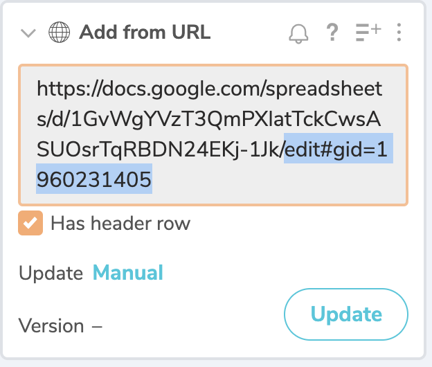

# Workbench tips and tricks

## Helpful functions

### Import Google Sheets csv

You can import form a Google Drive Sheets without connecting to drive if you adjust the URL.

- Make share your document is shared so others with the link can view it.
- Copy the Sheets URL and paste it into an **Add from URL** function/
- You want to delete the portion of the URL that starts with `edit`, as highlighted below.



- Now append this to the end of the URL:

``` text
gviz/tq?tqx=out:csv
```

#### Multiple sheets

If you have more than one sheet in your workbook and want one beyond the first, you might have to amend your URL like this: `gviz/tq?tqx=out:csv&sheet={sheet_name}` where `{sheet_name}` is the name of your sheet without the curly braces. Make that a simple name that starts with a letter and has no spaces to save headaches.

### Fill zeros for IDs

There is a common issue where IDs that are numbers that start with zeros (like ZIP codes or school IDs) are imported into Workbench as numbers. This Python function can fix them.

In the example below, the `CAMPUS` column needs to be `9` characters long.

```python
def process(table):
    table['CAMPUS'] = table['CAMPUS'].astype(str).str.replace(',', '').str.zfill(9)
    return table
```
